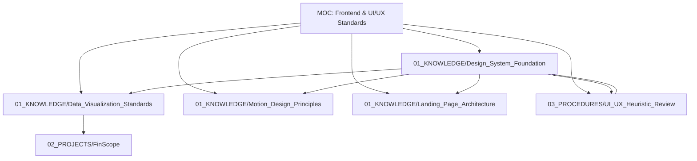

# Map of Content: Arhitectură Vizuală, Frontend Engineering & UI/UX Standards

Acest nod central (MOC) structurează și indexează toate standardele, procedurile de audit și fundamentele vizuale canonice ale AI Memory Vault.

---

## 1. Fundamente și Tokeni Vizuali
- [[01_KNOWLEDGE/Design_System_Foundation]] — Standarde de culori, scări tipografice, spațiere fixă (4/8px) și reguli WCAG AA.
- [[01_KNOWLEDGE/Motion_Design_Principles]] — Easing, durate de tranziție (100–500ms), compositing pe GPU și accesibilitate (`prefers-reduced-motion`).

## 2. Vizualizare de Date & Conversie
- [[01_KNOWLEDGE/Data_Visualization_Standards]] — Maximizarea raportului data-to-ink, paleta categorială de 8 nuanțe, selecția graficelor și KPI cards.
- [[01_KNOWLEDGE/Landing_Page_Architecture]] — Structura narativă în 7 pași, un singur CTA primar și optimizarea conversiei.

## 3. Proceduri Operaționale de Audit
- [[03_PROCEDURES/UI_UX_Heuristic_Review]] — Protocol complet de evaluare euristică bazat pe cele 10 Euristici Nielsen, testul de 5 secunde și scala de severitate 0–4.

## 4. Proiecte Active Conectate
- [[02_PROJECTS/FinScope]] — Implementează direct standardele de Data Viz (Recharts) și sistemul de design tipizat.

## 5. Colecții & Cataloage Agent Skills
- [[01_KNOWLEDGE/MengTo_Agent_Skills_Catalog]] — 130 de skill-uri specializate pentru Web Design, WebGL/Three.js, animații GSAP/Lenis, proceduri Codex și Game Dev.

---

## 🔗 Legături de Memorie & Graf Obsidian
- [[02 Memory Knowledge Map]]
- [[Knowledge Graph Home]]
- [[Knowledge Graph Home]]
