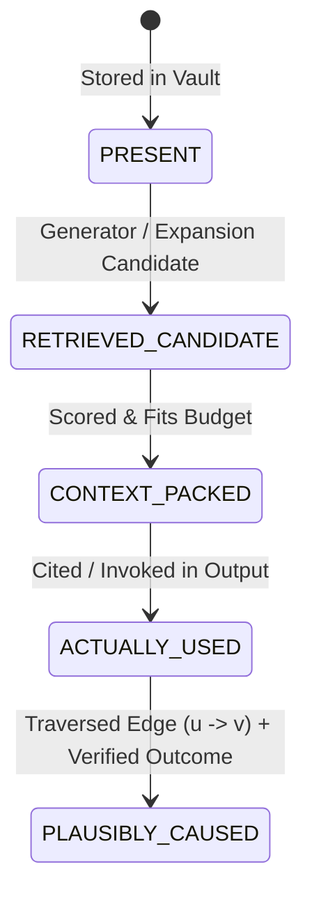

# Attribution-Aware Synaptic Plasticity Model

**Status**: Active / Production Ready  
**Component**: `03_IMPLEMENTATION/packages/graph/plasticity.py`  
**Layer**: Cognitive Graph Subsystem & Telemetry Feedback  
**Security Governance**: Invariant `P0-001..P0-015`, Least Privilege Multi-Agent Architecture

---

## 1. Context & Motivation

The AI Memory Vault operates not as a static repository or unconditional vector index, but as a living cognitive architecture. In biological neural systems, connections strengthen with verified utility and atrophied pathways fade (Spike-Timing-Dependent Plasticity).

Prior to this specification, retrieval trace logging (`candidate_trace` in `MemoryController.search()` and `ObservedMemoryTrace` in telemetry) was decoupled from synaptic weight adaptation (`SynapseStore.reinforce()`). The update logic was invoked solely via offline batch scripts without causal discrimination: all observed edges were reinforced uniformly.

Uniform reinforcement causes **Hub Pollution**:
A frequently linked navigation hub (e.g. index, map of content) or passive contextual memory enters the context pack of many queries. If every retrieved edge strengthens uniformly upon success, the hub's incoming and outgoing edges explode in weight. Eventually, graph expansion is dominated entirely by the hub, blinding retrieval to fine-grained semantic connections.

To prevent hub pollution and enable genuine learning, this model closes the loop:
$$\text{Retrieval Outcome} \longrightarrow \text{Causal Attribution} \longrightarrow \text{Bounded Weight Update}$$

---

## 2. The Five-State Attribution Model

To prevent false attribution, the runtime distinguishes five discrete states for any memory node $v \in V$:



1. **State 1: PRESENT (`present`)**  
   The note exists in vault storage / index. No query has retrieved it.
2. **State 2: RETRIEVED_CANDIDATE (`retrieved_candidate`)**  
   The note was surfaced by a retrieval generator or candidate expansion during initial scoring.
3. **State 3: CONTEXT_PACKED (`context_packed`)**  
   The note was selected by progressive disclosure and packed into the final context delivered to the agent (`candidate_trace['final_context_ids']`).
4. **State 4: ACTUALLY_USED (`actually_used`)**  
   The note was actively cited or invoked during execution (e.g. `[note_id]`, `[[wikilink]]`, tool argument, or `observed_capabilities['knowledge_refs']`).
5. **State 5: PLAUSIBLY_CAUSED (`plausibly_caused`)**  
   An edge $e = (u \to v)$ was traversed during retrieval / 1-hop graph expansion, **AND** target $v$ achieved State 4 (`ACTUALLY_USED`), **AND** the execution yielded an externally verified outcome (`SUCCESS` or `FAIL`).

### Causal Attribution Rule
> **Invariant**: Only edges that achieve **State 5 (`PLAUSIBLY_CAUSED`)** are eligible for synaptic weight modification. An edge whose target is merely in context (`CONTEXT_PACKED` without being `ACTUALLY_USED`) is strictly ignored and must **NEVER** strengthen.

---

## 3. Mathematical Formulation of Bounded Updates

Weight updates follow asymptotic compounding constrained within strict global bounds:

$$W \in [W_{\min}, W_{\max}] = [0.0, 1.5]$$
$$\Delta \le \Delta_{\max} = 0.15$$

### 3.1 Verified Success (Asymptotic Strengthening)
When an attributed edge contributes to a verified successful outcome:
$$\Delta = \min\left(\Delta_{\max},\; \eta \cdot (W_{\max} - W)\right)$$
$$W_{\text{new}} = \min(W_{\max},\; W + \Delta)$$

Where:
- $\eta = 0.15$ (default learning rate)
- $W_{\max} = 1.5$
- Compounding is asymptotic: as $W \to 1.5$, $(W_{\max} - W) \to 0$, ensuring diminishing returns and preventing weight runaway.

### 3.2 Verified Failure (Failure Depression)
Negative feedback is half of plasticity. When an attributed edge contributes to an execution resulting in a verified failure:
$$\Delta = \min\left(\Delta_{\max},\; \eta \cdot W\right)$$
$$W_{\text{new}} = \max(W_{\min},\; W - \Delta)$$

Where:
- $W_{\min} = 0.0$
- Compounding is asymptotic: as $W \to 0.0$, weight decays toward zero without ever underflowing.

---

## 4. Architectural Boundaries & Security Invariants

### 4.1 Zero Auto-Promotion (P0 Security Invariant)
Synaptic plasticity modifies edge weights in `SynapseStore` exclusively.
- **Forbidden**: Plasticity code **NEVER** modifies note frontmatter, YAML relations, note content, or note lifecycle.
- Note promotion to `ACTIVE` or attestation to `VERIFIED` remains strictly governed by `03_IMPLEMENTATION/packages/lifecycle/policy.py` and requires human/admin principal authority (`I-001..I-005`).

### 4.2 Reversible Append-Only Update Journal
Every weight update is logged to `telemetry/plasticity_journal.jsonl`:
```json
{
  "entry_id": "plj_a8b9c1d2e3f4",
  "run_id": "run_20260906_001",
  "timestamp": "2026-09-06T14:30:00Z",
  "action": "reinforce",
  "source_id": "policy_vault_01",
  "target_id": "guard_auth_02",
  "relation": "depends_on",
  "old_weight": 0.600000,
  "new_weight": 0.735000,
  "delta": 0.135000,
  "outcome": "success",
  "verification_method": "test_pass",
  "attribution_state": "plausibly_caused"
}
```

#### Rollback Capability
`journal.rollback(run_id, synapse_store)` identifies all modifications made for `run_id` and restores each edge to its `old_weight`. It maintains append-only integrity by writing compensating `action: "rollback"` entries. Subsequent rollback calls for the same run are idempotent no-ops.

### 4.3 Fail-Closed Verification
To protect the knowledge base from ungrounded reinforcement:
1. Outcomes with `verification_method: "none"` are rejected with status `unverified_outcome`.
2. Self-reported model claims ("I found this memory helpful") are rejected before reaching the update logic.
3. Missing or corrupt candidate traces abort with status `trace_missing` or `malformed_trace`.
4. The system never guesses.

---

## 5. Subsystem Consumption & Production Wiring

The plasticity loop is exposed via two primary interfaces:
1. **Python API**:
   ```python
   from graph.plasticity import PlasticityEngine, PlasticityJournal

   engine = PlasticityEngine()
   result = engine.apply_outcome(
       synapse_store=store,
       candidate_trace=candidate_trace,
       outcome_record=outcome_record,
       used_memory_ids=["note_id_1"],
   )
   ```
2. **CLI Adapter**:
   ```bash
   # Apply verified update with explicit attribution
   python 30_SCRIPTS/knowledge/plasticity_update.py --pack-id run_123 --success --used-ids note_01,note_02

   # Rollback an erroneous or superseded run
   python 30_SCRIPTS/knowledge/plasticity_update.py --rollback run_123
   ```
