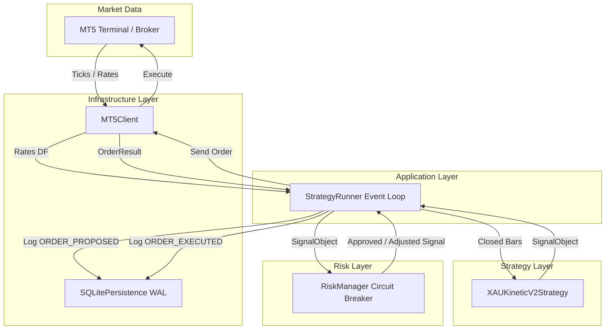

# XAU_Kinetic Quantitative Trading Bot (v2.0)

Clean Architecture algorithmic trading engine in Python 3.12+ for MetaTrader 5 (XAUUSD), strictly enforcing zero-trust Pydantic V2 schemas, isolated risk management with circuit breakers, and SHA-256 tamper-evident audit logging.

## 🏗 Architecture Overview



## 🛡 Key Features & Invariants

1. **Clean Architecture Isolation**:
   - `domain/`: Pydantic V2 models for zero-trust data flow across boundaries.
   - `application/`: Clean Abstract Base Classes (`IBrokerClient`, `IStrategy`, `IRiskManager`, `IPersistence`).
   - `infrastructure/`: MetaTrader 5 client wrapper and SQLite WAL persistence engine.
   - `risk/`: Isolated risk engine with absolute VETO authority over trading signals.
   - `strategies/`: Pure functional strategy engine with zero network side effects.
2. **Anti-Look-Ahead Guarantee**: Strategy evaluates indicators exclusively on completed closed bars (`bar[N-1]`).
3. **Circuit Breaker**: Hard limit daily drawdown stop (% of daily equity baseline), max symbol exposure, minimum free margin threshold.
4. **Cryptographic Audit Ledger**: Every signal, proposed order, and executed trade is recorded into a SHA-256 chained hash ledger adhering to AI Memory Vault rules.

## 🚀 Quick Start

### Installation

```bash
pip install -r xau_kinetic/requirements.txt
```

### Running with Mock Broker (Standalone Test Mode)

```bash
python -m xau_kinetic.main --mock --once
```

### Running Historical Backtest Simulation

```bash
python -m xau_kinetic.main --mock --backtest
```

### Verifying Cryptographic Audit Log Integrity

```bash
python -m xau_kinetic.tools.verify_audit_log --db xau_kinetic_audit.db
```

### Exporting Performance & Audit Reports

```bash
python -m xau_kinetic.tools.export_performance --db xau_kinetic_audit.db --out-json audit_report.json --out-csv audit_events.csv
```

### Running Live Loop with MetaTrader 5

```bash
python -m xau_kinetic.main --config xau_kinetic/config.json
```

### Running Unit Tests

```bash
python -m unittest discover -s xau_kinetic/tests
```
