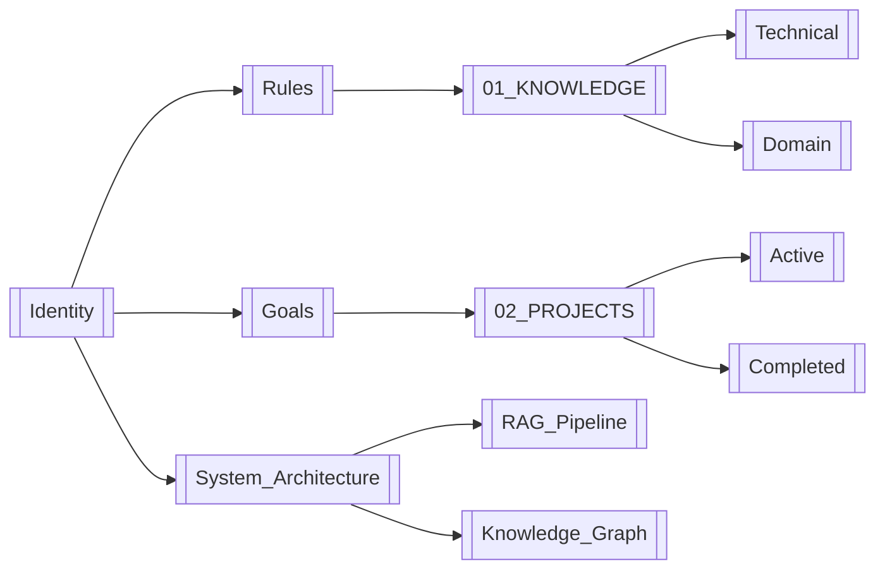

# Artifact: System_Architecture

# System Architecture

## Overview

This document describes the **technical architecture** of the AI Vault Memory System, including folder structure, data models, RAG pipeline, and Knowledge Graph integration.

---

## High-Level Architecture

```
┌─────────────────────────────────────────────────────────────┐
│                    AI Vault Memory System                   │
├─────────────────────────────────────────────────────────────┤
│                                                             │
│  ┌──────────┐  ┌──────────┐  ┌──────────┐  ┌──────────┐   │
│  │ 00_CORE  │  │ 01_KNOWLEDGE│ │ 02_PROJECTS│ │ 03_PROCEDURES│ │
│  └──────────┘  └──────────┘  └──────────┘  └──────────┘   │
│                                                             │
│  ┌──────────┐  ┌──────────┐  ┌──────────┐  ┌──────────┐   │
│  │ 04_MEMORY│  │ 05_RESOURCES│ │ 06_INBOX │ │ Templates│   │
│  └──────────┘  └──────────┘  └──────────┘  └──────────┘   │
│                                                             │
│  ┌──────────────────────────────────────────────────────┐  │
│  │           RAG Pipeline + Knowledge Graph             │  │
│  └──────────────────────────────────────────────────────┘  │
│                                                             │
└─────────────────────────────────────────────────────────────┘
```

---

## Folder Structure

### 00_CORE/
**Purpose:** Foundational system definitions

| File | Purpose |
|------|---------|
| [[Identity]] | System identity and purpose |
| [[Rules]] | Operational guidelines |
| [[Goals]] | Strategic objectives |
| System_Architecture | Technical documentation |
| Tag_Taxonomy | Tag standards (future) |
| Changelog | Version history (future) |

### 01_KNOWLEDGE/
**Purpose:** Domain knowledge and reference material

```
01_KNOWLEDGE/
├── Technical/
│   ├── Cybersecurity/
│   ├── Software_Development/
│   ├── System_Administration/
│   └── AI_ML/
├── Domain/
│   ├── Finance_Trading/
│   ├── Psychology/
│   └── Personal_Development/
├── Concepts/
│   ├── RAG/
│   ├── Knowledge_Graphs/
│   └── Memory_Systems/
└── Reference/
    ├── APIs/
    ├── Tools/
    └── Best_Practices/
```

### 02_PROJECTS/
**Purpose:** Active and completed project tracking

```
02_PROJECTS/
├── Active/
│   ├── Project_Template/
│   ├── AI_Vault_Build/
│   └── Trading_Bot/
├── Completed/
│   ├── 2026_Q3/
│   └── Archive/
└── Backlog/
    └── Ideas/
```

### 03_PROCEDURES/
**Purpose:** Step-by-step operational procedures

```
03_PROCEDURES/
├── Import/
│   ├── Export_ChatGPT/
│   ├── Export_Claude/
│   └── Classification_Workflow/
├── Maintenance/
│   ├── Weekly_Review/
│   ├── Monthly_Audit/
│   └── Archive_Process/
├── RAG/
│   ├── Query_Formulation/
│   ├── Context_Assembly/
│   └── Response_Generation/
└── Troubleshooting/
    └── Common_Issues/
```

### 04_MEMORY/
**Purpose:** Historical conversations and experiences

```
04_MEMORY/
├── Conversations/
│   ├── By_Date/
│   │   ├── 2026/
│   │   └── 2025/
│   └── By_Topic/
│       ├── Technical/
│       ├── Personal/
│       └── Decisions/
├── Experiences/
│   ├── Successes/
│   ├── Failures/
│   └── Lessons_Learned/
├── Decisions/
│   ├── Career/
│   ├── Technical/
│   └── Personal/
└── Patterns/
    ├── Behavioral/
    └── Cognitive/
```

### 05_RESOURCES/
**Purpose:** External references and curated content

```
05_RESOURCES/
├── Links/
│   ├── Articles/
│   ├── Tutorials/
│   └── Documentation/
├── Books/
│   ├── Summaries/
│   └── Notes/
├── Tools/
│   ├── Software/
│   └── Services/
└── People/
    ├── Experts/
    └── Contacts/
```

### 06_INBOX/
**Purpose:** Unprocessed incoming information

```
06_INBOX/
├── Unprocessed/
├── Processing/
└── To_Archive/
```

---

## Data Model

### Note Structure

```yaml
---
type: <knowledge|project|procedure|memory|resource|decision|experience|error|lesson|preference>
category: <domain/subdomain>
tags:
  - tag1
  - tag2
created: YYYY-MM-DD
updated: YYYY-MM-DD
status: <active|completed|archived|draft>
source: <chatgpt|claude|gemini|manual|web>
confidence: <high|medium|low>
---
```

### Link Types

| Link Type | Format | Example |
|-----------|--------|---------|
| Internal | `[[Note_Name]]` | `[[Identity]]` |
| Section | `[[Note_Name#Section]]` | `[[Goals#Strategic_Goals]]` |
| External | `[Title](URL)` | `[Obsidian](https://obsidian.md)` |
| Tag | `#tag` | `#project/active` |

### Metadata Fields

| Field | Type | Required | Description |
|-------|------|----------|-------------|
| type | Enum | Yes | Note type classification |
| category | String | Yes | Domain categorization |
| tags | Array | Yes | Searchable keywords |
| created | Date | Yes | Creation timestamp |
| updated | Date | Yes | Last modification |
| status | Enum | No | Lifecycle state |
| source | Enum | No | Origin of information |
| confidence | Enum | No | Reliability indicator |

---

## RAG Pipeline

### Architecture

```
┌─────────────┐     ┌─────────────┐     ┌─────────────┐
│   Query     │ ──> │   Retrieve  │ ──> │   Augment   │
│  Formulation│     │  (Search)   │     │  (Context)  │
└─────────────┘     └─────────────┘     └─────────────┘
                                               │
                                               ▼
┌─────────────┐     ┌─────────────┐     ┌─────────────┐
│   Store     │ <── │   Generate  │ <── │   Prompt    │
│  (Response) │     │  (Answer)   │     │  Assembly   │
└─────────────┘     └─────────────┘     └─────────────┘
```

### Query Processing

1. **Query Analysis**
   - Identify intent (factual, procedural, decision, memory)
   - Extract key entities and concepts
   - Determine time horizon (current, historical, future)

2. **Search Strategy**
   - Full-text search on content
   - Tag-based filtering
   - Date-range constraints
   - Link traversal for related concepts

3. **Retrieval Ranking**
   - Relevance score (TF-IDF + semantic similarity)
   - Recency boost (exponential decay)
   - Confidence weighting
   - Link authority (number of incoming links)

4. **Context Assembly**
   - Select top-k relevant notes (k=5-10)
   - Prune redundant content
   - Order by relevance + recency
   - Include metadata (source, confidence, date)

5. **Response Generation**
   - Synthesize retrieved context
   - Maintain factual accuracy
   - Cite sources ([[Note_Name]])
   - Mark uncertainty explicitly

### RAG Configuration

```yaml
rag_config:
  retrieval:
    top_k: 10
    min_relevance: 0.3
    date_decay_halflife: 180  # days
  context:
    max_tokens: 4000
    include_metadata: true
    citation_format: "[[Note_Name]]"
  generation:
    temperature: 0.7
    max_tokens: 2000
    cite_sources: true
```

---

## Knowledge Graph

### Schema

```
Note
├── id: UUID
├── title: String
├── content: Text
├── metadata: JSON
├── links: Array<Note_ID>
└── tags: Array<String>

Link
├── source: Note_ID
├── target: Note_ID
├── type: String (references, extends, contradicts, implements)
└── strength: Float (0.0-1.0)

Tag
├── name: String
├── count: Integer
└── related_tags: Array<Tag>
```

### Graph Construction

1. **Node Creation**
   - Each note = one node
   - Metadata as node properties
   - Tags as node labels

2. **Edge Creation**
   - Internal links ([[Note]]) = directed edges
   - Co-occurrence in same note = undirected edges
   - Shared tags = weighted edges

3. **Graph Metrics**
   - Node degree (popularity)
   - Betweenness centrality (bridge nodes)
   - Clustering coefficient (communities)
   - PageRank (importance)

### Visualization



---

## Integration Points

### AI Platforms

| Platform | Integration Method | Status |
|----------|-------------------|--------|
| ChatGPT | Export + Import | 🔴 Planned |
| Claude | Export + Import | 🔴 Planned |
| Gemini | Export + Import | 🔴 Planned |
| Perplexity | Export + Import | 🔴 Planned |
| Custom API | Direct Write | 🟡 In Progress |

### Tools

| Tool | Purpose | Status |
|------|---------|--------|
| Obsidian | Primary interface | 🟢 Active |
| Git | Version control | 🟡 Planned |
| Python Scripts | Classification | 🟡 In Progress |
| Embedding Model | Semantic search | 🔴 Planned |
| Graph Database | Knowledge graph | 🔴 Planned |

---

## Security Considerations

### Access Control
- Single-user vault (no multi-user conflicts)
- File-level encryption (optional, via Obsidian)
- API key management (external secret manager)

### Data Protection
- No sensitive data in plain text
- Redaction protocol for PII
- Regular backups (Git + cloud sync)

### Audit Trail
- All changes logged in Git history
- Manual changelog for major updates
- Access logging for AI platforms

---

## Performance Targets

| Metric | Target | Current |
|--------|--------|---------|
| Search latency | <2s | TBD |
| Import throughput | 100 notes/min | TBD |
| RAG accuracy | >90% | TBD |
| Graph traversal | <1s for 1000 nodes | TBD |
| Storage efficiency | <100MB for 10k notes | TBD |

---

## Related Files

- [[Identity]] — System purpose
- [[Rules]] — Operational constraints
- [[Goals]] — Strategic direction
- [[03_PROCEDURES/Import/Classification_Workflow]] — Import process (future)
- [[03_PROCEDURES/RAG/Query_Formulation]] — RAG usage (future)

---

## Metadata

```yaml
---
type: core
category: architecture
tags:
  - architecture
  - system
  - technical
  - rag
  - knowledge_graph
  - core
created: 2026-08-09
updated: 2026-08-09
status: active
---
```

