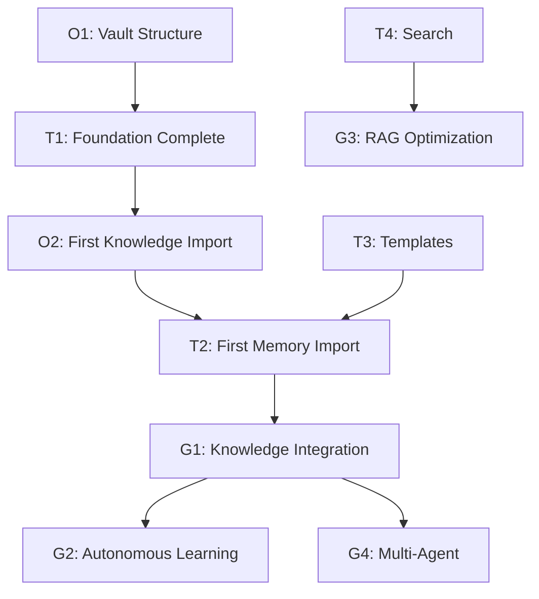

# Goals

## Overview

This document defines the **strategic objectives** for the AI Vault Memory System, organized by time horizon and priority.

---

## North Star Goal

> **Enable seamless AI continuity across sessions, platforms, and time — transforming ephemeral conversations into persistent, actionable knowledge.**

---

## Strategic Goals (12-24 Months)

### G1: Complete Knowledge Integration
- **Objective:** Integrate memory from 3+ AI platforms (ChatGPT, Claude, Gemini, Perplexity)
- **Success Metric:** 80%+ of historical conversations classified and stored
- **Key Results:**
  - [ ] Export pipeline established for each platform
  - [ ] Classification system operational (Knowledge/Projects/Procedures/Decisions/Experiences/Errors/Lessons/Preferences)
  - [ ] Deduplication logic removes 30%+ redundant content
  - [ ] Searchable knowledge graph with 1000+ nodes

### G2: Autonomous Learning
- **Objective:** System identifies patterns and generates insights without explicit prompting
- **Success Metric:** 5+ autonomous insight reports per month
- **Key Results:**
  - [ ] Pattern detection across [[04_MEMORY]]
  - [ ] Automated [[Lessons]] extraction from [[Errors]]
  - [ ] Cross-domain knowledge linking
  - [ ] Trend analysis on [[Projects]] outcomes

### G3: RAG Optimization
- **Objective:** Achieve 90%+ retrieval accuracy for context-aware responses
- **Success Metric:** <10% retrieval failures in user testing
- **Key Results:**
  - [ ] Semantic search tuned for domain vocabulary
  - [ ] Knowledge graph embeddings generated
  - [ ] Context window management optimized
  - [ ] Confidence scoring implemented

### G4: Multi-Agent Coordination
- **Objective:** Enable multiple AI instances to collaborate using shared vault
- **Success Metric:** 3+ AI platforms accessing vault simultaneously without conflicts
- **Key Results:**
  - [ ] Write-lock mechanism implemented
  - [ ] Conflict resolution protocol defined
  - [ ] Access logging operational
  - [ ] Version control for concurrent edits

---

## Tactical Goals (3-6 Months)

### T1: Foundation Complete
- **Objective:** All core folders and templates operational
- **Key Results:**
  - [x] 00_CORE structure defined
  - [ ] 01_KNOWLEDGE categories populated
  - [ ] 02_PROJECTS tracking active
  - [ ] 03_PROCEDURES documented
  - [ ] 04_MEMORY import pipeline ready
  - [ ] 05_RESOURCES curated
  - [ ] 06_INBOX workflow established

### T2: First Memory Import
- **Objective:** Successfully import and classify first AI platform export
- **Key Results:**
  - [ ] Export format standardized
  - [ ] Classification model trained (manual or automated)
  - [ ] 500+ notes imported
  - [ ] Zero data loss
  - [ ] User validation complete

### T3: Template System
- **Objective:** All note types have templates
- **Key Results:**
  - [ ] Knowledge template
  - [ ] Project template
  - [ ] Procedure template
  - [ ] Decision template
  - [ ] Experience template
  - [ ] Error template
  - [ ] Lesson template
  - [ ] Preference template

### T4: Search & Retrieval
- **Objective:** Fast, accurate search across vault
- **Key Results:**
  - [ ] Full-text search operational
  - [ ] Tag-based filtering
  - [ ] Date-range queries
  - [ ] Link traversal search
  - [ ] <2 second query response

---

## Operational Goals (1-4 Weeks)

### O1: Vault Structure Complete
- **Objective:** All folders and core files created
- **Key Results:**
  - [x] Identity.md
  - [ ] Rules.md
  - [ ] Goals.md (this file)
  - [ ] System_Architecture.md
  - [ ] All folder templates
  - [ ] RAG structure defined
  - [ ] Knowledge Graph schema

### O2: First Knowledge Import
- **Objective:** Manual import of 10-20 sample notes
- **Key Results:**
  - [ ] Test classification workflow
  - [ ] Validate template usability
  - [ ] Identify edge cases
  - [ ] Refine taxonomy

### O3: Documentation
- **Objective:** User guide for vault operations
- **Key Results:**
  - [ ] Import procedure documented
  - [ ] Classification guidelines
  - [ ] Search best practices
  - [ ] Maintenance checklist

---

## Goal Tracking

### Progress Dashboard

| Goal | Status | Progress | Next Action | Due Date |
|------|--------|----------|-------------|----------|
| G1: Knowledge Integration | 🟡 In Progress | 10% | Establish export pipeline | 2027-02-09 |
| G2: Autonomous Learning | 🔴 Not Started | 0% | Design pattern detection | 2027-05-09 |
| G3: RAG Optimization | 🔴 Not Started | 0% | Define accuracy metrics | 2027-02-09 |
| G4: Multi-Agent | 🔴 Not Started | 0% | Research lock mechanisms | 2027-08-09 |
| T1: Foundation | 🟢 On Track | 60% | Complete remaining folders | 2026-09-09 |
| T2: First Import | 🟡 In Progress | 20% | Await user exports | 2026-10-09 |
| T3: Templates | 🟢 On Track | 80% | Create remaining templates | 2026-08-16 |
| T4: Search | 🟡 In Progress | 40% | Test Obsidian search | 2026-09-09 |
| O1: Structure | 🟢 On Track | 75% | Complete this file set | 2026-08-09 |
| O2: First Import | 🟡 In Progress | 10% | Awaiting sample data | 2026-08-23 |
| O3: Documentation | 🟡 In Progress | 30% | Write import guide | 2026-08-30 |

**Legend:** 🟢 On Track | 🟡 At Risk | 🔴 Blocked/Not Started

---

## Goal Review Protocol

### Weekly Check (5 min)
- What progress was made on operational goals?
- Any blockers on tactical goals?
- Adjust priorities for next week?

### Monthly Review (30 min)
- Progress on all goals
- Update dashboard
- Re-prioritize if needed
- Archive completed goals

### Quarterly Retrospective (60 min)
- Strategic goal progress
- Goal achievement rate
- Lessons learned
- Set next quarter goals

---

## Goal Dependencies



---

## Related Files

- [[Identity]] — Why these goals exist
- [[Rules]] — How goals are pursued
- [[System_Architecture]] — Technical foundation
- [[02_PROJECTS/Goal_Tracking]] — Active project (future)
- [[04_MEMORY/Goal_History]] — Past goal reviews (future)

---

## Metadata

```yaml
---
type: core
category: goals
tags:
  - goals
  - strategy
  - planning
  - core
created: 2026-08-09
updated: 2026-08-09
status: active
---
```

---

## 🔗 Legături de Memorie & Graf Obsidian
- [[Knowledge Graph Home]]
- [[00 Core Map]]
- [[Knowledge Graph Home]]
