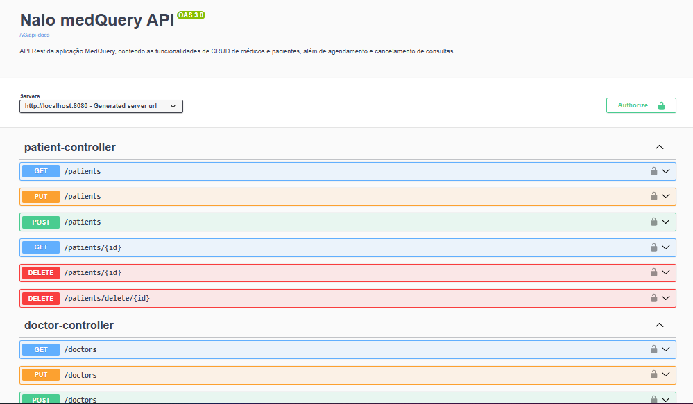

# *`Nalo`* - MedQuery


Api Rest Java com foco em Cadastro de Médicos, Pacientes e Consultas.



##  Login - Autorização Inicial

Faça o login e receba o Token para autorizar as requisições. Esta medida foi tomada apenas para garantir segurança da Aplicação

```bash
curl -X POST http://localhost:8080/login -H "Content-Type: application/json" -d '{"login":"natanleal@gmail.com","senha":"123456"}'

```

## Médicos

Cadastre um médico no endpoint `/doctors`

```json

{
  "nome": "Dr. João Silva",
  "email": "joao.silva@email.com",
  "crm": "123456",
  "especialidade": "CARDIOLOGIA", //Só pode em maíusculas
  "endereco": {
    "logradouro": "Rua das Flores",
    "bairro": "Centro",
    "cep": "40000-000",
    "cidade": "Salvador",
    "uf": "BA",
    "numero": "123",
    "complemento": "Sala 45"
  }
}

```

### Doctor's Crud - CREATE

Caso queira testar a criação de médicos no banco de dados utilize no `bash`

```bash
curl -X POST http://localhost:8080/doctors -H "Content-Type: application/json" -H "Authorization: Bearer SEU_TOKEN_AQUI" -d '{"nome":"Dr. João Silva","email":"joao.silva@email.com", "telefone":"71999999999","crm":"123456","especialidade":"CARDIOLOGIA","endereco":{"logradouro":"Rua das Flores","bairro":"Centro","cep":"40000-000","cidade":"Salvador","uf":"BA","numero":"123","complemento":"Sala 405"}}'

curl -X POST http://localhost:8080/doctors -H "Content-Type: application/json" -H "Authorization: Bearer SEU_TOKEN_AQUI" -d '{"nome":"Dra. Maria Oliveira","email":"maria.oliveira@email.com","telefone":"71888887777","crm":"654321","especialidade":"ORTOPEDIA","endereco":{"logradouro":"Av. Oceânica","bairro":"Barra","cep":"40170010","cidade":"Salvador","uf":"BA","numero":"250","complemento":"Sala 12"}}'

curl -X POST http://localhost:8080/doctors -H "Content-Type: application/json" -H "Authorization: Bearer SEU_TOKEN_AQUI" -d '{"nome":"Dr. Rafael Almeida","email":"rafael.almeida@email.com","telefone":"71966665555","crm":"112233","especialidade":"ORTOPEDIA","endereco":{"logradouro":"Rua da Graça","bairro":"Graça","cep":"40150055","cidade":"Salvador","uf":"BA","numero":"210","complemento":"Bloco B, Sala 3"}}'

curl -X POST http://localhost:8080/doctors -H "Content-Type: application/json" -H "Authorization: Bearer SEU_TOKEN_AQUI" -d '{"nome":"Dr. Carlos Menezes","email":"carlos.menezes@email.com","telefone":"71988886666","crm":"789012","especialidade":"DEMARTOLOGIA","endereco":{"logradouro":"Rua Almirante Barroso","bairro":"Rio Vermelho","cep":"41950000","cidade":"Salvador","uf":"BA","numero":"98","complemento":"Sala 203"}}'


```

### Doctor's cRud - READ

Caso queira ler os médicos que estão no banco de dados pelo `bash`. Observação: Os dados sensíveis como endereço e telefone serão ocultados nesta listagem

```bash
curl -X GET -H "Authorization: Bearer SEU_TOKEN_AQUI" http://localhost:8080/doctors

# Requisição GET com paginação que limita tamanho e diz a página do registro 
curl -X GET -H "Authorization: Bearer SEU_TOKEN_AQUI" http://localhost:8080/doctors?size=1&page=1

# Requisição GET ordenada pelo atributo crm da entidade
curl -X GET -H "Authorization: Bearer SEU_TOKEN_AQUI" http://localhost:8080/doctors?sort=crm

# Consultar apenas do médico 1
curl -X GET -H "Authorization: Bearer SEU_TOKEN_AQUI" http://localhost:8080/doctors/1
```

---

### Doctor's crUd - UPDATE

Caso queira atualizar as informações dos médicos. Observação só pode ser alterado ---> nome, telefone e endereço

```bash
curl -X PUT http://localhost:8080/doctors -H "Content-Type: application/json" -H "Authorization: Bearer SEU_TOKEN_AQUI" http://localhost:8080/doctors -d '{"id":1, "nome":"João Castro da Silva"}'

curl -X PUT http://localhost:8080/doctors -H "Content-Type: application/json" -H "Authorization: Bearer SEU_TOKEN_AQUI" http://localhost:8080/doctors -d '{ "id": 2, "nome":"Maria Souza Oliveira", "telefone":"8199999999" }'

```

### Doctor's cruD - DELETE

Se quiser deletar lógicamente-torna o médico inativo no sistema mas não apaga seus registros utilize

```bash
# Utilize no {id} o ID do médico que deseja inativar
curl -X DELETE -H "Authorization: Bearer SEU_TOKEN_AQUI" http://localhost:8080/doctors/{id}

```

---

Para apagar totalmente do Banco de Dados `Mysql` utilize este enpoint. Observação: Cuidado pois uma vez apagada não há volta atrás...

```bash
# Nesta requisição vc apaga totalmente os registros do médico então cuidado
curl -X DELETE -H "Authorization: Bearer SEU_TOKEN_AQUI" http://localhost:8080/doctors/delete/{id}
```

---

## Pacientes

quando quiser criar um paciente no banco de dados

```json
{
  "nome": "Manoel Bandeiras",
  "email": "manoel.band@email.com",
  "cpf": "00000000000",
  "telefone": "71999998888",
  "endereco": {
    "logradouro": "Rua das Louças",
    "bairro": "Centro Asa Norte",
    "cep": "70000000",
    "cidade": "Salvador",
    "uf": "BA",
    "numero": "123",
    "complemento": "Mansão Loures Gusman"
  }
}
```

### Patient's Crud - CREATE 

utilize este `curl` para criar registros de clientes com seus respectivos dados:

```bash
curl -X POST http://localhost:8080/patients -H "Content-Type: application/json" -H "Authorization: Bearer SEU_TOKEN_AQUI" -d '{"nome":"Manoel Bandeiras","email":"manoel.band@email.com","cpf":"00000000000","telefone":"71999998888","endereco":{"logradouro":"Rua das Louças","bairro":"Centro Asa Norte","cep":"70000000","cidade":"Salvador","uf":"BA","numero":"123","complemento":"Mansão Loures Gusman"}}'

curl -X POST http://localhost:8080/patients -H "Content-Type: application/json" -H "Authorization: Bearer SEU_TOKEN_AQUI" -d '{"nome":"Ana Paula Souza","email":"ana.souza@email.com","cpf":"12345678901","telefone":"71988887777","endereco":{"logradouro":"Av. Sete de Setembro","bairro":"Vitória","cep":"40080000","cidade":"Salvador","uf":"BA","numero":"1500","complemento":"Apto 302"}}'

curl -X POST http://localhost:8080/patients -H "Content-Type: application/json" -H "Authorization: Bearer SEU_TOKEN_AQUI" -d '{"nome":"Carlos Eduardo Lima","email":"carlos.lima@email.com","cpf":"98765432100","telefone":"71977776666","endereco":{"logradouro":"Rua do Comércio","bairro":"Comércio","cep":"40010000","cidade":"Salvador","uf":"BA","numero":"45","complemento":"Sala 801"}}'
```

### Patient's cRud - READ

quando quiser ler os pacientes que estão cadastrados e ativos no banco de dados, utilize:

```bash
curl -X GET -H "Authorization: Bearer SEU_TOKEN_AQUI" http://localhost:8080/patients

# Ou consulte apenas um médico trocando {id} pelo id do médico 
curl -X GET -H "Authorization: Bearer SEU_TOKEN_AQUI" http://localhost:8080/patients/{id}
```

### Patient's crUd - UPDATE

Caso queira atualizar dados de um paciente, escolhar seu ID e faça a alteração

```bash
curl -X PUT http://localhost:8080/patients -H "Content-Type: application/json" -H "Authorization: Bearer SEU_TOKEN_AQUI" -d '{"id":1, "nome":"Manoel Bandeira Torres Azevedo"}'
```

### Patient's cruD - DELETE

Se quiser deletar lógicamente---> torna o Paciente inativo no sistema mas não apaga seus registros utilize

```bash
# Utilize no {id} o ID do médico que deseja inativar
curl -X DELETE -H "Authorization: Bearer SEU_TOKEN_AQUI" http://localhost:8080/patients/{id}
```

Para apagar totalmente do Banco de Dados `Mysql` utilize este enpoint. Observação: Cuidado pois uma vez apagada não há volta atrás...

```bash
# Nesta requisição vc apaga totalmente os registros do médico então cuidado
curl -X DELETE -H "Authorization: Bearer SEU_TOKEN_AQUI" http://localhost:8080/patients/delete/{id}
```

## Consultas 

### Agendar

você poderá agendar caso o paciente/médico exista e esteja ativo no sistema. Além do mais caso o médico não seja escolhido será escolhido por recomendação inteligente do sistema. Só é possível agendar com no mínimo 30 minutos de antecedência.

```bash
curl -X POST http://localhost:8080/appointments -H "Authorization: Bearer SEU_TOKEN_AQUI" -H "Content-Type: application/json" -d '{"doctorId":1,"patientId":2,"dia":"2026-02-10T14:30:00"}'

# Caso você queira que o sistema escolha o médico para você baseado na especialidade
curl -X POST http://localhost:8080/appointments -H "Authorization: Bearer SEU_TOKEN_AQUI" -H "Content-Type: application/json" -d '{"especialidade": "CARDIOLOGIA","patientId":2,"dia":"2026-02-10T14:30:00"}'
```

### Cancelamento

Você poderá cancelar consultas baseadas no seu ID (Obs: Cancelamento de consultas não mais serão inativas, mas serão deletadas do banco)

```curl
curl -X POST http://localhost:8080/appointments/{id} -H "Authorization: Bearer SEU_TOKEN_AQUI"'
```


## Configurações do Projeto MySQL

```bash

make db-shell

```

utilize este comandos para ver a tabela doctors

```bash
use medquery 

show tables; 

desc doctors;
```

---

Projeto desenvolvido por: Natan Leal(Nalo)