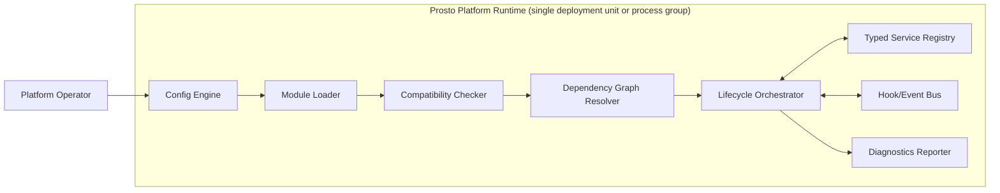

# 01 Architecture Baseline

Date: 2026-03-24  
Status: Draft revised

## 1. Mission
`prosto-platform` is a headless, extensible platform where the core runtime remains minimal and stable, while feature growth happens through plugin modules and adapters.

## 2. Architecture Drivers

### Functional Drivers
- Load modules from explicit configuration and initialize them in deterministic order.
- Provide typed extension points (services, hooks, events).
- Support optional adapters (HTTP, persistence, queue, auth) without coupling the kernel to a specific framework.
- Expose operational diagnostics about loaded, skipped, and failed modules.

### Non-Functional Drivers
- Strict TypeScript contracts and runtime validation at boundaries.
- Security-first module loading and configuration validation.
- Low-coupling architecture supporting independent module release cadence.
- Predictable startup and shutdown behavior.
- Strong testability (unit, integration, contract tests).

## 3. Constraints
- Node.js runtime (`>=22`) and ESM project mode.
- TypeScript strict mode for all packages.
- Micro-core boundary: kernel must not own domain features.
- External module repositories are a first-class model.
- Security classification and compatibility metadata are mandatory for modules.

## 4. In Scope
- Runtime architecture for SDK, core kernel, adapter interfaces, and modules.
- Lifecycle and compatibility governance.
- Module loading flow and security controls.
- Observability baseline and quality gates.
- Admin integration architecture for hybrid model: shell + UI plugins contracts, discovery flow, and policy boundaries.

## 5. Out Of Scope
- Concrete domain modules implementation details.
- Admin shell runtime implementation details and frontend technology choices.
- Vendor-specific infra implementation scripts.
- Direct UI rendering concerns inside `platform-core`.

## 6. System Context Summary
- Platform operators run and configure the runtime.
- Module developers publish modules as independent packages.
- Client applications access the platform through adapters (for example HTTP).
- External systems are integrated by modules/adapters, not by kernel.

Detailed context: [C4-01 System Context](./c4/01-system-context.md)

## 7. Core Principles
- Keep kernel responsibilities explicit and small.
- Prefer contracts over conventions.
- Treat module load as a controlled pipeline: discover -> validate -> resolve -> initialize -> persistence -> start.
- Fail fast for security-critical misconfiguration.
- Keep framework specifics in adapters.
- Optimize for operability: structured logs, startup report, deterministic shutdown.

Related decisions:
- [ADR-0001](./adr/ADR-0001-micro-core-kernel-boundary.md)
- [ADR-0003](./adr/ADR-0003-module-loading-security-allowlist-integrity.md)
- [ADR-0004](./adr/ADR-0004-lifecycle-orchestration-and-startup-policies.md)

## 8. Conceptual Runtime Model

## 9. Quality Attribute Scenarios (Architecture Targets)

| Quality Attribute | Scenario | Target | Design Tactics |
|---|---|---|---|
| Security | Untrusted module artifact is referenced in config | Module is rejected before lifecycle start | Allowlist, integrity checks, schema validation, policy gates |
| Compatibility | Module built against incompatible SDK/core range | Startup blocks incompatible module with explicit reason | Semver checks, peer dependency policy, manifest version range |
| Availability | Optional module fails during startup | Runtime starts in `best-effort` mode and reports degraded state | Startup policy switch + module criticality flag |
| Reliability | Critical module fails during startup | Runtime refuses to start in `strict` mode | Deterministic fail-fast rule |
| Performance | Boot with medium module set | Bounded startup with dependency graph caching | Cached graph, reduced sync I/O, optional parallel init where safe |
| Operability | Incident debugging required | Operator receives startup report and structured error metadata | Correlation IDs, startup diagnostics, standardized error model |
| Maintainability | Add new adapter framework | No kernel code changes required | Stable adapter interfaces and explicit extension points |
| Testability | Validate module contract before release | Contract tests fail module CI on incompatibility | Shared contract test package, compatibility matrix |

## 10. Security Baseline
- Validate module manifests against versioned schema.
- Validate environment/config at startup and block unsafe defaults.
- Redact secrets from logs and diagnostics payloads.
- Record loaded modules with id/version/security class in startup report.
- Distinguish trusted vs third-party reviewed module categories.

See:
- [DFD-03 Module Loading L2](./dfd/03-module-loading-l2.md)
- [ADR-0003](./adr/ADR-0003-module-loading-security-allowlist-integrity.md)

## 11. Performance Baseline
- No heavy framework in kernel path.
- Minimize startup hot path overhead.
- Cache dependency graph resolution.
- Limit lifecycle side effects and make them explicit by phase.
- Track startup timing and hook/event dispatch metrics.

See:
- [C4-03 Core Component View](./c4/03-component-view-kernel.md)
- [ADR-0005](./adr/ADR-0005-core-runtime-stack-validation-and-logging.md)

## 12. Operability Baseline
- Structured logs (`moduleId`, `phase`, `correlationId`, `errorCode`).
- Health/readiness surfaces exposed by adapter layer.
- Startup report includes loaded/skipped modules and reasons.
- Graceful shutdown with bounded timeout and stop-order control.

See:
- [SEQ-03 Graceful Shutdown](./sequence/03-graceful-shutdown.md)
- [ADR-0007](./adr/ADR-0007-observability-and-operability-baseline.md)

## 13. Architecture Fitness Functions

Fitness functions are automated architecture assertions that protect the micro-core model from erosion.

| Function ID | Assertion | Measurement Point | Failing Condition | Enforcement Surface |
|---|---|---|---|---|
| FF-01 | Kernel boundary remains clean | CI dependency graph | `platform-core` imports adapters/modules | `lint:architecture` + dependency graph check |
| FF-02 | Module coupling stays contract-only | Static import policy scan | Module direct import to another module internals | `validate:dependency-policy` |
| FF-03 | Lifecycle determinism holds | Integration test suite | Non-deterministic start/stop order under same config | `test:lifecycle-determinism` |
| FF-04 | Startup diagnostics completeness | Bootstrap validation tests | Missing module failure reason or missing correlation metadata | `validate:runtime-policy` |
| FF-05 | Compatibility governance is active | Contract and matrix tests | Module accepted without compatible SDK/core range evidence | `test:contracts` + compatibility matrix validation |

## 14. SLO and Error Budget Policy

Architecture-level SLO baselines used for release gating:

| SLO Domain | Indicator | Target Baseline | Error Budget Rule |
|---|---|---|---|
| Startup Reliability | Successful strict-mode startup for approved module set | >= 99.5% over rolling release window | Budget burn > 50% blocks non-critical architecture changes |
| Startup Latency | Runtime bootstrap duration for reference module set | p95 <= agreed platform threshold | Budget burn triggers mandatory startup optimization plan |
| Lifecycle Stability | Unplanned critical module stops after successful start | = 0 in production grade environments | Any violation triggers incident review and gate freeze |
| Compatibility Safety | Incompatible module set reaching deploy stage | = 0 | Any violation blocks release and requires policy fix |
| Observability Completeness | Startup report and lifecycle telemetry presence | 100% required fields available | Missing required telemetry blocks release gate |

Error budget governance:
- Budget policy is evaluated in release gates and post-incident reviews.
- Repeated budget overrun requires architecture review before new capabilities are enabled.
- Stage transition in [`03 Architecture Evolution Path`](./03-architecture-evolution-path.md) requires healthy budget trend.

## 15. ADR Lifecycle and Governance

ADR discipline is mandatory to preserve architectural intent:

| ADR State | Meaning | Entry Criteria | Exit Criteria |
|---|---|---|---|
| Proposed | Candidate architectural decision | Driver and alternatives documented | Accepted or Rejected by architecture review |
| Accepted | Active decision and policy source | Review approved and traceability linked | Superseded, Deprecated, or Rejected |
| Superseded | Replaced by newer ADR | New ADR explicitly references replacement | Archived with migration notes |
| Deprecated | No longer recommended for new work | Decision still partially active but sunset planned | Removed after migration completion |
| Rejected | Decision evaluated and declined | Context and rationale recorded | None |

Governance rules:
- Every cross-package boundary change must reference an ADR.
- Release notes must include ADR impact when behavior contracts change.
- CI policy checks and architecture docs must stay traceable to accepted ADRs.

## 16. Risks And Mitigations

| Risk | Impact | Mitigation |
|---|---|---|
| Contract drift between core and external modules | Runtime instability | SDK semver governance + contract test package |
| Overgrowth of kernel responsibilities | Loss of modularity | Enforce boundary ADR and package ownership rules |
| Hidden side effects in module imports | Startup unpredictability | Policy: no side effects at import time + lint/test checks |
| Inconsistent module quality across repos | Support burden | Repository template, CI policy, compatibility matrix |
| Security gaps in third-party modules | Vulnerability exposure | Security classification, review status, allowlist-only production |

## 17. Implementation Alignment
This baseline maps directly to roadmap phases in research document 06:
- Contracts first -> SDK and manifest schema.
- Minimal kernel -> loader, lifecycle, compatibility.
- First adapter and sample modules -> runtime reference.
- Ecosystem governance -> module catalog and CI standards.
- Hardening -> performance budgets and chaos/failure testing.

Roadmap source: [Research 06](../01-research/06-implementation-roadmap.md)

## Revision History

| Date       | Version | Change        | Author            |
|------------|---------|---------------|-------------------|
| 2026-03-24 | 0.1     | Initial draft | Architecture Team |
