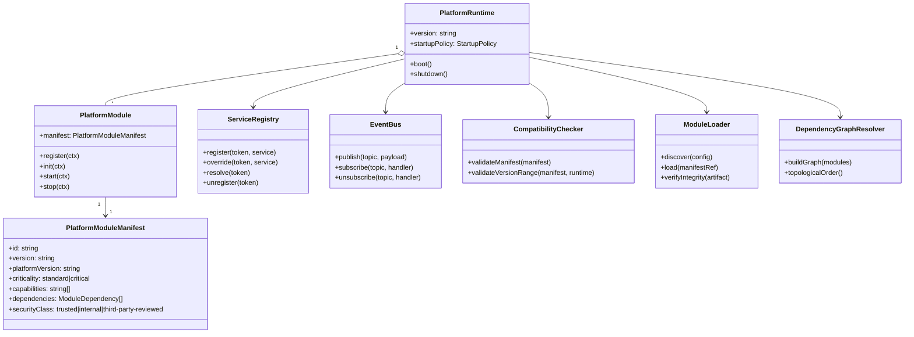
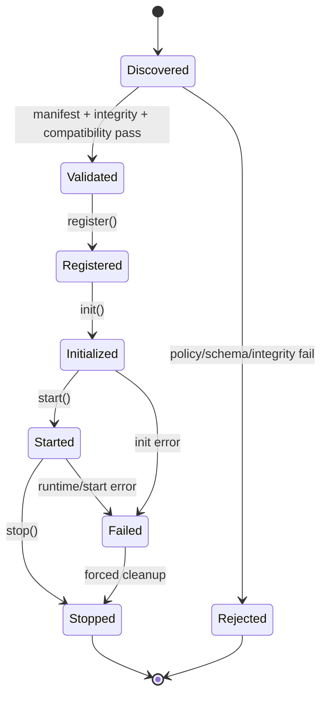

# 02 Domain And Capability Model

Date: 2026-03-24  
Status: Draft revised

## 1. Domain Concepts

| Concept | Purpose | Owner |
|---|---|---|
| Platform Runtime | Hosts kernel, adapters, and loaded modules | Platform Operator |
| Platform SDK | Contract package with interfaces/types/errors/tokens | Platform Core Team |
| Module Manifest | Declares identity, compatibility, dependencies, capabilities | Module Developer |
| Module | Executable plugin implementing lifecycle contract | Module Developer |
| Adapter | Integration package (HTTP, DB, queue, auth) outside kernel | Platform/Module Team |
| Service Token | Typed service identity in shared registry | Kernel and modules |
| Hook/Event | Extension and communication mechanism across modules | Kernel and modules |
| Startup Policy | Runtime boot behavior (`strict` or `best-effort`) | Platform Operator |
| Module Catalog | Governance registry of support/security/compatibility state | Platform Governance |

## 2. Core Domain Model

## 3. Capability Taxonomy

Capabilities are explicit manifest-level declarations used for routing, dependency checks, and policy control.

| Capability Category | Examples | Why It Exists |
|---|---|---|
| Runtime Lifecycle | `lifecycle.register`, `lifecycle.start` | Module orchestration and diagnostics |
| Transport | `transport.http`, `transport.queue` | Adapter-specific request/message entry points |
| Domain Feature | `feature.content`, `feature.auth`, `feature.catalog` | Discoverability and routing decisions |
| Integration | `integration.payment`, `integration.crm` | External connector governance |
| Security | `security.rbac`, `security.audit` | Policy checks and review requirement |
| Observability | `obs.metrics`, `obs.tracing` | Operational visibility and SLO alignment |

Related decision: [ADR-0002](./adr/ADR-0002-sdk-contract-and-semver-governance.md)

## 4. Lifecycle State Model

## 5. Service Registry Model
- The registry is keyed by typed tokens exported from SDK.
- Registration happens during `register`.
- Resolution happens during `init/start/request handling`.
- Collisions are treated as configuration/runtime errors unless explicitly defined as multi-binding extension points.

## 6. Event And Hook Model
- Hooks are ordered extension points with bounded contracts (for example `beforeStart`).
- Events are asynchronous notifications for cross-module collaboration.
- Kernel guarantees event envelope metadata (`timestamp`, `correlationId`, `producerModuleId`, `schemaVersion`).
- Modules must not rely on undocumented ordering except where hook contract states explicit priority semantics.

## 7. Startup Policy Model

| Policy | Critical Module Failure | Non-Critical Module Failure | Runtime Outcome |
|---|---|---|---|
| `strict` | Fail startup | Fail startup (unless explicitly configurable exception) | Runtime not started |
| `best-effort` | Fail startup | Skip failed module and continue | Runtime started in degraded mode |

Related decision: [ADR-0004](./adr/ADR-0004-lifecycle-orchestration-and-startup-policies.md)

## 8. Module Governance Metadata

Required governance metadata in manifest/catalog entry:
- `id`, `version`, `platformVersion`
- `securityClass`
- `supportStatus` (for catalog)
- `compatibilityRange`
- optional checksum/signature metadata for artifact validation

Related decisions:
- [ADR-0003](./adr/ADR-0003-module-loading-security-allowlist-integrity.md)
- [ADR-0006](./adr/ADR-0006-external-module-repository-and-distribution-model.md)

## 9. Domain Model To View Mapping
- Context and actor relationships: [C4-01](./c4/01-system-context.md)
- Runtime container boundaries: [C4-02](./c4/02-container-view.md)
- Kernel internals and module lifecycle: [C4-03](./c4/03-component-view-kernel.md)
- Data movement: [DFD-02](./dfd/02-runtime-l1.md), [DFD-03](./dfd/03-module-loading-l2.md)
- Temporal behavior: [SEQ-01](./sequence/01-bootstrap-lifecycle.md)

## Revision History

| Date       | Version | Change        | Author            |
|------------|---------|---------------|-------------------|
| 2026-03-24 | 0.1     | Initial draft | Architecture Team |
