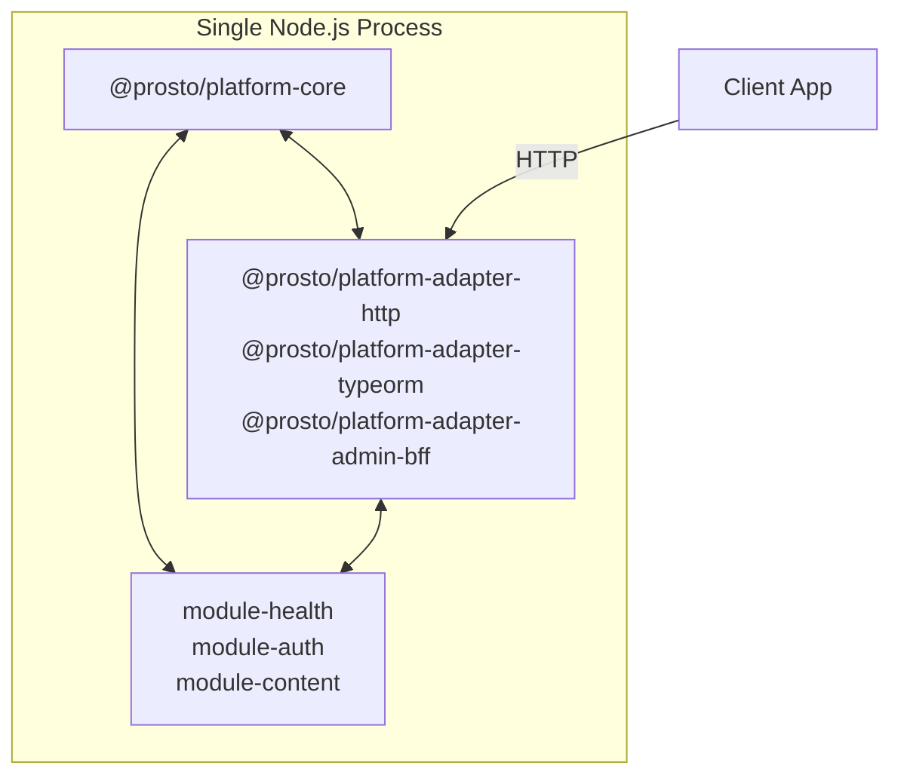
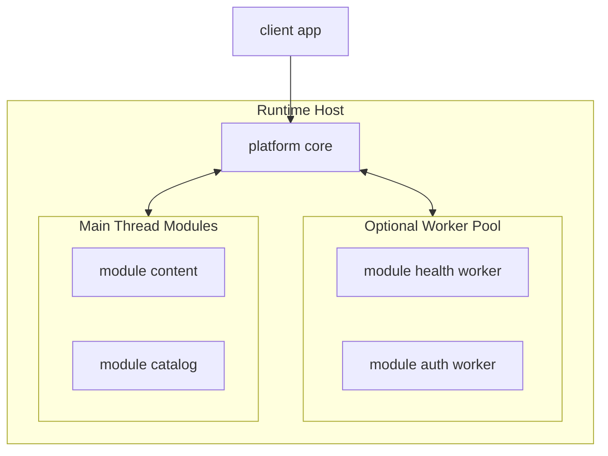

# 03 Architecture Evolution Path (Optional)

Date: 2026-03-25  
Status: Draft revised

## Purpose

This document defines how `prosto-platform` evolves from a single runtime to a modular monolith while preserving core architectural invariants from ADR decisions.

The evolution model is **driver-based**, not team-size-based. Transition between stages is triggered by measurable architecture drivers, SLO pressure, and governance requirements.

## Evolution Stages Overview


## Stage 1 Monolithic Runtime

### Characteristics
- Single deployment unit with kernel, adapters, and modules.
- All modules execute in one Node.js process.
- Minimal operational overhead and fastest implementation feedback.
- Primary target for initial platform hardening.

### Architecture



### Stay Criteria
- Startup and shutdown are deterministic under target load.
- Isolation requirements are satisfied by process boundaries.
- SLO and recovery objectives are met without per-module isolation.

### Transition Triggers to Stage 2
- Need for strict internal boundaries and anti-coupling enforcement.
- Module lifecycle failures require finer-grained containment.
- Governance requires explicit module contracts and compatibility controls.

---

## Stage 2 Modular Monolith

### Characteristics
- Single deployable runtime remains primary topology.
- Module boundaries become strictly enforceable by contracts and policies.
- Optional execution isolation for selected modules using worker threads.
- Per-module diagnostics and policy checks become mandatory.

### New Capabilities

| Capability | Description |
|---|---|
| Contract-governed boundaries | Module-to-module direct imports are blocked by policy |
| Optional thread isolation | Untrusted or high-risk modules may run in worker threads |
| Per-module diagnostics | Metrics and lifecycle events include module identity |
| Runtime policy gates | Startup can enforce strict or best-effort policy by environment |

### Architecture



### Stay Criteria
- Single runtime topology still meets scale and availability goals.
- Isolation is required only for selected modules.
- Cross-module workflows remain manageable without network hops.

---

## Architecture Invariants

The following invariants apply at all stages:

| Invariant | Description |
|---|---|
| Contract stability | SDK contracts remain backward compatible inside major version |
| Kernel lifecycle authority | Kernel controls lifecycle ordering and policy gates |
| Security boundary | Allowlist and integrity controls are never relaxed in production |
| Module isolation | No direct module internal state access across boundaries |
| Structured observability | Diagnostics and lifecycle telemetry remain mandatory |

---

## Architecture Compliance and Anti-Erosion Controls

### Risks and Controls

| Risk | Control |
|---|---|
| Kernel scope creep | Dependency boundary checks enforced in CI |
| Module coupling | Policy checks block direct module imports |
| Hidden dependencies | Dependency graph validation and cycle detection |
| Security drift | Allowlist and integrity policy verification in startup and CI |
| Operational blind spots | Required lifecycle telemetry and startup report gates |

### Policy Checks

```yaml
architecture_policy:
  kernel_boundary:
    deny_dependencies:
      - packages platform adapter
      - modules
  module_coupling:
    deny_direct_imports:
      - modules to modules
  security_loading:
    require_allowlist: true
    require_integrity: true
  observability:
    require_startup_report: true
    require_lifecycle_metrics: true
```

```bash
# Example CI checks
npm run lint:architecture
npm run test:contracts
npm run validate:module-graph
npm run validate:runtime-policy
```

---

## Scaling Dimensions

| Dimension | Stage 1 | Stage 2 |
|---|---|---|
| Deployment topology | Single runtime | Single runtime with strict modular boundaries |
| Isolation model | Process-level | Contract plus optional worker isolation |
| Release scope | Platform release | Platform release with module policy gates |
| Observability depth | Structured logs | Logs plus per-module metrics |
| Governance complexity | Low | Medium |

---

## Decision Gates

### Gate G1 Runtime Hardening
- Validate deterministic lifecycle and startup diagnostics.
- Confirm boundary and dependency policies are enforceable.

### Gate G2 Isolation Hardening
- Classify module criticality and trust classes.
- Enable optional worker isolation only for justified modules.

---

## Related Documents

- [ADR-0001 Micro-Core Kernel Boundary](./adr/ADR-0001-micro-core-kernel-boundary.md)
- [ADR-0003 Module Loading Security](./adr/ADR-0003-module-loading-security-allowlist-integrity.md)
- [ADR-0006 External Module Repository Model](./adr/ADR-0006-external-module-repository-and-distribution-model.md)
- [ADR-0007 Observability and Operability Baseline](./adr/ADR-0007-observability-and-operability-baseline.md)
- [C4-04 Deployment View](./c4/04-deployment-view.md)

---

## Revision History

| Date       | Version | Change        | Author            |
|------------|---------|---------------|-------------------|
| 2026-03-25 | 0.1     | Initial draft | Architecture Team |
