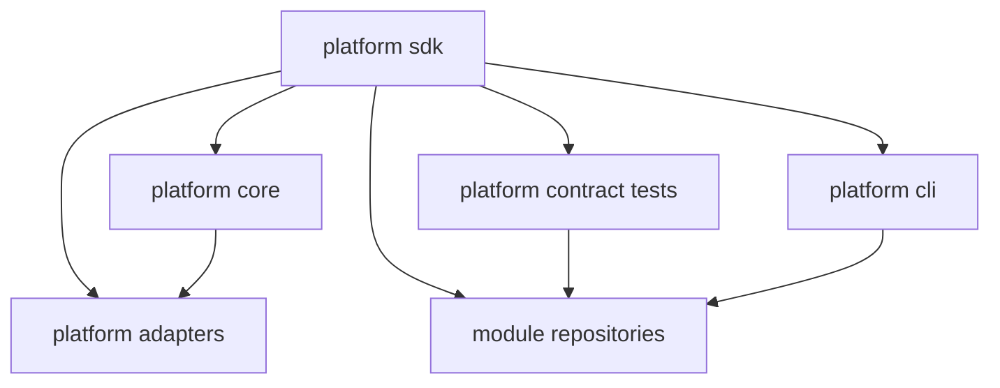

# 04 Package Structure Blueprint

Date: 2026-03-25
Status: Draft revised

## Purpose

This document defines repository and package structure for `prosto-platform`, including dependency boundaries, build orchestration, and module integration contracts.

Primary goal: preserve micro-core boundaries from ADR while enabling independent module evolution.

## Repository Strategy

### Core Platform Repository

Core packages live in the `prosto-platform` monorepo under `packages/`.

```
prosto-platform/
├── packages/
│   ├── platform-sdk/                    # Contract package (types, interfaces, tokens)
│   ├── platform-core/                   # Runtime kernel
│   ├── platform-adapters/
│   │   ├── platform-adapter-typeorm/    # TypeORM persistence adapter (shared DataSource)
│   │   ├── platform-adapter-http/       # HTTP adapter (Fastify/Express abstraction)
│   │   ├── platform-adapter-auth-oidc/  # OIDC bearer authentication adapter
│   │   ├── platform-adapter-aes-key-ring/ # AES-256-GCM secret-cipher adapter
│   │   ├── platform-adapter-auth-oidc-session/ # Browser OIDC session adapter
│   │   ├── platform-adapter-auth-local/ # Local authentication adapter
│   │   └── platform-adapter-admin-bff/  # Admin BFF adapter for policy-aware aggregation
│   ├── platform-contract-tests/         # Shared contract test suite
│   ├── platform-cli/                    # CLI tooling for module development
│   ├── platform-admin-contracts/        # Admin shell and UI plugin contracts
│   └── platform-admin-shell/            # Admin UI runtime
│
├── examples/
│   ├── module-health/                   # Example module: health check endpoint
│   ├── module-auth/                     # Example module: basic auth
│   └── module-content/                  # Example module: content management
│
├── tools/
│   ├── eslint-config/                   # Shared ESLint configuration
│   ├── tsconfig/                        # Shared TypeScript configuration
│   └── scripts/                         # Build and release scripts
│
└── docs/
    └── ...
```

### Module Repositories

Feature modules are developed in separate repositories.

```
prosto-systems/
├── prosto-module-health/              # github.com/prosto-systems/prosto-module-health
├── prosto-module-auth/
├── prosto-module-content/
├── prosto-module-catalog/
├── prosto-module-media/
├── prosto-module-seo/
├── prosto-module-analytics/
└── prosto-module-ecommerce/
```

### Third-Party Modules

External organizations can create compatible modules:

```
other-org/
└── prosto-module-custom/       # Must implement PlatformModule contract
```

---

## Package Definitions

### `@prosto/platform-sdk`

**Purpose**: contract authority for module API, lifecycle interfaces, tokens, and shared validation primitives.

**Directory**: `packages/platform-sdk/`

```
platform-sdk/
├── src/
│   ├── index.ts
│   ├── types/
│   │   ├── manifest.types.ts
│   │   ├── lifecycle.types.ts
│   │   ├── context.types.ts
│   │   └── error.types.ts
│   ├── interfaces/
│   │   ├── platform-module.interface.ts
│   │   ├── service-registry.interface.ts
│   │   └── event-bus.interfaces.ts
│   ├── tokens/
│   │   ├── service.tokens.ts
│   │   └── event.tokens.ts
│   ├── validation/
│   │   ├── manifest.schema.ts
│   │   └── semver.rules.ts
│   └── testing-helpers/
│       ├── mocks.ts
│       └── fixtures.ts
├── package.json
├── tsconfig.json
└── README.md
```

**Dependency policy**:
- Keep external runtime dependencies minimal and justified.
- Prefer TypeScript and platform-native APIs where possible.
- Any new dependency requires architecture review because SDK is the ecosystem contract root.

**Exports scope**:
- Contracts: interfaces and types.
- Tokens: typed service and event identifiers.
- Validation primitives: schema and semver helpers.
- Testing helpers only: mocks and fixtures.

`platform-sdk` does **not** own full contract conformance test suites.

---

### `@prosto/platform-core`

**Purpose**: runtime kernel for module loading, compatibility checks, lifecycle orchestration, policy enforcement, and diagnostics.

**Directory**: `packages/platform-core/`

```
platform-core/
├── src/
│   ├── index.ts
│   ├── bootstrap/
│   ├── config/
│   ├── loader/
│   ├── compatibility/
│   ├── graph/
│   ├── lifecycle/
│   ├── registry/
│   ├── events/
│   ├── policy/
│   ├── diagnostics/
│   └── errors/
├── package.json
├── tsconfig.json
└── README.md
```

**Dependencies**:
- `@prosto/platform-sdk`
- runtime libs required by ADR baselines such as validation and logging libraries

`platform-core` must not import feature modules or adapter implementations directly.

---

### `@prosto/platform-contract-tests`

**Purpose**: reusable conformance suite executed by module repositories and CI.

**Directory**: `packages/platform-contract-tests/`

```
platform-contract-tests/
├── src/
│   ├── index.ts
│   ├── lifecycle/
│   ├── manifest/
│   ├── security/
│   └── observability/
├── package.json
└── README.md
```

**Responsibility boundary**:
- `platform-contract-tests`: authoritative conformance tests.
- `platform-sdk/testing-helpers`: fixtures and mocks only.

**Usage in module repository**:

```typescript
import { createModuleContractTests } from '@prosto/platform-contract-tests';
import { MyModule } from '../src/my-module';

describe('Module Contract Compliance', () => {
  createModuleContractTests(new MyModule());
});
```

---

### `@prosto/platform-cli`

**Purpose**: tooling for scaffolding, validation, and developer workflows.

**Directory**: `packages/platform-cli/`

```
platform-cli/
├── src/
│   ├── index.ts
│   ├── commands/
│   ├── generators/
│   └── templates/
├── package.json
└── README.md
```

**Usage**:

```bash
# Create new module
npx @prosto/platform-cli create module my-module

# Validate module manifest
npx @prosto/platform-cli validate ./module-manifest.json

# Run contract tests
npx @prosto/platform-cli test ./my-module

# Check environment
npx @prosto/platform-cli doctor
```

---

### `@prosto/platform-admin-contracts`

**Purpose**: contract authority for hybrid admin model, including admin shell discovery payloads and UI plugin extension manifests.

**Directory**: `packages/platform-admin-contracts/`

```text
platform-admin-contracts/
├── src/
│   ├── index.ts
│   ├── manifests/
│   │   ├── ui-plugin-manifest.types.ts
│   │   └── ui-plugin-manifest.schema.ts
│   ├── discovery/
│   │   ├── admin-discovery.types.ts
│   │   └── admin-discovery.schema.ts
│   ├── permissions/
│   │   └── admin-permissions.types.ts
│   └── compatibility/
│       └── admin-shell-compatibility.rules.ts
├── package.json
└── README.md
```

**Boundary rules**:
- Keep this package framework-neutral and transport-neutral.
- Keep only contracts, schemas, and compatibility semantics.
- Do not place rendering/runtime frontend code in this package.

---

### `@prosto/platform-adapter-admin-bff`

**Purpose**: policy-aware admin aggregation adapter for shell discovery, permission-aware actions, and diagnostics.

**Directory**: `packages/platform-adapters/platform-adapter-admin-bff/`

```text
platform-adapters/platform-adapter-admin-bff/
├── src/
│   ├── index.ts
│   ├── discovery/
│   ├── permissions/
│   ├── routes/
│   ├── diagnostics/
│   └── compatibility/
├── package.json
└── README.md
```

**Boundary rules**:
- May depend on `@prosto/platform-sdk` and `@prosto/platform-admin-contracts`.
- Must not introduce compile-time coupling from `platform-core` to admin shell runtime.
- Must expose diagnostics for rejected UI plugins and policy decisions.

---

### Adapter Packages

**Purpose**: integration boundaries for transport and infrastructure concerns.

Example `platform-adapter-http`:

```
platform-adapters/platform-adapter-http/
├── src/
│   ├── index.ts
│   ├── http.adapter.ts             # Framework abstraction
│   ├── request.handler.ts          # Request routing
│   ├── response.mapper.ts          # Response formatting
│   ├── middleware.registry.ts      # Middleware management
│   └── http.types.ts               # Type definitions
├── package.json
└── README.md
```

Adapters may depend on `platform-sdk` and framework-specific dependencies, while preserving boundary contracts.

---

## Ownership and Decision Boundaries

Ownership map clarifies who can approve contract and boundary changes.

| Area | Primary Owner | Required Co-Approval | Typical Change Types |
|---|---|---|---|
| `platform-sdk` contracts | Platform Core Team | Architecture Team | Public types, interfaces, tokens, schema primitives |
| `platform-core` kernel policies | Core Runtime Team | Architecture Team | Lifecycle ordering, loading policy, diagnostics model |
| `platform-admin-contracts` | Admin Platform Team | Architecture Team | Discovery contracts, UI plugin manifest schema, permission model |
| `platform-contract-tests` | QA and Quality Team | Platform Core Team | Conformance suites, compatibility assertions |
| `platform-adapter-admin-bff` | Admin Platform Team | Core Runtime Team | Admin discovery aggregation, policy and diagnostics mapping |
| `platform-adapter-*` | Adapter Owners | Core Runtime Team | Transport and infrastructure integration boundaries |
| `platform-cli` | DevEx Team | Platform Core Team | Generators, validators, governance automation |
| External module templates | DevRel Team | Platform Core Team | Onboarding assets, module skeleton, best practices |

Boundary decisions that impact public contracts require ADR reference and compatibility statement.

## API Stability Levels

Public surfaces must be marked with explicit stability level in package docs:

| Level | Meaning | Compatibility Commitment | Allowed Consumers |
|---|---|---|---|
| Stable | Default public contract | Backward compatible within major line | All modules and adapters |
| Beta | Candidate public contract | May evolve in minor releases with migration notes | Early adopters by opt-in |
| Experimental | Exploration surface | No compatibility guarantee | Internal use and controlled pilots |
| Internal | Not public API | Can change without notice | Package maintainers only |

Labeling rules:
- Every export in `@prosto/platform-sdk` must be tagged with one stability level.
- `platform-core` internals are `Internal` unless explicitly promoted via SDK.
- Beta and Experimental contracts require sunset or promotion criteria in release notes.

## Dependency Rules

### Allowed Dependencies Matrix

| Package | Can Depend On | Cannot Depend On                                   |
|---|---|----------------------------------------------------|
| `platform-sdk` | Minimal vetted external libs | Other PROSTO runtime packages                      |
| `platform-core` | `platform-sdk`, vetted runtime libs | Adapters implementations, feature modules, admin shell runtime |
| `platform-adapter-typeorm` | `platform-sdk`, TypeORM driver libs | `platform-core` internals, other adapter internals |
| `platform-admin-contracts` | `platform-sdk`, minimal validation libs | `platform-core` internals, frontend runtime frameworks |
| `platform-contract-tests` | `platform-sdk`, `platform-admin-contracts`, test framework | `platform-core`, adapters implementations          |
| `platform-cli` | `platform-sdk`, `platform-admin-contracts`, CLI libs | `platform-core` runtime internals                  |
| `platform-adapter-admin-bff` | `platform-sdk`, `platform-admin-contracts`, framework libs | `platform-core` internals, admin shell runtime internals |
| `platform-adapter-*` | `platform-sdk`, framework libs | Other adapters internals, feature modules          |
| `admin-shell` | `platform-admin-contracts`, approved UI libs | `platform-core` internals                           |
| `modules` | `platform-sdk`, `platform-admin-contracts`, approved third-party libs | `platform-core` internals, other modules internals |

### Module Runtime Compatibility Declaration

Modules declare runtime compatibility metadata, not compile-time coupling to core internals.

```json
{
  "name": "@prosto/platform-module-health",
  "version": "1.2.3",
  "peerDependencies": {
    "@prosto/platform-sdk": "^0.x"
  }
}
```

### Dependency Enforcement

```bash
npm run lint:architecture
npm run validate:module-graph
npm run validate:dependency-policy
npm run validate:public-api-boundary
npm run validate:contract-stability
```

### Enforcement Tooling Model

| Check | Scope | Blocks PR | Blocks Release | Owner |
|---|---|---|---|---|
| `lint:architecture` | Forbidden dependency directions and boundary leaks | Yes | Yes | Architecture Team |
| `validate:module-graph` | Cycles and hidden dependencies | Yes | Yes | Core Runtime Team |
| `validate:dependency-policy` | Module-to-module direct import violations | Yes | Yes | Core Runtime Team |
| `validate:public-api-boundary` | Public API extraction and forbidden internal exports | Yes | Yes | Platform Core Team |
| `validate:contract-stability` | Breaking changes in Stable API surfaces | Yes | Yes | Platform Core Team |
| `test:contracts` | Runtime/module conformance | Yes | Yes | QA Team |

All enforcement jobs must publish machine-readable reports for architecture review history.

---

## Versioning Strategy

### SDK Contract Versioning

| Change Type | Version Bump | Example |
|---|---|---|
| Breaking contract change | Major | Remove required lifecycle field |
| Backward-compatible contract extension | Minor | Add optional manifest field |
| Non-breaking fix | Patch | Correct type narrowing |

### Core Runtime Versioning

| Change Type | Version Bump | Example |
|---|---|---|
| Breaking runtime behavior | Major | Lifecycle ordering contract change |
| Backward-compatible feature | Minor | New optional policy hook |
| Bug or performance fix | Patch | Fix memory leak |

### Module Versioning

Modules are independently versioned but must keep declared compatibility metadata aligned with tested runtime ranges.

---

## Build Orchestration

### Build Dependency Graph



`platform-core` has no compile-time dependency on module packages.

### Build Commands

```json
{
  "scripts": {
    "build": "npm run build --workspaces --if-present",
    "build:sdk": "npm run build --workspace=@prosto/platform-sdk",
    "build:core": "npm run build --workspace=@prosto/platform-core",
    "build:adapters": "npm run build --workspace=@prosto/platform-adapter-http",
    "test": "npm run test --workspaces --if-present",
    "test:contract": "npm run test --workspace=@prosto/platform-contract-tests",
    "lint": "eslint packages/*/src/**/*.ts",
    "typecheck": "tsc --noEmit --project packages/*/tsconfig.json"
  }
}
```

---

## Module Template Structure

Generated by `platform-cli create module`:

```
my-module/
├── src/
│   ├── index.ts
│   ├── my-module.ts
│   ├── manifest.json
│   ├── services/
│   ├── hooks/
│   └── routes/
├── tests/
│   ├── unit/
│   ├── integration/
│   └── contract/
├── package.json
├── tsconfig.json
├── .eslintrc.js
└── README.md
```

**Example manifest**:

```json
{
  "id": "prosto-module-health",
  "version": "1.0.0",
  "platformVersion": "^0.x",
  "criticality": "standard",
  "securityClass": "internal",
  "capabilities": [
    "transport.http",
    "obs.metrics"
  ],
  "dependencies": [],
  "services": [
    {
      "token": "healthChecker",
      "description": "Health check service"
    }
  ],
  "hooks": [
    {
      "name": "beforeStart",
      "priority": 100
    }
  ]
}
```

---

## Related Documents

- [ADR-0002 SDK Contract And Semver Governance](./adr/ADR-0002-sdk-contract-and-semver-governance.md)
- [ADR-0006 External Module Repository Model](./adr/ADR-0006-external-module-repository-and-distribution-model.md)
- [03 Architecture Evolution Path](./03-architecture-evolution-path.md)
- [05 Git Branching and Release Strategy](./05-git-branching-strategy.md)

---

## Revision History

| Date       | Version | Change        | Author            |
|------------|---------|---------------|-------------------|
| 2026-03-25 | 0.1     | Initial draft | Architecture Team |
