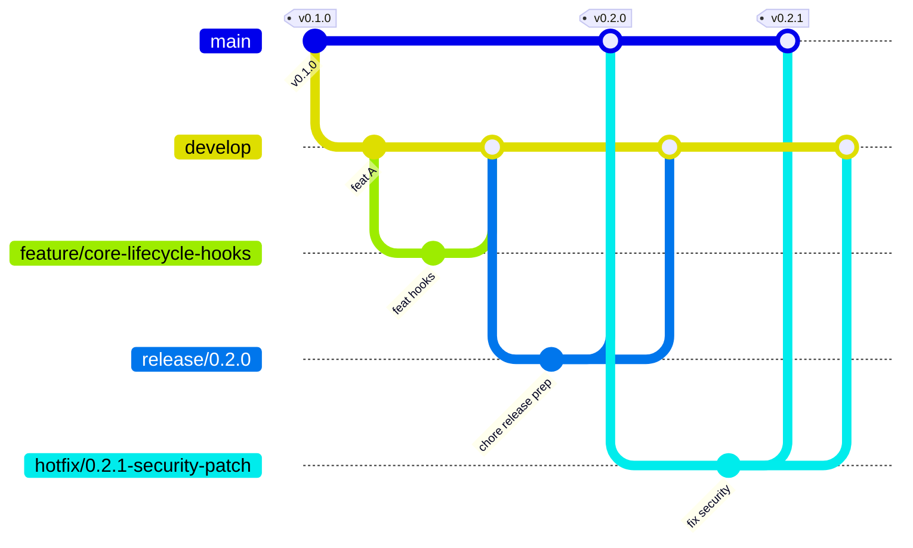
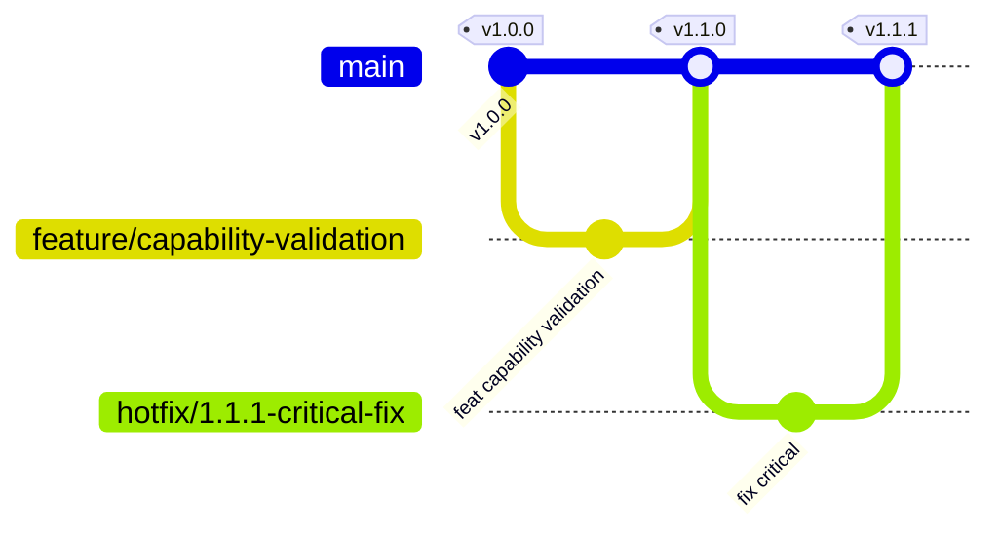

# 05 Git Branching and Release Strategy

Date: 2026-03-25
Status: Draft revised

## Purpose

This document defines a unified branching and release strategy for `prosto-platform` monorepo and external module repositories.

This strategy is intentionally **GitFlow-style with protected integration and release branches**. It is not trunk-only.

---

## Repository Types

### Type A Platform Monorepo

**Repository**: `prosto-systems/prosto-platform`

**Contains**: SDK, core, adapters, CLI, contract tests

**Branch model**: GitFlow-style with `main`, `develop`, short-lived feature branches, release branches, and hotfix branches.

### Type B Module Repositories

**Repository**: `prosto-systems/prosto-module-*` and third-party module repos

**Contains**: one feature module per repository

**Branch model**: simplified GitFlow-style with `main`, short-lived feature branches, optional release branches, and hotfix branches.

---

## Platform Monorepo Branch Strategy

### Branch Overview



### Branch Definitions

| Branch | Purpose | Protection | Merge Direction |
|---|---|---|---|
| `main` | Production releases only | Protected, PR and required CI | receives from `release/*` and `hotfix/*` |
| `develop` | Integration branch for next release | Protected, PR and required CI | receives from `feature/*`, `chore/*`, `hotfix/*`, `release/*` |
| `feature/*` | Feature implementation | Short-lived | merges to `develop` |
| `chore/*` | Docs, CI, dependency and maintenance work | Short-lived | merges to `develop` |
| `release/*` | Release stabilization and version prep | Protected during freeze | merges to `main` and back to `develop` |
| `hotfix/*` | Urgent production fixes | Expedited review | merges to `main` and back to `develop` |

---

## Branch Naming Conventions

### Feature Branches

```
feature/{scope}-{description}

Examples:
  feature/sdk-manifest-types
  feature/core-lifecycle-hooks
  feature/adapter-http-routes
```

### Chore Branches

```
chore/{scope}-{description}

Examples:
  chore/docs-add-architecture-diagrams
  chore/ci-add-contract-test-job
  chore/deps-update-zod-4
```

### Release Branches

```
release/{major}.{minor}.{patch}

Examples:
  release/0.2.0
  release/1.0.0
```

### Hotfix Branches

```
hotfix/{major}.{minor}.{patch}-{description}

Examples:
  hotfix/0.2.1-security-patch
  hotfix/1.0.2-memory-leak
```

---

## Commit Message Convention

### Format

```
<type>(<scope>): <subject>

<body>

<footer>
```

### Types

| Type | Description |
|---|---|
| `feat` | New feature |
| `fix` | Bug fix |
| `docs` | Documentation |
| `style` | Code style (formatting, semicolons) |
| `refactor` | Internal refactoring |
| `test` | Test updates |
| `chore` | Tooling, deps, maintenance |
| `perf` | Performance improvement |
| `ci` | Pipeline updates |
| `revert` | Revert commit |

### Scopes

| Scope | Area |
|---|---|
| `sdk` | `@prosto/platform-sdk` |
| `core` | `@prosto/platform-core` |
| `cli` | `@prosto/platform-cli` |
| `adapter-http` | `@prosto/platform-adapter-http` |
| `adapter-typeorm` | `@prosto/platform-adapter-typeorm` |
| `contract-tests` | `@prosto/platform-contract-tests` |
| `docs` | Architecture and docs |
| `ci` | CI workflows |

### Examples

```
feat(sdk): add module capability validation

Add runtime validation for module capability declarations
in manifest validator.

Closes #123
```

```
fix(core): resolve circular dependency in lifecycle orchestrator

Break circular import between lifecycle.orchestrator and
phase.executor by extracting shared types.

Fixes #456
```

```
chore(deps): update zod to version 3.24.0

Update across all packages to use latest zod version
for improved TypeScript inference.
```

```
docs(architecture): add package structure blueprint

Add new architecture document 04-package-structure-blueprint.md
defining monorepo organization and dependency rules.
```

---

## Versioning and Release Policy

Semantic versioning policy aligns with package governance in architecture docs.

### Pre-1.0 Policy
- `0.y.0` may include breaking changes with explicit migration notes.
- `0.y.z` is for backward-compatible fixes.

### Post-1.0 Policy
- `X.0.0` for breaking changes.
- `X.y.0` for backward-compatible features.
- `X.y.z` for backward-compatible fixes.

### Release Checklist

```markdown
## Pre-Release
- [ ] All required CI checks pass on `develop`
- [ ] Contract tests pass for module compatibility
- [ ] Typecheck and lint pass
- [ ] Architecture fitness checks pass
- [ ] Public API stability diff reviewed and approved
- [ ] CHANGELOG updated
- [ ] Version updates prepared
- [ ] Docs updated

## Release Branch
- [ ] Create `release/X.Y.Z` from `develop`
- [ ] Stabilize and run full pipeline
- [ ] Tag release candidate and validate
- [ ] Validate error budget status and architecture gate readiness

## Publish
- [ ] Merge `release/X.Y.Z` to `main`
- [ ] Create annotated tag `vX.Y.Z`
- [ ] Merge `release/X.Y.Z` back to `develop`
- [ ] Publish packages and release notes

## Post-Release
- [ ] Update compatibility matrix
- [ ] Notify module maintainers
- [ ] Monitor regressions and security alerts
- [ ] Record architecture gate outcomes and exceptions
```

### Release Workflow

```bash
# Create release branch
git checkout develop
git pull origin develop
git checkout -b release/0.2.0

# Prepare release artifacts
npm version 0.2.0 --workspaces
git add .
git commit -m "chore(release): prepare 0.2.0"

git push -u origin release/0.2.0

# Merge after approval
git checkout main
git pull origin main
git merge --no-ff release/0.2.0
git tag -a v0.2.0 -m "Release 0.2.0"
git push origin main --tags

# Back merge
git checkout develop
git merge --no-ff release/0.2.0
git push origin develop
```

---

## Hotfix Process

### When to Use
- Active security incident.
- Production outage.
- Data integrity issue.
- Severe regression with customer impact.

### Hotfix Workflow

```bash
# Branch from main
git checkout main
git pull origin main
git checkout -b hotfix/0.2.1-security-patch

# Implement and validate fix
git add .
git commit -m "fix(core): security patch for module loading"
git push -u origin hotfix/0.2.1-security-patch

# Merge to main
git checkout main
git merge --no-ff hotfix/0.2.1-security-patch
git tag -a v0.2.1 -m "Hotfix 0.2.1"
git push origin main --tags

# Back merge to develop
git checkout develop
git merge --no-ff hotfix/0.2.1-security-patch
git push origin develop
```

---

## Module Repository Strategy

### Unified Module Branching Model

Module repositories use one consistent model:
- Protected `main` branch.
- Short-lived `feature/*` and `hotfix/*` branches.
- Optional `release/*` branch for higher-risk releases.
- No long-lived `develop` branch required for modules.



### Module Release Process

```bash
git checkout main
git pull origin main

git checkout -b feature/capability-validation
# implement changes and tests

git checkout main
git merge --no-ff feature/capability-validation
git tag -a v1.1.0 -m "Release 1.1.0"
git push origin main --tags

npm publish
```

### Module Manifest Compatibility Example

```json
{
  "name": "prosto-module-health",
  "version": "1.1.0",
  "peerDependencies": {
    "@prosto/platform-sdk": "^0.x"
  },
  "prostoPlatform": {
    "minCoreVersion": "0.5.0",
    "maxCoreVersion": "<1.0.0",
    "testedWithCoreVersions": [
      "0.5.0",
      "0.5.1",
      "0.6.0"
    ]
  }
}
```

---

## Pull Request Guidelines

### PR Template

```markdown
## Description

## Type of Change
- [ ] ✨ Feature
- [ ] 🐛 Bug Fix
- [ ] 📝 Documentation
- [ ] ♻️ Refactor
- [ ] 🧪 Tests
- [ ] ⚙️ CI or Build

## Testing
- [ ] Unit tests updated
- [ ] Integration tests updated
- [ ] Contract tests passing

## Checklist
- [ ] Style guidelines followed
- [ ] Self review completed
- [ ] Documentation updated
- [ ] Breaking changes documented

## Related Issues
```

### Review Requirements

| Package | Reviewers Required | Additional Requirement |
|---|---|---|
| `platform-sdk` | 2 | Architecture team approval |
| `platform-core` | 2 | Core team approval |
| `platform-adapter-*` | 1 | Adapter owner approval |
| `platform-cli` | 1 | CLI owner approval |
| `platform-contract-tests` | 1 | QA team approval |

### Architecture Gates in Pull Requests

Required for PR into protected branches:
- Architecture impact label required for boundary or contract changes.
- ADR reference required for cross-package boundary changes.
- Public API diff report required for `platform-sdk` and public adapter contracts.
- Compatibility matrix update required when module-facing behavior changes.

### Required CI Checks

```yaml
required_checks:
  - typecheck
  - lint
  - unit-tests
  - contract-tests
  - build
  - coverage-core-sdk
```

---

## Tagging Strategy

### Version Tags

```
v{MAJOR}.{MINOR}.{PATCH}

Examples:
  v0.2.0
  v0.2.1
  v1.0.0
```

### Pre-Release Tags

```
v{MAJOR}.{MINOR}.{PATCH}-{TYPE}.{NUMBER}

Examples:
  v1.0.0-alpha.1
  v1.0.0-beta.1
  v1.0.0-rc.1
```

### Annotated Tags Required

```bash
git tag -a v0.2.0 -m "Release 0.2.0"
git push origin --tags
```

---

## Dependency Update Strategy

### Automated Updates

Use Dependabot or Renovate for routine updates with constrained scope and CI validation.

### Manual Major Updates

```bash
git checkout -b chore/deps-update-zod-4
npm install zod@^4.0.0 --workspace=@prosto/platform-sdk
npm run test --workspace=@prosto/platform-sdk
git commit -m "chore(deps): update zod to 4.0.0"
```

---

## Related Documents

- [AGENTS.md](../../AGENTS.md)
- [04 Package Structure Blueprint](./04-package-structure-blueprint.md)
- [ADR-0002 SDK Contract And Semver Governance](./adr/ADR-0002-sdk-contract-and-semver-governance.md)

---

## Revision History

| Date       | Version | Change        | Author            |
|------------|---------|---------------|-------------------|
| 2026-03-25 | 0.1     | Initial draft | Architecture Team |
