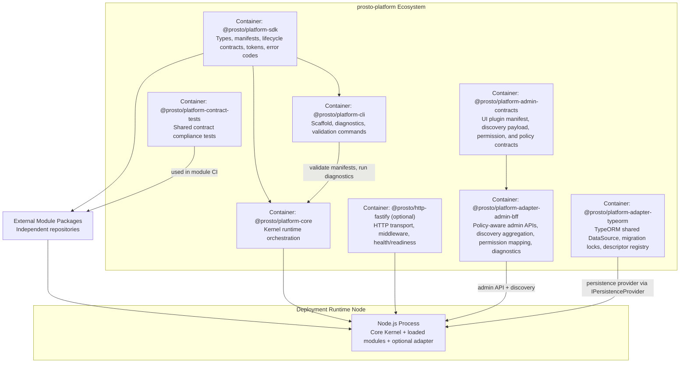

# C4-02 Container View

Date: 2026-03-24  
Scope: L2 container view

## Purpose
Describe major runtime/development containers and their responsibilities.

## Container Diagram

## Container Responsibilities

| Container | Responsibilities | Must Not Own |
|---|---|---|
| `@prosto/platform-sdk` | Shared contracts, types, token model, error taxonomy | Runtime side effects, framework code |
| `@prosto/platform-core` | Bootstrapping, loading, compatibility, lifecycle orchestration, registry/event bus, persistence coordination via SDK contracts | HTTP framework specifics, ORM specifics, domain modules |
| `@prosto/platform-adapter-typeorm` | TypeORM shared DataSource lifecycle, migration lock coordination, descriptor ownership | `platform-core` internals, other adapter internals |
| `@prosto/platform-cli` | Scaffolding, preflight checks, config/module diagnostics | Runtime hosting logic |
| `@prosto/http-fastify` (optional) | Request routing, middleware, auth hooks, health surfaces | Kernel lifecycle ownership |
| `@prosto/platform-admin-contracts` | UI plugin manifest schemas, discovery payload contracts, permission and policy contracts, compatibility rules | Runtime behavior, framework code |
| `@prosto/platform-adapter-admin-bff` | Policy-aware admin APIs, discovery aggregation pipeline, permission mapping, diagnostics, observability | Domain logic, kernel lifecycle, shell rendering |
| External Modules | Feature and integration logic, capability implementations | Kernel orchestration concerns |
| Contract Test Package | Contract conformance suite reusable in CI | Production runtime behavior |

## Data Stores And External Dependencies
- Config source: env/files/secret provider.
- Package source: npm or GitHub Packages.
- Observability sink: logging and metrics backend.
- Module catalog: compatibility + support metadata.

Container Interaction Rules
- Core imports SDK contracts, never the opposite.
- Modules depend on SDK (peer dependency), not on core internals.
- Adapter depends on SDK and core extension points.
- Persistence adapter implements `IPersistenceProvider` and is composed by the application at the `RuntimeBuilder` boundary; core never imports ORM specifics.
- Contract tests depend on SDK contract fixtures and target core compatibility matrix.
- Admin BFF depends on admin-contracts for plugin manifest schemas and policy contracts.
- Admin BFF integrates with kernel via route handlers, not by importing core internals.
- Admin shell consumes only contract-defined discovery payloads from admin BFF.

## Linked Views
- Components in core: [C4-03 Core Component View](./03-component-view-kernel.md)
- Runtime data flow: [DFD-02 Runtime L1](../dfd/02-runtime-l1.md)
- Stack decision: [ADR-0005](../adr/ADR-0005-core-runtime-stack-validation-and-logging.md)
