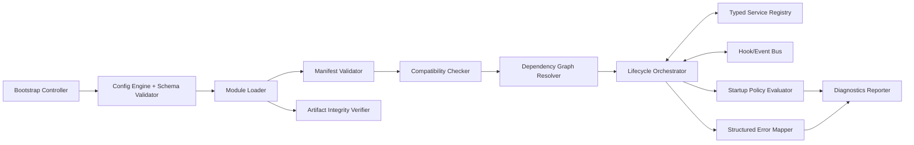

# C4-03 Core Component View

Date: 2026-03-24  
Scope: L3 component view for `@prosto/platform-core`

## Purpose
Detail internal kernel components and control flow for module runtime management.

## Component Diagram

## Component Responsibilities

| Component | Responsibility | Input | Output |
|---|---|---|---|
| Bootstrap Controller | Entry point for boot/shutdown orchestration | Operator command, config | Runtime state transitions |
| Config Engine | Parse and validate config | Env/files/secrets | Typed runtime config |
| Module Loader | Discover and resolve module artifacts | Allowlist + registry references | Loadable module instances |
| Manifest Validator | Validate module manifest schema | Manifest document | Valid/invalid with diagnostics |
| Artifact Integrity Verifier | Check checksum/signature policy | Artifact metadata | Verification result |
| Compatibility Checker | Verify core/sdk/platform ranges | Manifest + runtime version | Compatibility decision |
| Dependency Graph Resolver | Build acyclic module init order | Module dependencies | Topological order |
| Lifecycle Orchestrator | Execute register/init/start/stop phases | Ordered modules | Runtime module state |
| Typed Service Registry | Service token registration and lookup | Token/service pairs | Resolved service instances |
| Hook/Event Bus | Cross-module extension dispatch | Events/hooks | Handler execution results |
| Startup Policy Evaluator | Apply `strict` or `best-effort` rules | Module errors + criticality | Continue/abort decision |
| Structured Error Mapper | Normalize error codes and context | Raw errors | Portable diagnostics payload |
| Diagnostics Reporter | Emit startup and runtime diagnostics | State transitions/errors | Logs/metrics/report data |

## Component Contracts
- All module-facing interfaces come from SDK package.
- No component accesses module internals directly beyond contract interfaces.
- Every lifecycle failure is mapped to structured error metadata (`moduleId`, `phase`, `errorCode`, `remediationHint`).
- Dependency graph must be acyclic; cycles fail pre-start.

## Startup Control Pipeline
1. Load typed config.
2. Discover allowlisted module artifacts.
3. Validate manifest schema and integrity.
4. Check compatibility and dependencies.
5. Execute module `init()` phases (collect persistence descriptors).
6. Initialize shared persistence provider, acquire migration locks, run migrations.
7. Execute module `start()` phases (resolve native persistence service tokens).
8. Apply policy on failures.
9. Publish startup report.

Detailed sequence: [SEQ-01 Bootstrap Lifecycle](../sequence/01-bootstrap-lifecycle.md)

## Failure Isolation Rules
- Module-level failure cannot corrupt registry state for already loaded modules.
- In `best-effort`, non-critical failure results in skip + degraded startup report.
- In `strict`, startup aborts on critical or policy-configured fatal failures.

Related decision: [ADR-0004](../adr/ADR-0004-lifecycle-orchestration-and-startup-policies.md)

