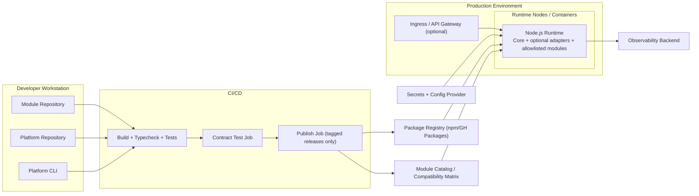

# C4-04 Deployment View

Date: 2026-03-24  
Scope: Deployment perspective for development and production

## Purpose
Describe where containers run and how artifacts/configuration flow across environments.

## Deployment Diagram

## Environment-Specific Notes

| Environment | Characteristics | Architecture Controls |
|---|---|---|
| Local development | Fast iteration, local module testing | Optional relaxed policies, but schema and compatibility checks still enforced |
| CI/CD | Quality gate and release governance | Contract tests, manifest validation, tagged publishing only |
| Production | Stable and secure operation | Allowlist-only loading, integrity checks, strict secrets handling, startup diagnostics |

## Deployment Policies
- Immutable versioned artifacts from registry only.
- No production runtime loading from raw Git URLs.
- Startup requires validated config and policy-compliant module set.
- Observability endpoints are mandatory in production deployments.

## Linked Views
- System context: [C4-01](./01-system-context.md)
- Runtime internals: [C4-03](./03-component-view-kernel.md)
- Security decision: [ADR-0003](../adr/ADR-0003-module-loading-security-allowlist-integrity.md)
- Distribution decision: [ADR-0006](../adr/ADR-0006-external-module-repository-and-distribution-model.md)

