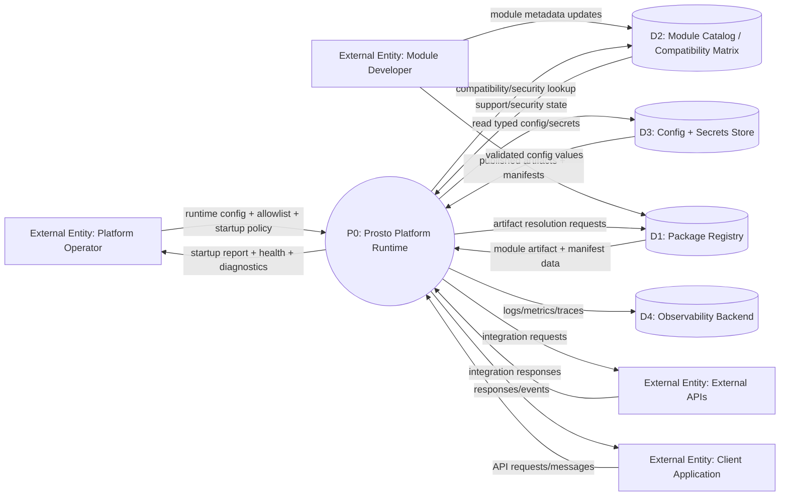

# DFD-01 Context Level (L0)

Date: 2026-03-24  
Scope: External data flows around platform runtime

## Purpose
Show the platform as a single process (`P0`) and its data exchange with external entities and stores.

## DFD L0

## Data Flows

| Flow | From -> To | Description |
|---|---|---|
| F1 | Operator -> P0 | Runtime settings, policy mode, allowlisted module list |
| F2 | P0 -> Operator | Startup summary, loaded/skipped modules, health state |
| F3 | P0 <-> D1 | Module artifact retrieval and manifest metadata |
| F4 | P0 <-> D2 | Compatibility and security governance checks |
| F5 | P0 <-> D3 | Config and secret retrieval/validation |
| F6 | Client -> P0 -> Client | Runtime business interactions through adapters |
| F7 | P0 <-> External APIs | Integrations called by modules |
| F8 | P0 -> D4 | Operational telemetry |

## Controls Linked To Data Flow
- Manifest schema validation and version checks before module activation.
- Integrity verification before artifact acceptance.
- Secrets redaction before diagnostics emission.

Linked detailed flows:
- [DFD-02 Runtime L1](./02-runtime-l1.md)
- [DFD-03 Module Loading L2](./03-module-loading-l2.md)

