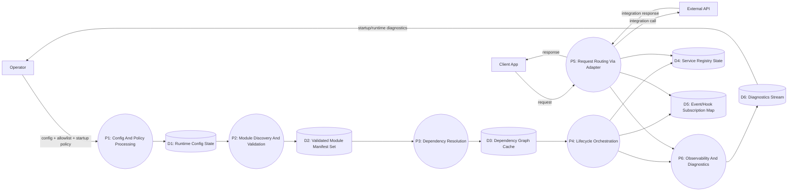

# DFD-02 Runtime Level (L1)

Date: 2026-03-24  
Scope: Internal runtime processes and data stores

## Purpose
Decompose `P0` into major runtime processes and stores.

## DFD L1

## Process Dictionary

| Process | Description | Critical Controls |
|---|---|---|
| P1 Config And Policy Processing | Parse/validate config and policy mode | Schema validation, security defaults, secret redaction |
| P2 Module Discovery And Validation | Discover modules and validate manifest/integrity | Allowlist gate, checksum/signature, compatibility metadata |
| P3 Dependency Resolution | Build and validate acyclic dependency graph | Cycle detection, deterministic ordering |
| P4 Lifecycle Orchestration | Execute register/init/start/stop | Phase isolation, policy-aware failure handling |
| P5 Request Routing Via Adapter | Entry-point request handling delegated to modules | Input validation, auth hooks, structured error responses |
| P6 Observability And Diagnostics | Telemetry and startup report emission | Correlation IDs, phase timings, error metadata normalization |

## Data Store Dictionary

| Store | Contents | Retention |
|---|---|---|
| D1 Runtime Config State | Typed config and policy values | Process lifecycle |
| D2 Validated Module Manifest Set | Approved manifest set for current startup | Process lifecycle |
| D3 Dependency Graph Cache | Resolved module ordering and graph metadata | Process lifecycle (or persistent optimization in future) |
| D4 Service Registry State | Token-service bindings | Process lifecycle |
| D5 Event/Hook Subscription Map | Topics and handlers by module | Process lifecycle |
| D6 Diagnostics Stream | Startup and runtime events/errors | Forwarded to logs/metrics backend |

## Linked Scenarios
- Startup orchestration: [SEQ-01](../sequence/01-bootstrap-lifecycle.md)
- Request handling: [SEQ-02](../sequence/02-http-request-module-flow.md)
- Shutdown: [SEQ-03](../sequence/03-graceful-shutdown.md)

