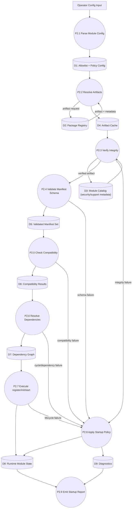

# DFD-03 Module Loading Level (L2)

Date: 2026-03-24  
Scope: Detailed load pipeline for module activation

## Purpose
Provide a fine-grained data flow for discovery, verification, compatibility checks, and lifecycle transition into active state.

## DFD L2

## Step-Level Controls

| Step | Control Objective | Failure Outcome |
|---|---|---|
| P2.1 Parse Module Config | Ensure only configured modules are candidates | Invalid config blocks startup |
| P2.2 Resolve Artifacts | Fetch immutable versioned artifacts | Missing artifact routed to policy evaluator |
| P2.3 Verify Integrity | Ensure artifact authenticity/trust | Reject module, raise security diagnostics |
| P2.4 Validate Manifest Schema | Contract consistency and required metadata | Reject module with schema errors |
| P2.5 Check Compatibility | Prevent runtime/API mismatch | Reject incompatible module |
| P2.6 Resolve Dependencies | Ensure valid acyclic initialization order | Reject or block startup per policy |
| P2.7 Execute Lifecycle | Controlled activation of approved modules | Failure isolated and escalated to policy |
| P2.8 Apply Startup Policy | Determine continue vs abort decision | `strict`: abort, `best-effort`: skip non-critical |
| P2.9 Emit Startup Report | Operator visibility and audit trail | Startup fails closed if report pipeline is critical |

## Security Enforcement Points
- Integrity verification before schema compatibility checks.
- Mandatory security classification and compatibility metadata.
- Block module if trust metadata is absent in production mode.

## Linked Decisions
- [ADR-0003 Module Loading Security](../adr/ADR-0003-module-loading-security-allowlist-integrity.md)
- [ADR-0004 Lifecycle Policies](../adr/ADR-0004-lifecycle-orchestration-and-startup-policies.md)
- [ADR-0006 Module Distribution Model](../adr/ADR-0006-external-module-repository-and-distribution-model.md)

## Linked Sequences
- [SEQ-01 Bootstrap Lifecycle](../sequence/01-bootstrap-lifecycle.md)
- [SEQ-04 Critical Module Failure](../sequence/04-critical-module-failure.md)

