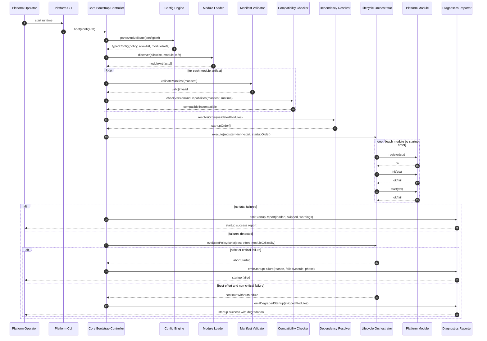

# SEQ-01 Bootstrap Lifecycle

Date: 2026-03-24  
Scope: Runtime startup in normal path with policy-driven error branch

## Sequence Diagram

## Notes
- Lifecycle order is deterministic from dependency graph topological sort.
- Policy evaluation runs on every load/lifecycle error with module criticality context.
- Startup report is a required operational artifact.

Related:
- [DFD-03 Module Loading L2](../dfd/03-module-loading-l2.md)
- [ADR-0004 Lifecycle Policies](../adr/ADR-0004-lifecycle-orchestration-and-startup-policies.md)

