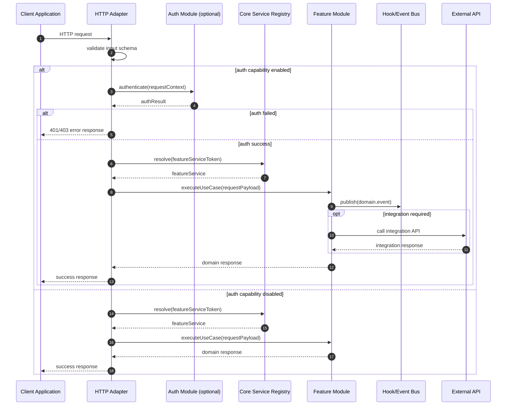

# SEQ-02 HTTP Request Through Module

Date: 2026-03-24  
Scope: Request path with optional auth and module service resolution

## Sequence Diagram

## Notes
- Adapter owns transport-specific concerns (routing, status codes, middleware).
- Module business logic remains transport-agnostic.
- Event publication supports decoupled reactions in other modules.

Related:
- [C4-02 Container View](../c4/02-container-view.md)
- [DFD-02 Runtime L1](../dfd/02-runtime-l1.md)
- [ADR-0001 Micro-Core Boundary](../adr/ADR-0001-micro-core-kernel-boundary.md)

