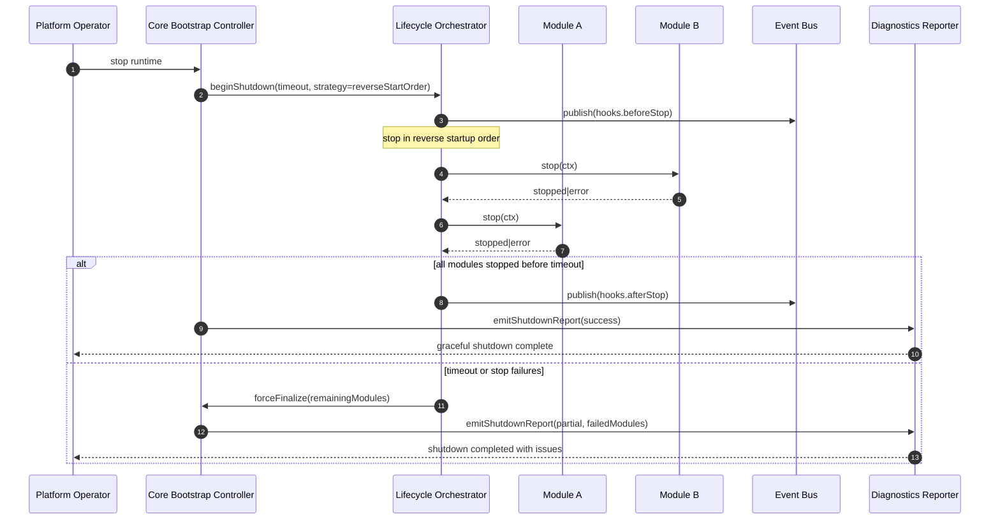

# SEQ-03 Graceful Shutdown

Date: 2026-03-24  
Scope: Controlled runtime shutdown with timeout and reverse order stop

## Sequence Diagram

## Notes
- Stop order is reverse of startup order to preserve dependency safety.
- Timeout is mandatory to prevent indefinite hangs.
- Shutdown report captures modules that failed to stop cleanly.

Related:
- [C4-03 Core Component View](../c4/03-component-view-kernel.md)
- [ADR-0004 Lifecycle Policies](../adr/ADR-0004-lifecycle-orchestration-and-startup-policies.md)
- [ADR-0007 Observability Baseline](../adr/ADR-0007-observability-and-operability-baseline.md)

