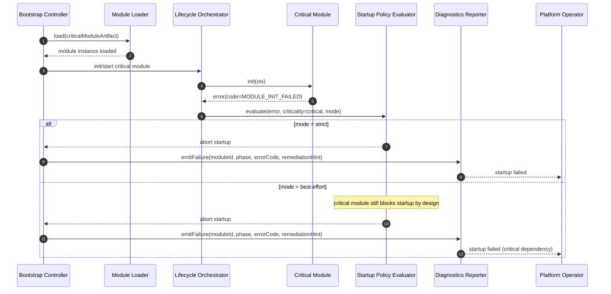

# SEQ-04 Critical Module Failure During Startup

Date: 2026-03-24  
Scope: Failure handling for critical module by startup policy

## Sequence Diagram

## Notes
- Critical module failures always abort startup.
- `best-effort` applies only to non-critical modules.
- Failure payload must include phase, module identity, and remediation hint.

Related:
- [DFD-03 Module Loading L2](../dfd/03-module-loading-l2.md)
- [ADR-0003 Module Loading Security](../adr/ADR-0003-module-loading-security-allowlist-integrity.md)
- [ADR-0004 Lifecycle Policies](../adr/ADR-0004-lifecycle-orchestration-and-startup-policies.md)
