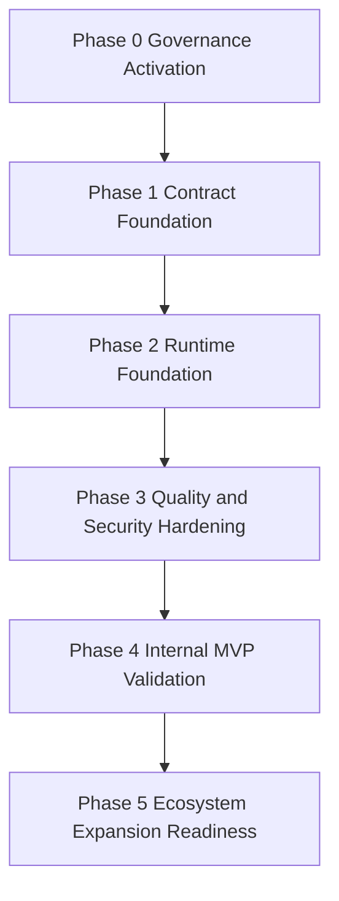

# 03 Step-by-Step Implementation Sequence

## 1. Sequence Principles

- Enforce controls before feature growth.
- Establish contracts before module proliferation.
- Add observability before ecosystem scale-out.
- Use stage gates to validate readiness transitions.

## 2. Execution Flow

## 3. Ordered Phases and Actions

## Phase 0 Governance Activation

1. Turn architecture and release checklists into mandatory CI evidence artifacts.
2. Enforce branch protection and required checks for main and develop.
3. Define ownership map for gate failures and exception handling.

Exit criteria:
- No protected branch merge without policy evidence.
- Exception process documented with expiration and accountability.

## Phase 1 Contract Foundation

1. Implement `@prosto/platform-sdk` minimal contract surface.
2. Implement `@prosto/platform-contract-tests` reusable conformance suite.
3. Pin contract versioning and compatibility policy with migration template.

Exit criteria:
- Two internal reference modules pass contract tests.
- Contract CI checks are stable on protected branches.

## Phase 2 Runtime Foundation

1. Implement `@prosto/platform-core` minimal kernel with deterministic lifecycle.
2. Implement module discovery, compatibility validation, and policy-driven startup modes.
3. Add startup diagnostics with module load outcomes and reasons.

Exit criteria:
- Strict and best-effort startup behaviors validated in integration tests.
- Startup diagnostics payload passes schema validation.

## Phase 3 Quality and Security Hardening

1. Add architecture boundary, dependency graph, and cycle detection checks.
2. Add security policy checks: allowlist, integrity validation, and secret redaction tests.
3. Add performance benchmark suite and CI regression budgets.

Exit criteria:
- Security and architecture gates block invalid merges.
- Performance baselines are measured and enforced.

## Phase 4 Internal MVP Validation

1. Run pilot with internal modules under production-like staging conditions.
2. Measure KPI contract from metrics file and compare against thresholds.
3. Record incidents, bottlenecks, and policy exceptions; feed corrective actions.

Exit criteria:
- Internal MVP KPI targets achieved or deviations formally accepted.
- Reliability and diagnostics trend is stable across consecutive cycles.

## Phase 5 Ecosystem Expansion Readiness

1. Publish module template repository and onboarding workflow for external developers.
2. Introduce progressive trust model and third-party security onboarding checks.
3. Scale architecture compliance workflows to external module repositories.

Exit criteria:
- External module onboarding path validated by pilot maintainers.
- Governance controls operate without blocking healthy adoption.

## 4. Change Batch Strategy

- Batch A: governance automation and contract baseline.
- Batch B: core runtime and diagnostics.
- Batch C: security and performance gates.
- Batch D: internal MVP validation and ecosystem preparation.

Each batch must end with:
1. Measured evidence against acceptance criteria.
2. Updated risk register deltas.
3. Explicit go no-go decision for next batch.
