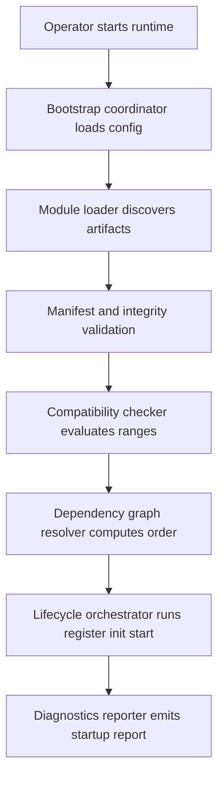
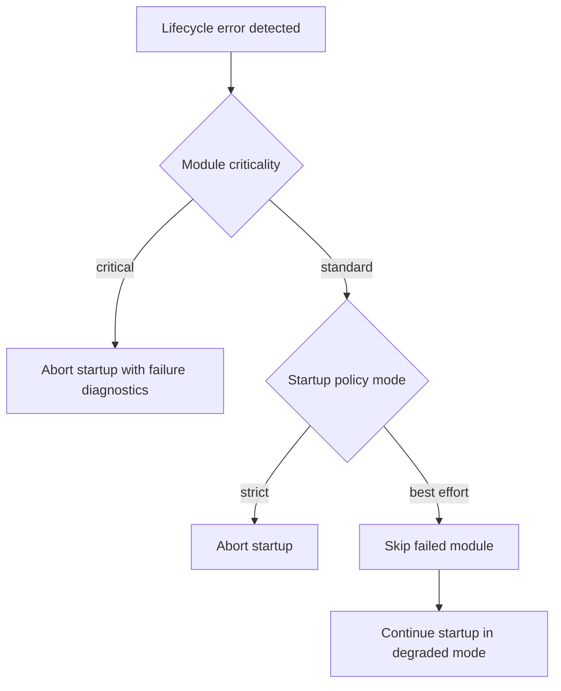
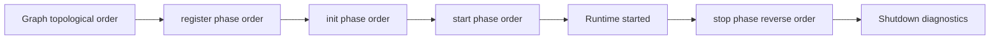
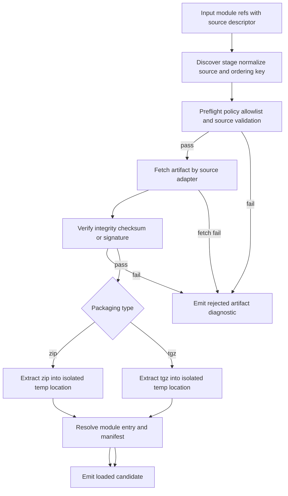

# Phase 05 - Core Runtime Foundation and Deterministic Lifecycle

## Execution Status
- Status: Partially Completed (reassessed)
- Validation date: 2026-04-14
- Reassessment date: 2026-04-23
- Implementation update date: 2026-04-23
- Repository evidence snapshot:
  - `packages/platform-core/src/` includes runtime bootstrap, compatibility, graph, lifecycle, policy, diagnostics, and runtime factory implementation
  - Root script `validate:runtime-policy` is executable via `scripts/validate-runtime-policy.mjs`
  - Root script `test:lifecycle-determinism` is executable via `scripts/test-lifecycle-determinism.mjs`
  - Phase 04 contract conformance package remains active and reusable
- Reassessment rationale:
  - Workstreams WS-03, WS-04, and WS-05 are operationally implemented and covered by active checks.
  - WS-02 Step 3 remains partially implemented after universal-source baseline rollout: discovery and reject taxonomy are implemented, runtime/bootstrap integration is implemented, path-source checksum preflight is implemented; full source adapters and archive extraction/resolution for `url` and `registry` are still pending.

## Phase Objective
Implement `@prosto/platform-core` minimal runtime kernel with deterministic lifecycle orchestration, compatibility validation, startup policy control `strict` and `best-effort`, and machine-readable diagnostics required to activate architecture fitness functions FF-03 and FF-04.

## Scope Boundaries
### In Scope
- Bootstrap pipeline in runtime kernel: discover -> validate -> resolve -> initialize -> persistence -> start.
- Deterministic dependency graph resolution and stable ordering.
- Startup policy decision engine for `strict` and `best-effort`.
- Required diagnostics payload for loaded, skipped, failed modules with reason taxonomy.
- Shutdown sequencing in reverse startup order with bounded timeout contract.
- Integration and determinism tests for policy and ordering behavior.

### Out of Scope
- Full production adapter matrix beyond minimal runtime entry.
- Third-party ecosystem rollout and external catalog automation.
- Distributed multi-node runtime topology.
- Admin shell implementation and UI concerns.

## Prerequisites and Dependencies
- Completed: Phase 03 SDK contracts and validation baseline.
- Completed: Phase 04 contract conformance suite and reference modules.
- Required architecture references:
  - `.context/02-architecture-design/01-architecture-baseline.md`
  - `.context/02-architecture-design/02-domain-and-capability-model.md`
  - `.context/02-architecture-design/adr/ADR-0004-lifecycle-orchestration-and-startup-policies.md`
  - `.context/02-architecture-design/sequence/01-bootstrap-lifecycle.md`
  - `.context/02-architecture-design/sequence/03-graceful-shutdown.md`
  - `.context/02-architecture-design/sequence/04-critical-module-failure.md`

## Execution Closure Snapshot

| Area | Phase-start evidence | Delivered in Phase 05 | Verification signal |
|---|---|---|---|
| Runtime kernel | `packages/platform-core/src/index.ts` placeholder export | Runtime bootstrap, loader, graph, lifecycle, policy, diagnostics, and runtime factory are implemented | `@prosto/platform-core` integration tests and package exports |
| Runtime policy validation | Root script existed as TODO | Executable policy validation command implemented in `scripts/validate-runtime-policy.mjs` | `npm run validate:runtime-policy` |
| Determinism test gate | Root script existed as TODO | Deterministic order test gate implemented in `scripts/test-lifecycle-determinism.mjs` | `npm run test:lifecycle-determinism` |
| Contract alignment | Phase 04 suite active | Runtime outcomes aligned with contract semantics and validated against reference modules | `npm run test:contracts` plus runtime integration suite |

## Target Runtime Flow

### Bootstrap pipeline

### Policy branching

### Deterministic ordering and shutdown

## Workstreams

### WS-01 Runtime Contracts and Types
Goal: define runtime contracts that align with SDK and diagnostics requirements.

### WS-02 Bootstrap and Module Loading
Goal: implement discover validate resolve pipeline with explicit failure mapping.

### WS-03 Deterministic Lifecycle and Policy Engine
Goal: enforce stable lifecycle ordering and policy outcomes for all failure classes.

### WS-04 Diagnostics and Operability
Goal: produce machine-readable startup and shutdown reports with required metadata.

### WS-05 Test Gates and Script Activation
Goal: replace Phase 05 placeholders with executable validation and determinism checks.
Outcome: completed; both runtime scripts are active and wired to integration tests.

## Detailed Ordered Implementation Plan
The ordered steps below are preserved as execution traceability for the completed Phase 05 implementation.

### Step 1 - Create runtime public API skeleton
- File-level target:
  - `packages/platform-core/src/index.ts`
  - `packages/platform-core/src/runtime/runtime.types.ts`
  - `packages/platform-core/src/runtime/create-runtime.ts`
- Evidence linkage:
  - Core was placeholder at phase start and required a runnable API baseline.
  - Domain model requires explicit runtime object and startup policy representation.
- Activation condition:
  - Runtime APIs are available for subsequent workstreams.
- Acceptance signal:
  - `platform-core` exports typed runtime factory and startup options.
  - `typecheck` passes for `platform-core` package.

### Step 2 - Implement bootstrap coordinator
- File-level target:
  - `packages/platform-core/src/bootstrap/bootstrap.coordinator.ts`
  - `packages/platform-core/src/bootstrap/bootstrap.types.ts`
- Evidence linkage:
  - Architecture baseline requires controlled pipeline discover validate resolve initialize persistence start.
- Activation condition:
  - Coordinator accepts config input and emits structured bootstrap context.
- Acceptance signal:
  - Coordinator executes stage transitions in fixed order and captures stage outcomes.

### Step 3 - Implement module discovery and artifact loading
- File-level target:
  - `packages/platform-core/src/loader/module-discovery.ts`
  - `packages/platform-core/src/loader/module-loader.ts`
  - `packages/platform-core/src/loader/loader.types.ts`
- Evidence linkage:
  - Sequence model requires explicit discover stage before validation and lifecycle.
- Activation condition:
  - Loader returns module candidates and artifact metadata with deterministic ordering key.
- Acceptance signal:
  - Discovery output is stable for identical input config.
  - Rejected artifacts contain reason code and module identity.

### Step 3A - Loader completion plan to fully satisfy Step 3
- Objective: close remaining gaps in loader responsibilities so Step 3 acceptance criteria are fully satisfied.

- Gap summary against Step 3 acceptance:
  - Deterministic discovery ordering is implemented.
  - Explicit rejected artifact output from loader boundary is not fully implemented.
  - `module-loader` does not yet perform concrete artifact loading or loading-failure mapping.

- Ordered implementation plan:
  1. Extend loader contracts in `packages/platform-core/src/loader/loader.types.ts`
     - Add artifact-source metadata fields required by loader stage.
     - Add rejected artifact structure that supports reason code, phase, and remediation hint.
  2. Expand discovery behavior in `packages/platform-core/src/loader/module-discovery.ts`
     - Keep stable ordering key behavior.
     - Populate `rejected` for pre-loading discovery failures.
  3. Implement real loading path in `packages/platform-core/src/loader/module-loader.ts`
     - Resolve artifact references and map loading failures into rejected artifact outputs.
     - Preserve deterministic output ordering for loaded artifacts.
  4. Refine bootstrap boundary usage in `packages/platform-core/src/bootstrap/bootstrap.coordinator.ts`
     - Consume loader rejected outputs directly.
     - Keep validation and policy logic focused on post-loading module candidates.
  5. Add focused test coverage in `packages/platform-core/tests/integration/`
     - Add loader integration test for deterministic output stability.
     - Add loader integration test for rejected artifact taxonomy coverage.

- Acceptance signals for Step 3 closure:
  - For invalid or unavailable artifacts, loader returns non-empty `rejected` with explicit reason code and remediation hint.
  - For identical input sets, discovery and loading outputs are deterministic across repeated runs.
  - Bootstrap no longer duplicates artifact-stage failure mapping already emitted by loader.

#### Step 3A.1 - Universal artifact source contract path url registry
- Decision scope:
  - Artifact source model is unified and supports `path`, `url`, and `registry` under one loader contract.
  - Zip is first-class packaging format for `path` and `url` sources.
  - Registry source may return either zip or tgz package artifact, resolved by source adapter.

- File-level target:
  - `packages/platform-core/src/loader/loader.types.ts`
  - `packages/platform-core/src/loader/module-discovery.ts`
  - `packages/platform-core/src/loader/module-loader.ts`
  - `packages/platform-core/src/runtime/runtime.types.ts`

- Contract baseline:
  - Add source descriptor union in loader types:
    - `path`: absolute or workspace-relative file path and expected digest metadata
    - `url`: https artifact URL and expected digest metadata
    - `registry`: package coordinate and version plus integrity metadata
  - Add normalized artifact descriptor produced by discovery:
    - `sourceType`, `sourceRef`, `packaging`, `orderingKey`
  - Add rejected artifact diagnostic shape with required fields:
    - `moduleId`, `phase`, `errorCode`, `message`, `remediationHint`, `sourceType`, `sourceRef`

- Security and policy constraints:
  - Allowlist applies before artifact fetch and extraction.
  - Integrity verification is mandatory before loading executable module entry.
  - `url` source requires HTTPS and explicit hash or signature evidence.
  - Diagnostics must redact secrets and sensitive URL query fragments.

#### Step 3A.2 - Loader pipeline design for zip and non-zip artifacts

- Stage behavior detail:
  1. Discovery stage
     - Normalizes raw source descriptors and computes deterministic ordering key.
     - Rejects malformed source descriptors early with explicit reason code.
  2. Fetch stage
     - Uses source adapter by type: local path resolver, HTTPS fetcher, registry resolver.
     - Produces immutable artifact record for downstream verification.
  3. Integrity stage
     - Compares digest or validates signature before extraction.
     - Rejects mismatch with security-classified diagnostic.
  4. Extraction stage
     - Unpacks archive into isolated temp location.
     - Enforces path traversal protections and file count or size limits.
  5. Entry resolution stage
     - Resolves module entrypoint and manifest from extracted content.
     - Returns loaded candidate or rejected with deterministic reason taxonomy.

#### Step 3A.3 - Ordered implementation plan for universal source support
1. Extend runtime input contract
   - Add source descriptor to runtime module references in `runtime.types.ts`.
   - Preserve backward compatibility path for in-memory module references during migration.
   - Status: implemented.
2. Implement typed discovery normalization
   - Add deterministic normalization for `path`, `url`, `registry`.
   - Add early source validation and rejected output population.
   - Status: implemented.
3. Implement source adapters in loader
   - Path adapter for local zip or tgz files.
   - URL adapter for HTTPS artifacts with timeout and retry policy.
   - Registry adapter for package coordinate resolution to artifact.
   - Status: partially implemented (path checksum preflight and deterministic rejection are implemented; URL and registry adapters are TODO).
4. Implement integrity verification and extraction guards
   - Validate checksum or signature before extraction.
   - Add secure extraction constraints and deterministic temp layout rules.
   - Status: partially implemented (checksum preflight for path source implemented; extraction and entry resolution for external artifacts are TODO).
5. Integrate loader outputs into bootstrap coordinator
   - Consume loaded and rejected artifacts as source of truth.
   - Remove duplicate artifact-stage rejection logic from bootstrap where applicable.
   - Status: implemented.
6. Expand integration and policy validation tests
   - Add deterministic repeated-run tests across mixed source types.
   - Add rejection taxonomy tests for source validation, fetch failure, integrity failure, extraction failure.
   - Status: implemented for current baseline coverage.

#### Step 3A.4 - Acceptance signals for universal source model
- Functional acceptance:
  - Runtime accepts mixed module source set with `path`, `url`, `registry` in one startup config.
  - Zip artifacts from `path` and `url` are discovered, verified, extracted, and resolved deterministically.
  - Current status: first condition is implemented at contract and runtime pipeline level; external artifact resolution is partially implemented.
- Security acceptance:
  - Any missing or invalid integrity evidence causes rejection before lifecycle phases.
  - Any disallowed source by allowlist policy is rejected at preflight stage.
  - Current status: integrity rejection is implemented for path source checksum preflight; allowlist and full signature policy remain pending.
- Operability acceptance:
  - Startup report includes source-aware rejected diagnostics without leaking secrets.
  - Error taxonomy distinguishes source-validate, source-fetch, integrity, extraction, entry-resolve failures.
  - Current status: implemented for source-stage diagnostics and reason taxonomy.
- Determinism acceptance:
  - Repeated startup runs with identical source set produce identical candidate order and identical reject ordering.
  - Current status: implemented and covered by integration tests.

### Step 4 - Implement manifest and compatibility validation
- File-level target:
  - `packages/platform-core/src/compatibility/manifest-guard.ts`
  - `packages/platform-core/src/compatibility/compatibility-checker.ts`
  - `packages/platform-core/src/compatibility/runtime-reason-codes.ts`
- Evidence linkage:
  - SDK contracts and ADR policy require explicit compatibility gating.
- Activation condition:
  - Every discovered module receives pass or fail decision with reason taxonomy.
- Acceptance signal:
  - Incompatible SDK or platform ranges are rejected before graph resolution.
  - Validation result includes `moduleId`, `phase`, `errorCode`, `remediationHint`.

### Step 5 - Implement dependency graph resolver and deterministic order
- File-level target:
  - `packages/platform-core/src/graph/dependency.graph.ts`
  - `packages/platform-core/src/graph/topological-sort.ts`
  - `packages/platform-core/src/graph/dependency-graph.errors.ts`
- Evidence linkage:
  - ADR lifecycle order is dependency-driven and deterministic.
- Activation condition:
  - Validated module set can be ordered or rejected on cycle detection.
- Acceptance signal:
  - Cycle detection returns explicit diagnostic with impacted modules.
  - Repeated runs with same module set produce identical startup order.

### Step 6 - Implement lifecycle orchestrator
- File-level target:
  - `packages/platform-core/src/lifecycle/module-lifecycle.orchestrator.ts`
  - `packages/platform-core/src/lifecycle/lifecycle.types.ts`
  - `packages/platform-core/src/lifecycle/module-lifecycle.errors.ts`
- Evidence linkage:
  - Required lifecycle sequence is register -> init -> start -> stop.
- Activation condition:
  - Orchestrator can execute startup phases and stop in reverse order.
- Acceptance signal:
  - Startup uses forward deterministic order.
  - Shutdown uses reverse startup order with timeout handling.

### Step 7 - Implement startup policy evaluator
- File-level target:
  - `packages/platform-core/src/policy/startup-policy-evaluator.ts`
  - `packages/platform-core/src/policy/policy.types.ts`
- Evidence linkage:
  - ADR mandates strict and best-effort behavior with critical module override.
- Activation condition:
  - Policy evaluator returns one of: abort, skip, continue-degraded.
- Acceptance signal:
  - Critical module failure always aborts startup regardless of policy mode.
  - Non-critical failure in best-effort produces skip with degraded flag.

### Step 8 - Implement diagnostics reporter
- File-level target:
  - `packages/platform-core/src/diagnostics/diagnostics.reporter.ts`
  - `packages/platform-core/src/diagnostics/diagnostics-reports.schema.ts`
  - `packages/platform-core/src/diagnostics/diagnostics.types.ts`
- Evidence linkage:
  - Operability baseline requires structured startup and shutdown reports.
- Activation condition:
  - Runtime emits diagnostics for success, degraded success, and startup failure.
- Acceptance signal:
  - Report includes policy mode, loaded modules, skipped modules, failed modules, correlation metadata.
  - Secret fields are redacted from logs and report payload.

### Step 9 - Add integration tests for runtime behavior
- File-level target:
  - `packages/platform-core/tests/integration/bootstrap-strict.test.ts`
  - `packages/platform-core/tests/integration/bootstrap-best-effort.test.ts`
  - `packages/platform-core/tests/integration/critical-failure.test.ts`
  - `packages/platform-core/tests/integration/shutdown-order.test.ts`
- Evidence linkage:
  - FF-03 and FF-04 require deterministic lifecycle and diagnostics completeness.
- Activation condition:
  - Integration suite covers strict abort, best-effort degrade, critical failure override, reverse shutdown order.
- Acceptance signal:
  - Tests are deterministic and pass for stable reference fixtures.
  - Failures emit actionable reason codes.

### Step 10 - Activate repository gates and scripts
- File-level target:
  - `package.json`
  - `scripts/validate-runtime-policy.mjs`
  - `scripts/test-lifecycle-determinism.mjs`
  - `turbo.json`
- Evidence linkage:
  - Root scripts were placeholders at phase start and could not enforce fitness functions.
- Activation condition:
  - Placeholder scripts are replaced by executable checks linked to runtime tests.
- Acceptance signal:
  - `validate:runtime-policy` validates diagnostics payload completeness.
  - `test:lifecycle-determinism` executes deterministic order checks.

### Step 11 - Update package documentation and rollout notes
- File-level target:
  - `packages/platform-core/README.md`
  - `README.md`
  - `docs/governance/required-checks.md`
- Evidence linkage:
  - Governance requires traceable checks and documented runtime behavior.
- Activation condition:
  - Runtime startup policy behavior and checks are documented in repository docs.
- Acceptance signal:
  - Docs map scripts and outcomes to FF-03 and FF-04.
  - Operators can identify strict versus degraded startup outcomes.

## Runtime Reason Taxonomy Baseline

| Code | Phase | Meaning | Policy impact |
|---|---|---|---|
| MANIFEST_INVALID | validate | Manifest schema or required fields invalid | reject module |
| INTEGRITY_CHECK_FAILED | validate | Artifact integrity evidence missing or invalid | reject module |
| COMPATIBILITY_MISMATCH | validate | SDK or platform version range not satisfied | reject module |
| DEPENDENCY_CYCLE_DETECTED | resolve | Module dependency graph contains cycle | abort startup |
| DEPENDENCY_MISSING | resolve | Required dependency module unavailable | abort or skip by policy and criticality |
| LIFECYCLE_REGISTER_FAILED | lifecycle | Module register phase failed | policy evaluation required |
| LIFECYCLE_INIT_FAILED | lifecycle | Module init phase failed | policy evaluation required |
| LIFECYCLE_START_FAILED | lifecycle | Module start phase failed | policy evaluation required |
| SHUTDOWN_TIMEOUT | lifecycle | Module stop phase exceeded timeout | runtime shutdown degraded |

## Validation and Testing Strategy
- Unit tests per workstream component:
  - graph ordering and cycle detection
  - policy evaluator decisions
  - diagnostics payload shape and redaction
- Integration tests for full pipeline under strict and best-effort modes.
- Determinism repeated-run tests with identical fixture sets.
- Diagnostics schema conformance tests with required metadata checks.
- Contract alignment checks using reference modules from `examples/`.

## Data and Migration Impact
- No business data migration.
- Operational behavior migration:
  - startup outcomes become explicitly policy-driven.
  - diagnostics payload becomes required release artifact for runtime gates.

## Risk Register and Mitigation Gates

| Risk | Trigger | Mitigation gate | Exit criterion |
|---|---|---|---|
| Hidden module import side effects | Non-deterministic ordering or timing | Determinism tests with repeated runs | Stable order confirmed across repeated executions |
| Overly strict compatibility checks | Valid module rejected | Compatibility matrix review using reference modules | False rejection cases resolved with tests |
| Diagnostics drift | Missing required fields in report | Runtime policy validation script | Validation passes with full required payload |
| Policy ambiguity in failure handling | Inconsistent strict and best-effort behavior | Integration tests for branch outcomes | Branch outcomes match ADR rules |

## Rollback Approach
- Keep Phase 05 runtime behind a controlled release flag at entry layer where practical.
- On critical regression:
  - revert `@prosto/platform-core` runtime API to previous tag,
  - disable newly activated runtime policy gates temporarily with documented exception,
  - preserve diagnostics and integration outputs for root-cause analysis.

## Completion Criteria
- `@prosto/platform-core` exposes runtime API capable of deterministic startup and shutdown orchestration.
- Strict and best-effort policy branches behave according to ADR-0004, including critical failure override.
- Diagnostics payload includes required metadata and reason taxonomy for all startup outcomes.
- Root scripts `validate:runtime-policy` and `test:lifecycle-determinism` are executable and non-placeholder.
- Integration tests pass for strict, best-effort, critical-failure, and reverse-shutdown scenarios.
- Governance docs reflect activated runtime checks and fitness function coverage.

## Traceability Matrix

| Requirement | Architecture source | Implementation artifact | Verification artifact |
|---|---|---|---|
| Deterministic lifecycle ordering | ADR-0004 and SEQ-01 | `platform-core/src/graph` and `platform-core/src/lifecycle` | lifecycle determinism tests |
| Policy-driven startup behavior | ADR-0004 and domain model policy table | `platform-core/src/policy` | strict and best-effort integration tests |
| Startup diagnostics completeness | Architecture baseline FF-04 | `platform-core/src/diagnostics` and runtime policy script | `validate:runtime-policy` output |
| Reverse-order graceful shutdown | SEQ-03 | `platform-core/src/lifecycle` stop orchestration | shutdown integration tests |
| Critical module failure abort | SEQ-04 | policy evaluator plus bootstrap coordinator | critical failure integration tests |
