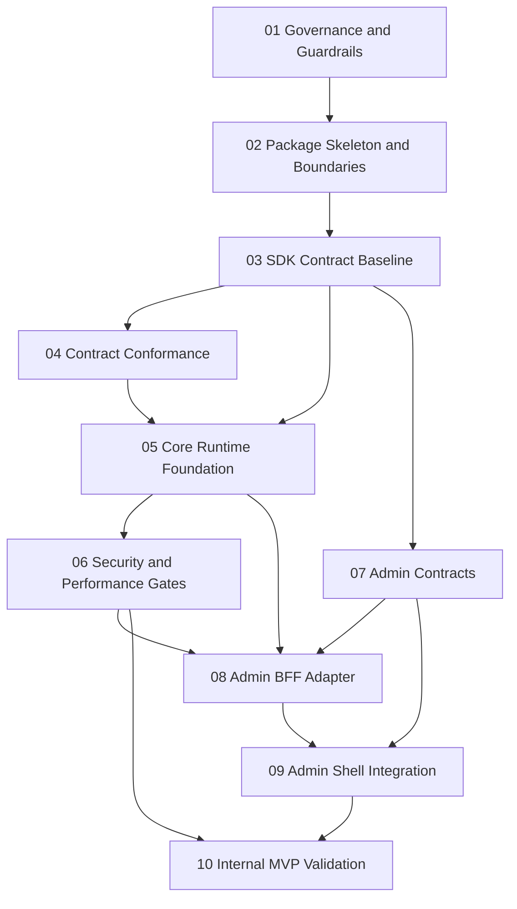

# Implementation Plan Index

This index consolidates the execution-ready implementation plan for `prosto-platform` based on the current repository state and architecture artifacts in `.context/02-architecture-design` and `.context/03-work-plan`.

## Planning Baseline
- Repository has completed Phase 01 governance activation, Phase 02 workspace/package baseline setup, Phase 03 SDK contract baseline delivery, Phase 04 contract conformance delivery, Phase 05 core runtime foundation, Phase 06 security and performance hardening, Phase 07 admin contracts and UI plugin manifests, Phase 08 admin BFF adapter and discovery pipeline, Phase 09 admin shell integration and plugin runtime, and Phase 10 internal MVP validation and operability readiness.
- Phase 10 issued a documented internal MVP `go` decision for ecosystem expansion readiness.
- Architecture intent emphasizes micro-core boundaries, contract-first delivery, deterministic lifecycle, security-first module loading, and hybrid admin model with shell plus UI plugins.
- This plan is sequenced to reduce early architecture drift and keep risk controls enforceable from the first implementation increment.

## Execution Status (As of 2026-08-02, post-Phase 10 completion with persistence adapter)
- `Phase 01`: Completed (governance workflows, required checks documentation, PR template, release evidence script).
- `Phase 02`: Completed (workspace packages, TypeScript baseline, dependency and public API boundary checks, dependency map).
- `Phase 03`: Completed (SDK contracts, manifest schema/semantic validation, typed tokens, validation errors, unit and type-level tests).
- `Phase 04`: Completed (contract conformance package implementation, failure taxonomy, reference module validation, compatibility matrix baseline).
- `Phase 05`: Completed (core runtime foundation, deterministic lifecycle orchestration, active FF-03/FF-04 scripts).
- `Phase 06`: Completed (security controls and performance regression gates — secret redaction, integrity checks, CI policy gates, performance baseline and drift enforcement, risk-to-control evidence).
- `Phase 07`: Completed (`@prosto/platform-admin-contracts`, UI plugin manifest contracts, discovery payload contracts, permission and policy contracts, compatibility rules, public exports, validation tests).
- `Phase 08`: Completed (`@prosto/platform-adapter-admin-bff`, policy-aware admin APIs, UI plugin discovery aggregation, permission mapping, compatibility filtering, diagnostics, observability instrumentation).
- `Phase 09`: Completed (`@prosto/platform-admin-shell`, Vue 3 SPA with plugin runtime, policy-gated rendering, degraded-mode diagnostics, observability instrumentation).
- `Phase 10`: Completed (production-like internal MVP pilot, KPI/SLO evidence, incident and exception registers, admin plugin readiness report, go decision, and reference TypeORM persistence adapter delivered with shared DataSource lifecycle, migration lock coordination, and descriptor ownership enforcement).

## Phase Order
1. [Phase 01 - Governance Activation and Delivery Guardrails](./01-phase.md)
2. [Phase 02 - Monorepo Package Skeleton and Contract Surface Setup](./02-phase.md)
3. [Phase 03 - SDK Contract Baseline and Manifest Validation](./03-phase.md)
4. [Phase 04 - Contract Conformance Test Package and Reference Module Validation](./04-phase.md)
5. [Phase 05 - Core Runtime Foundation and Deterministic Lifecycle](./05-phase.md)
6. [Phase 06 - Security Controls and Performance Regression Gates](./06-phase.md)
7. [Phase 07 - Admin Contracts and UI Plugin Manifests](./07-phase.md)
8. [Phase 08 - Admin BFF Adapter and Discovery Pipeline](./08-phase.md)
9. [Phase 09 - Admin Shell Integration and Plugin Runtime](./09-phase.md)
10. [Phase 10 - Internal MVP Validation and Operability Readiness](./10-phase.md)

## Phase Summaries
### 01
Converts architecture governance from documentation into mandatory CI and branch protection controls with evidence artifacts.

### 02
Introduces workspace package topology and boundary-preserving dependency ownership to support implementation without root-level coupling.

### 03
Builds SDK contract authority for lifecycle, manifest metadata, validation, tokens, and public API stability management.

### 04
Builds reusable contract conformance suite and validates at least two reference modules against the SDK contract.

### 05
Implements minimal runtime kernel with deterministic lifecycle, compatibility checks, dependency ordering, and startup policy behavior.

### 06
Adds module loading security controls and performance budgets so reliability and supply-chain posture are enforceable in CI and runtime.

### 07
Implements `platform-admin-contracts` with versioned UI plugin manifest, discovery payload, and permission contracts.

### 08
Implements `platform-adapter-admin-bff` with policy-aware discovery aggregation, permission mapping, and admin diagnostics.

### 09
Delivers `platform-admin-shell` (Vue 3 SPA) integration with plugin runtime, contract-driven rendering registry, and compatibility-gated extension loading.

### 10
Runs internal production-like MVP validation, proves KPI and SLO trends, and issues formal go or no-go outcome for external expansion.

## Cross-Phase Dependencies
- Phase 01 is required before all implementation phases to prevent governance drift.
- Phase 02 depends on Phase 01 and is required before SDK/core/package-level implementation.
- Phase 03 depends on Phase 02 and is prerequisite for Phase 04, Phase 05, and Phase 07.
- Phase 04 depends on Phase 03 and provides conformance confidence for Phase 05.
- Phase 05 depends on Phases 03 and 04.
- Phase 06 depends on Phase 05 and risk-controls baseline from architecture/work-plan docs.
- Phase 07 depends on Phase 03 and provides admin contract baseline for Phase 08 and Phase 09.
- Phase 08 depends on Phases 05, 06, and 07.
- Phase 09 depends on Phases 07 and 08.
- Phase 10 depends on successful outcomes from Phases 01 through 09.

Current dependency fulfillment:
- Phase 01 prerequisite: satisfied.
- Phase 02 prerequisite: satisfied.
- Phase 03 prerequisite: satisfied.
- Phase 04: completed and validated.
- Phase 05: completed and validated.
- Phase 06: completed and validated.
- Phase 07: completed and validated.
- Phase 08: completed and validated.
- Phase 09: completed and validated.
- Phase 10: completed and validated.

## Milestones and Stage Gates
### M1 Governance Gate Active
- Branch protection and mandatory checks operational.
- Required evidence artifacts generated in CI.

### M2 Contract Foundation Ready
- SDK contract package stable.
- Contract test package validates reference modules.

### M3 Runtime Baseline Ready
- Deterministic lifecycle and startup policy behaviors validated.
- Startup diagnostics contract implemented and tested.

### M4 Security and Performance Gates Active
- Allowlist and integrity controls enforced.
- Performance regression budgets enforced in protected branches.

### M5 Admin Enablement Stream
- Introduce `platform-admin-contracts` after contract baseline is available.
- Introduce `platform-adapter-admin-bff` after runtime baseline is available.
- Introduce `platform-admin-shell` (Vue 3 SPA) in monorepo and integrate via workspace reference to contracts.
- Enforce allowlist, trust class, integrity, and compatibility checks for UI plugins before internal MVP gate.

### M6 Internal MVP Go or No-Go Decision
- KPI and SLO evidence package complete.
- Exception and incident registers reviewed.
- Formal transition decision documented.

## Inter-Phase Workflow

## Execution Notes
- Keep all gates evidence-driven and linked to CI artifacts.
- Treat exceptions as time-bound and auditable, never as permanent bypasses.
- Update risk register and compatibility matrix at each milestone.
- Preserve ADR traceability when package boundaries or public contracts change.
