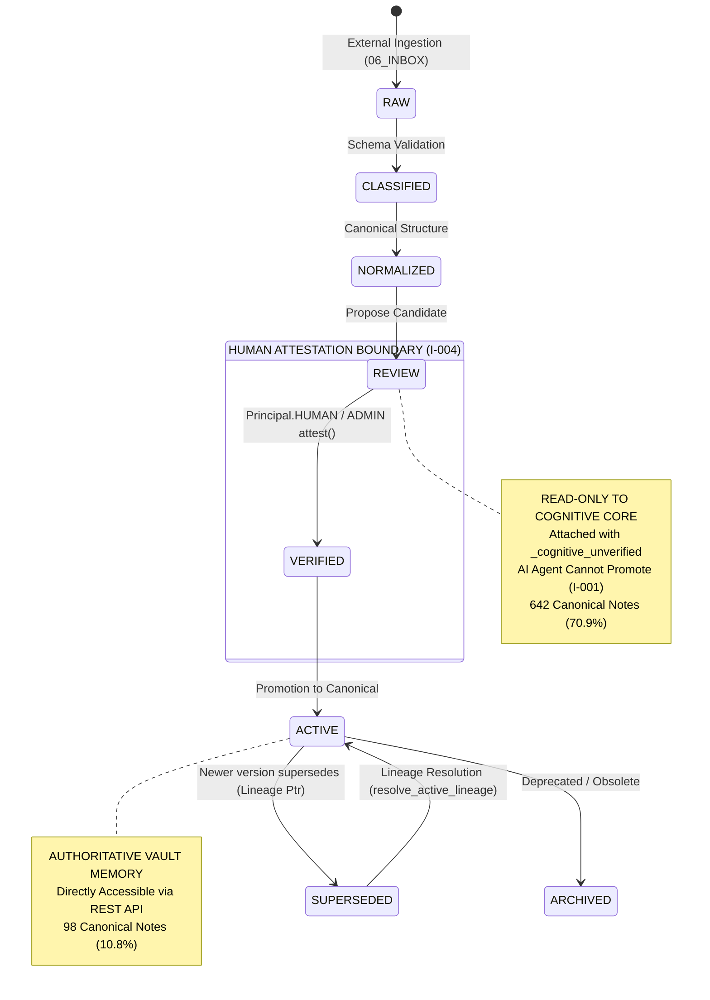

# Memory Lifecycle Visualization V1 (Antigravity Observability)

**Target Repository**: `userist123/AI_Memory_Vault_CODEX_READY`  
**Observability Agent**: Antigravity  
**Date**: 2026-09-04  
**Status**: `RUNTIME_VERIFIED` / `CODE_VERIFIED`  

---

## 1. Actual Empirical Lifecycle Counts

Across all 905 canonical Markdown notes in the repository (`00_CORE`, `01_KNOWLEDGE`, `02_PROJECTS`, `03_PROCEDURES`, `04_MEMORY`, `05_RESOURCES`, `99_SYSTEM`) and SQLite storage (`vault_memory.sqlite3`), the physical lifecycle census is:

### Canonical Markdown Notes Distribution ($N = 905$)
| Lifecycle Stage | Count | Percentage | Operational Meaning |
|---|---|---|---|
| **`REVIEW`** | **642** | **70.9%** | Non-authoritative candidate knowledge requiring human review/attestation. Read-only to cognitive core. |
| **`ACTIVE`** | **98** | **10.8%** | Authoritative canonical memory. Verified and directly retrievable. |
| **`NO_LIFECYCLE`** | **95** | **10.5%** | Structural navigation files, MOCs, indexes, or legacy un-frontmattered markdown. |
| **`ARCHIVED`** | **6** | **0.7%** | Obsolete memory retained solely for historical audit with $0.10$ ranking penalty. |
| **`RAW`** / `raw` | **5** | **0.6%** | Raw un-normalized ingestion inputs; strictly excluded from general search (`I-003`). |
| **`CLASSIFIED`** | 0 | 0.0% | Transient intermediate state (currently empty). |
| **`NORMALIZED`** | 0 | 0.0% | Transient intermediate state (currently empty). |
| **`VERIFIED`** | 0 | 0.0% | Transient pre-active state following human attestation (`I-004`). |
| **`SUPERSEDED`** | 0 | 0.0% | In markdown files; 1 tested dynamically in test harness. |

### SQLite Store (`vault_memory.sqlite3`, $N = 49$)
| Lifecycle | Count | Notes |
|---|---|---|
| `REVIEW` | **42** | Human-gated policy lessons, candidates. |
| `ACTIVE` | **7** | Production active notes with full attestation. |

### Book Knowledge Atoms (`06_INBOX/DERIVED/BOOKS/...`, $N = 31$)
| Stage | Count | Verification |
|---|---|---|
| `READY_FOR_HUMAN_REVIEW` | **31** | 100% marked `verification_required: true`, `UNVERIFIED` |

---

## 2. Source Provenance Breakdown ($N = 905$)

```text
┌─────────────────────────────────────────────────────────────┐
│ Provenance Source Distribution                              │
├────────────────────────────────┬───────────┬────────────────┤
│ Source Type                    │ Count     │ Percentage     │
├────────────────────────────────┼───────────┼────────────────┤
│ inference                      │ 572       │ 63.2%          │
│ UNKNOWN                        │ 98        │ 10.8%          │
│ execution                      │ 47        │ 5.2%           │
│ user                           │ 46        │ 5.1%           │
│ import                         │ 30        │ 3.3%           │
│ official                       │ 16        │ 1.8%           │
│ ai_conversation                │ 12        │ 1.3%           │
│ unknown                        │ 10        │ 1.1%           │
│ ai                             │ 6         │ 0.7%           │
│ external_documentation         │ 5         │ 0.6%           │
│ repository-scan                │ 1         │ 0.1%           │
│ developer_action               │ 1         │ 0.1%           │
│ experience                     │ 1         │ 0.1%           │
│ user_provided                  │ 1         │ 0.1%           │
└────────────────────────────────┴───────────┴────────────────┘
```

> [!IMPORTANT]
> **Dominance of `inference` (572 notes, 63.2%)**:
> The vast majority of vault notes originated from AI inference steps (e.g. `policy-lesson_*.md`). This empirical reality is why invariant `I-002` (Privileged Provenance Gated) and `I-003` (Creation Lifecycle Restricted) are critical: AI agents cannot claim `official` or `user` provenance and cannot self-promote into `ACTIVE`.

---

## 3. Cognitive Unverified Status

* **Unverified Flagged Notes**: **633 notes** (69.9% of all canonical markdown notes).
* **Tag / Field Representation**:
  - `verification: unverified` in YAML frontmatter.
  - `_cognitive_unverified: True` attached dynamically at runtime whenever `RecallEngine` or `ActivationEngine` loads a `REVIEW` note [`CODE_VERIFIED`].
  - Prevents hallucinated authority from bleeding into reasoning prompts.

---

## 4. State Machine Transition Graph & Isolation Boundaries



---

## 5. Visual Differentiation: REVIEW vs. ACTIVE

The contrast between `REVIEW` and `ACTIVE` memory is an absolute security and cognitive boundary:

| Feature / Invariant | `REVIEW` Lifecycle | `ACTIVE` Lifecycle | Code Reference |
|---|---|---|---|
| **Current Vault Count** | **642 notes (70.9%)** | **98 notes (10.8%)** | `FileStorageEngine` audit |
| **Trust Status** | Provisional, unverified | Canonical, authoritative | `I-001`, `I-003` |
| **Promotion Authority** | Only `HUMAN` or `ADMIN` via `attest()` | Frozen until superseded | `I-004` (`authorizer.py`) |
| **AI Agent Modification**| Allowed to propose into `REVIEW` | Prohibited from writing to `ACTIVE` | `I-003` |
| **Recall Behavior** | Read-only detached copy; `_cognitive_unverified = True` | Direct admission to context pack | `recall.py:85-88` |
| **Public API Read** | Prohibited via `read()` (raises `ValueError`) | Allowed via `read()` with progressive disclosure | `controller.py:140` |
| **Lineage Resolution** | Does not participate in lineage inheritance | Inherits score when superseding older note | `recall.py:189` |
| **Audit Chaining** | Event logged as `cognitive_propose` | Event logged as `cognitive_attest` | `logger.py` |
