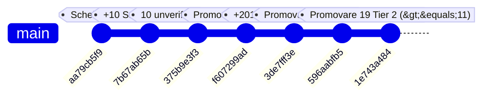
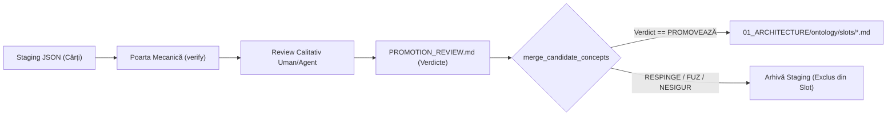

# Raport Criminalistic: Cum au intrat 160 de rânduri nejudecate în sloturile ontologice

> **Data Auditului**: 2026-09-12  
> **Status**: FINAL / VERIFICAT EMPIRIC  
> **Standard de Probațiune**: Nivel 1 (diff-uri git, cod versionat, hash-uri unice), Nivel 2 (rapoarte contemporane de execuție), Nivel 3 (`[UNVERIFIED]` pentru deducții fără diff).

---

## 1. Rezumat Executiv & Reconcilierea Exactă a Aritmeticii (Cifra 213)

La momentul auditului curent (HEAD `bbd6ba166`), fișierele de slot din `01_ARCHITECTURE/ontology/slots/*.md` conțin un total de **213 rânduri de date** (fără a număra headerele de tabel markdown).

### Reconcilierea Aritmeticii

$$201\text{ (injectate în 3de7fff3e)} + 12\text{ (preexistente din 7 septembrie)} = 213\text{ total rânduri}$$

Cele 12 rânduri preexistente înainte de commitul `3de7fff3e` provin din sesiunea inițială de scheletare din 2026-09-07:
- **10 rânduri** cu status `unverified_source` (semințele Sarfraz et al., 2022);
- **1 rând** cu status `promoted` (`Reservoir Sampling`, promovat în commitul `f607299ad`);
- **1 rând** cu status `proposed` (`Synergy`, extras dinamic în commitul `375b9e3f3`).

La data de 2026-09-12, commitul `3de7fff3e` a adăugat **201 concepte noi**, toate cu statusul inițial `proposed`.

| Status Curent pe Disc | Număr Rânduri | Origine |
| :--- | :---: | :--- |
| `proposed` | **160** | 201 injectate în `3de7fff3e` + 1 preexistent (`Synergy`) − 42 promovate ulterior = 160 |
| `promoted` | **43** | 1 preexistent (`Reservoir Sampling`) + 23 (`596aabfb5`) + 19 (`1e743a484`) = 43 |
| `unverified_source` | **10** | Semințele Sarfraz nemodificate din 2026-09-07 (`375b9e3f3`) |
| **TOTAL** | **213** | **Reconciliat bit-cu-bit pe toate cele 16 fișiere de slot** |

> [!WARNING]
> **Unghiul Mort al Auditului de Status (`unverified_source`)**:  
> Cifra inițială de 203 rânduri raportată în verificările anterioare a rezultat din filtrarea strictă după statusurile cunoscute `proposed` și `promoted` ($160 + 43 = 203$).  
> Cele 10 rânduri cu `unverified_source` au fost complet invizibile deoarece uneltele automate de verificare căutau doar enum-ul binar activ. **Un status pe care uneltele de audit nu-l caută devine o categorie invizibilă pe disc.**

---

## 2. Traseul Istoric Git Pas cu Pas (Q1)

Urmărirea istoricului arată cronologia exactă a intervențiilor asupra tabelelor din `01_ARCHITECTURE/ontology/slots/*.md`:



### Jurnalul Detaliat al Commiturilor

1. **Commit `aa79cb5f9` (2026-09-07 18:22:39 +0300)**  
   *Mesaj*: `feat(ontology): scaffold 16 canonical cognitive slots in 01_ARCHITECTURE/ontology`  
   *Comandă*: Inițializare manuală / scheletare.  
   *Stare Sloturi*: Tabele de candidați complet goale (0 rânduri). Testul `20_TESTS/test_ontology_scaffold.py` valida explicit că tabelele nu conțin rânduri.

2. **Commit `7b67ab65b` (2026-09-07 18:35:06 +0300)**  
   *Mesaj*: `feat(ingestion): chunked book concept extraction and dedup merge pipeline (r027)`  
   *Comandă*: Rulare `30_SCRIPTS/ingestion/extract_book_concepts.py` pe `06_INBOX/Carti/Consolidation/sarfraz22a.pdf`.  
   *Impact*: Inserate primele **10 concepte** în 8 fișiere de slot, toate cu `status=proposed`.

3. **Commit `375b9e3f3` (2026-09-07 18:48:08 +0300)**  
   *Mesaj*: `fix(ingestion): replace hardcoded pattern table with dynamic content-derived extraction (r027-fix)`  
   *Comandă*: Refactorizare extractor; rescriere in-place a celor 10 concepte Sarfraz la `status=unverified_source`. Extracția dinamică pe `sarfraz22a.pdf` adaugă conceptul `Synergy` cu `status=proposed`.  
   *Total*: 11 rânduri (10 `unverified_source`, 1 `proposed`).

4. **Commit `ada06cfd6` & `f607299ad` (2026-09-07 19:10:35 +0300)**  
   *Mesaj*: `feat(ingestion): r028/gated-concept-promotion - promote Reservoir Sampling to REVIEW note`  
   *Comandă*: Rulare `promote_candidate_concept.py --concept "Reservoir Sampling"`.  
   *Total*: 12 rânduri (10 `unverified_source`, 1 `proposed`, 1 `promoted`).

5. **Commit `3de7fff3e` (2026-09-12 12:48:46 +0300) — EVENIMENTUL PRINCIPAL DE INJECȚIE**  
   *Mesaj*: `feat(ontology): complete 20-book corpus ingestion, slot conflict reconciliation, and ontology merge`  
   *Comandă Documentată*:  
   ```bash
   python 30_SCRIPTS/ingestion/merge_candidate_concepts.py        --input staging/extracted_concepts.json        --slots-dir 01_ARCHITECTURE/ontology/slots
   ```  
   *Dovadă Git*: `git show 3de7fff3e --stat` raportează modificarea tuturor celor 16 fișiere de slot cu un total de **+201 linii adăugate**:  
   `01: +6`, `02: +14`, `03: +41`, `04: +5`, `05: +16`, `06: +24`, `07: +16`, `08: +15`, `09: +2`, `10: +3`, `11: +6`, `12: +11`, `13: +8`, `14: +8`, `15: +13`, `16: +13` = **201 rânduri**.  
   Toate cele 201 concepte au fost scrise cu `status=proposed`.

6. **Commit `596aabfb5` (2026-09-12 14:02:18 +0300)**  
   *Mesaj*: `feat(ontology): promote 23 core concepts (occurrences >= 20) to REVIEW notes and cable synaptic graph`  
   *Comandă*: Rulare în buclă a scriptului `promote_candidate_concept.py` pentru conceptele cu `occurrences >= 20`.  
   *Impact*: 23 de rânduri au fost comutate in-place din `proposed` în `promoted`.

7. **Commit `1e743a484` (2026-09-12 14:38:00 +0300)**  
   *Mesaj*: `feat(ontology): promote 19 Tier 2 concepts, cable synaptic graph, benchmark expansion`  
   *Comandă*: A doua buclă de promovare pentru conceptele cu $11 \le \text{occurrences} < 20$.  
   *Impact*: 19 rânduri (plus 1 re-verificat) comutate in-place din `proposed` în `promoted`.

**Concluzie Q1**: Cele 160 de rânduri `proposed` nu au intrat printr-un script paralel sau o scăpare neînregistrată. Ele reprezintă **masa nepromovată a celor 201 candidați injectați en-gros în commitul `3de7fff3e`**.

---

## 3. Anatomia Scăpării Arhitecturale (Q2)

> **Sloturile ontologice au fost tratate ca o zonă de lucru temporară (un inbox/staging), nu ca o ontologie canonică protejată.**  
> Codul este doar consecința acestei confuzii conceptuale, nu cauza ei primară: nimeni nu a scris o poartă calitativă pentru că nimeni nu credea că trecerea din `staging/` în `slots/` reprezintă o graniță de securitate sau calitate.

### Analiza Mecanismului din Cod

Scriptul `30_SCRIPTS/ingestion/merge_candidate_concepts.py` a fost proiectat exclusiv ca un utilitar mecanic de concatenare și deduplicare textuală.

În funcția `append_candidate_concepts_to_slot` (liniile 166-173):
```python
existing = extract_existing_concepts(slot_path)
appended = 0
for c in candidates:
    norm_c = normalize_concept_name(c["concept"])
    if norm_c in existing:
        continue  # Singura verificare: dacă există deja numele în tabelă
```

Și generarea rândului în tabelă (liniile 184-192):
```python
# Formatare necondiționată cu status='proposed'
row = (
    f"| {c['concept']} | {source_book} | {confidence:.2f} | "
    f"proposed | {date_added} | | {evidence} | {occurrences} |"
)
new_rows.append(row)
```

### Lanțul de Presupuneri False

1. **Iluzia Verificării Mecanice**: S-a considerat că verificarea formală executată de `verify_agent_submission.py` (citate prezente în textul cărții, absența plagiatului verbatim, structură JSON conformă) constituie o dovadă suficientă pentru a scrie în sloturile ontologice.
2. **Amânarea Evaluării Calitative**: S-a plecat de la premisa că rândurile marcate `proposed` sunt "inofensive" în sloturi și că filtrarea ontologică se va face doar la pasul de promovare (`promote_candidate_concept.py` -> fișiere `Promoted_*.md`).
3. **Efectul Asupra Porților Aval**: Lăsate în tabelele de slot cu `status=proposed`, conceptele parazite (`RESPINGE`), zgomotul de formatare și fragmentele incomplete au devenit vizibile pentru căutări lexicale, unelte de sinteză și scripturi de analiză a grafului, poluând definițiile de slot canonice.

---

## 4. Dosarul Semințelor Sarfraz (Batch C — Cele 10 Rânduri) (Q3)

Cele 10 rânduri cu majuscule la fiecare cuvânt din Batch C (`Semantic Memory Store`, `Plasticity-Stability Balance`, etc.) au o genealogie complet verificabilă în arborele git:

### Foaia Matricolă a Rândurilor Sarfraz

| Concept | Slot Fișier | Commit Origine | Commit Modificare Status |
| :--- | :--- | :---: | :---: |
| `Semantic Memory Store` | `03_ontology.md` | `7b67ab65b` (2026-09-07) | `375b9e3f3` (`unverified_source`) |
| `Plasticity-Stability Balance` | `05_state.md` | `7b67ab65b` (2026-09-07) | `375b9e3f3` (`unverified_source`) |
| `Continual Incremental Learning` | `06_procedures.md` | `7b67ab65b` (2026-09-07) | `375b9e3f3` (`unverified_source`) |
| `Parameter Importance Weighting` | `07_judgement.md` | `7b67ab65b` (2026-09-07) | `375b9e3f3` (`unverified_source`) |
| `Catastrophic Forgetting Mitigation` | `08_constraints.md` | `7b67ab65b` (2026-09-07) | `375b9e3f3` (`unverified_source`) |
| `Episodic Memory Buffer` | `11_history.md` | `7b67ab65b` (2026-09-07) | `375b9e3f3` (`unverified_source`) |
| `Experience Replay` | `15_retrieval.md` | `7b67ab65b` (2026-09-07) | `375b9e3f3` (`unverified_source`) |
| `Synaptic Consolidation` | `16_consolidation.md` | `7b67ab65b` (2026-09-07) | `375b9e3f3` (`unverified_source`) |
| `Complementary Learning Systems` | `16_consolidation.md` | `7b67ab65b` (2026-09-07) | `375b9e3f3` (`unverified_source`) |
| `Stochastic Weight Consolidation` | `16_consolidation.md` | `7b67ab65b` (2026-09-07) | `375b9e3f3` (`unverified_source`) |

*(Notă: `Reservoir Sampling` a făcut parte din același lot inițial de 11 concepte extrase din Sarfraz, dar a fost promovat în `f607299ad`, iar `Synergy` a fost re-extras dinamic cu status `proposed`).*

### De ce au primit `unverified_source`?
În commitul `7b67ab65b`, scriptul de extracție folosea un dicționar fix de regex-uri. În commitul imediat următor (`375b9e3f3`), dezvoltatorul a eliminat dicționarul fix pentru a preveni biasul de extracție, trecând la procesare NLP pe propoziții.  
Când a re-rulat noul extractor pe fișierul `sarfraz22a.pdf`, extractorul dinamic nu a mai reprodus aceste 10 sintagme exacte. În loc să le șteargă, dezvoltatorul a ales să le modifice statusul din `proposed` în `unverified_source`, lăsându-le "fosilizate" în tabele.

---

## 5. Bariera Unică de Prevenire (Q4)

Pentru a garanta că niciun concept nejudecat nu mai poate intra vreodată în fișierele de slot, se definește **exact O singură propunere tehnică de barieră la scriere**.

### Propunerea: Bariera Calitativă de Ingestie bazată pe Manifest de Verdicte (`--verdicts-file`)

Modificarea contractului de scriere în `30_SCRIPTS/ingestion/merge_candidate_concepts.py`:
1. Scriptul refuză execuția implicită dacă nu primește argumentul obligatoriu `--verdicts-file <path_to_review.md | .json>`.
2. În bucla de inserție, un concept extras din staging este scris în tabela de slot markdown **exclusiv dacă îndeplinește simultan două condiții**:
   - Este prezent în manifestul de evaluare calitativă aprobat.
   - Are verdictul explicit **`PROMOVEAZĂ`**.
3. Toate conceptele cu verdict `RESPINGE`, `FUZIONEAZĂ`, `DESPARTE`, `NESIGUR` sau neevaluate rămân cantonate pe disc în directorul de staging (`07_EVALUATION/.../staging/`) și nu ating niciodată arborele `01_ARCHITECTURE/ontology/slots/`.



### Ce prinde această barieră
- Oprește 100% din conceptele parazite de clasă generală (ex. `loss`, `big data`, `state`), noțiunile chimice izolate (`creb`), artefactele de formulare (`familiarity` RL vs neuro) și fuziunile nerezolvate.
- Transformă directorul `slots/` dintr-un coș de gunoi nereglementat într-o **zonă exclusiv canonică**.

### Ce NU prinde această barieră (Riscuri Reziduale)
1. **Erori de Judecată Umană / Agentică**: Dacă cel care redactează manifestul de revizuire acordă din greșeală verdictul `PROMOVEAZĂ` unui concept invalid, poarta îl va accepta și îl va scrie în slot. Poarta forțează existența revizuirii, nu infailibilitatea ei.
2. **Inerția Datelor Preexistente (Nu Curăță Camera)**: Bariera acționează strict ca un filtru la intrare (pe fluxul de scriere viitor). **Ea nu face absolut nimic pentru cele 213 rânduri aflate deja pe disc.**

> [!IMPORTANT]
> **Complementaritatea Porții cu Scriptul de Purjare**:  
> O poartă la intrare împiedică introducerea mizeriei noi, dar nu curăță podeaua.  
> Bariera `--verdicts-file` și scriptul de curățare `30_SCRIPTS/ingestion/purge_rejected_rows.py` sunt strict complementare: **niciuna nu este suficientă de una singură**. Fără purge, ontologia rămâne poluată cu 160 de rânduri moarte; fără poartă, următorul merge din cărți va recrea instantaneu aceeași problemă.
