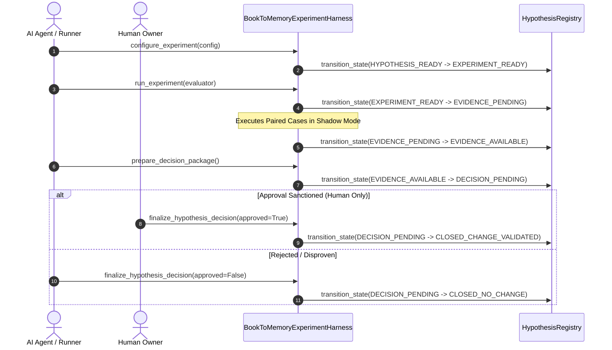

# Phase 10 Architecture Specification — Controlled Experimentation Harness & Shadow Mode Execution

**Document Version**: 1.0.0  
**Phase**: Phase 10 — Controlled Experimentation Harness & Shadow Mode Execution  
**Branch**: `research/book-to-memory-phase10-experiment-harness`  
**Parent HEAD**: `46212022e` (Phase 9 validat)  
**Status**: APPROVED & IMPLEMENTED  
**Date**: 2026-10-04  

---

## 1. Scope & Governance Authority

The **Controlled Experimentation Harness** (`BookToMemoryExperimentHarness`), implemented in [book_to_memory_experiment.py](file:///C:/Users/Marius/Documents/Codex/AI_Memory_Vault_CODEX_READY/03_IMPLEMENTATION/packages/lifecycle/validation/book_to_memory_experiment.py), serves as the execution engine for research tracks under (no experiment has been run on real data yet):
- `00_GOVERNANCE/rules/POLICY-LEARNING-QUALITY-02.md` (Section 14: Biological Fact $\to$ Engineering Hypothesis $\to$ Controlled Experiment $\to$ Vault Mechanism)
- `08_RESEARCH/BOOK_TO_MEMORY/RESEARCH-TRACK-CONTRACT.md` (Sections 88–148: Anti-Gaming, Paired Evaluation, and Shadow Mode)

It operationalizes the progression of registered hypotheses through runtime evidence collection and owner decision packaging.

---

## 2. Finite State Machine Progression

The harness transitions hypotheses through the 8-stage lifecycle defined in Phase 9:

---

## 3. Strict Boundary Invariants

### 3.1 Shadow Mode Execution Invariant
All experiment configurations enforce `shadow_mode = True`. The evaluator operates purely on frozen test cases and in-memory simulated variant components. No destructive mutations or direct writes to `MemoryController` storage are permitted.

### 3.2 Anti-Gaming Constraints
- **Sample Count Constraint**: `sample_size >= 5`. Configurations with fewer than 5 cases fail validation (`ExperimentValidationError`).
- **Paired Controls**: Baseline control and mechanism variant are evaluated on identical test cases.
- **Dual Delta Reporting**: Both `absolute_delta` and `relative_delta` are computed and stored. Relative percentages alone can never justify promotion.
- **Non-Censored Failure Accounting**: Failed or crashed test runs are recorded in `failure_count` with 0.0 scores, preventing cherry-picking.

### 3.3 Human Attestation Gate (I-001 / I-004)
The harness checks `actor` upon finalization:
- If `approved=True` and `actor == Principal.AI_AGENT`, the harness raises `PermissionError`.
- Only `Principal.HUMAN` or `Principal.ADMIN` can authorize promotion to `CLOSED_CHANGE_VALIDATED`.

---

## 4. Cryptographic Ledger & Auditability

Every experiment execution produces an `ExperimentResult` containing:
- Per-case score deltas and metadata;
- Mean scores and aggregate deltas;
- Deterministic SHA-256 result digest;
- Immutable entry in the harness audit ledger.

The complete state of the harness and registry can be recomputed at any time with `compute_harness_digest()`.
