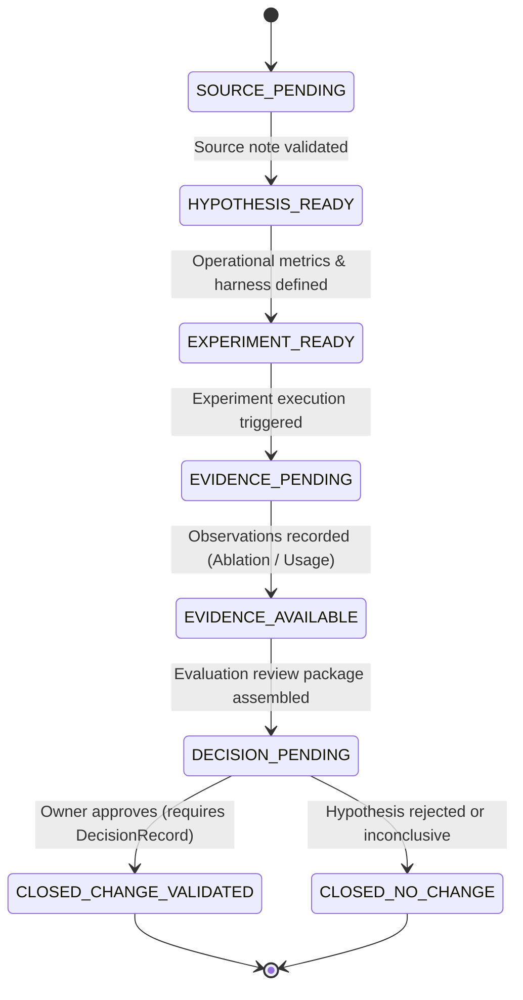

# Phase 9 Architecture Specification — Systematic Hypothesis Validation Engine & Problem Matrix Traceability

**Document Version**: 1.0.0  
**Phase**: Phase 9 — Problem Matrix Traceability & Systematic Hypothesis Validation Engine  
**Branch**: `research/book-to-memory-phase9-hypothesis`  
**Parent HEAD**: `b0cf20727` (Phase 8)  
**Status**: APPROVED & IMPLEMENTED  
**Date**: 2026-10-04  

---

## 1. Architectural Purpose & Scope

The **Systematic Hypothesis Validation Engine** (`BookToMemoryHypothesisRegistry`), implemented in [book_to_memory_hypothesis.py](file:///C:/Users/Marius/Documents/Codex/AI_Memory_Vault_CODEX_READY/03_IMPLEMENTATION/packages/lifecycle/validation/book_to_memory_hypothesis.py), fulfills the authoritative requirement of `00_GOVERNANCE/rules/POLICY-LEARNING-QUALITY-02.md` Section 14:

```text
BIOLOGICAL FACT
       ↓
ENGINEERING HYPOTHESIS
       ↓
CONTROLLED EXPERIMENT
       ↓
VAULT MECHANISM
```

Under the AI Memory System Operating Contract:
1. Untrusted biological literature or speculative concepts must **never** be admitted directly into production code or active memory.
2. A biological finding is merely an inspirational observation; it must be operationalized into a falsifiable engineering hypothesis linked directly to a known vault limitation (one of the canonical problems in `08_RESEARCH/PROBLEM_MATRIX.md`).
3. Changes to vault mechanisms can only occur if supported by paired evaluations with positive ablation delta ($\Delta \ge 0$), passing usage tests ($\ge 8/10$), and signed Human Owner attestation.

---

## 2. Finite State Machine (8-State Evidence Chain)

The hypothesis lifecycle follows an unbroken 8-state directional finite state machine (`TrackState`):



### State Definitions
1. **`SOURCE_PENDING`**: Initial draft state awaiting validated source citation and reference link in the Book-to-Memory Catalog.
2. **`HYPOTHESIS_READY`**: Falsifiable engineering claim, mechanism, target problem, and predicted ablation delta explicitly articulated.
3. **`EXPERIMENT_READY`**: Controlled test harness, evaluation protocol, and success criteria configured and frozen.
4. **`EVIDENCE_PENDING`**: Multi-run paired evaluation in active progress.
5. **`EVIDENCE_AVAILABLE`**: Observations (both absolute and relative deltas, sample counts, failure counts) collected.
6. **`DECISION_PENDING`**: Structured evaluation package prepared for council and owner review.
7. **`CLOSED_CHANGE_VALIDATED`**: Terminal state where a measured improvement has been attested by the owner, and changes are sanctioned for implementation. **Requires `Principal.HUMAN` authorization and valid `DecisionRecord`**.
8. **`CLOSED_NO_CHANGE`**: Terminal state where the hypothesis failed to demonstrate value or was disproven. Preserves negative evidence to prevent recurring cycles.

---

## 3. Strict Boundary Invariants & Anti-Gaming Controls

To ensure absolute integrity and compliance with `POLICY-LEARNING-QUALITY-02` and `RESEARCH-TRACK-CONTRACT.md`, the registry enforces the following deterministic invariants:

### 3.1 Zero-Jump Invariant
Transitions must advance sequentially through permitted transitions. Attempting to bypass intermediate states (e.g., jumping from `HYPOTHESIS_READY` directly to `CLOSED_CHANGE_VALIDATED`) raises a `ValueError` and halts execution.

### 3.2 Human Attestation Gate (I-004 Enforcement)
`Principal.AI_AGENT` is cryptographically barred from transitioning any hypothesis to `CLOSED_CHANGE_VALIDATED`. Only `Principal.HUMAN` or `Principal.ADMIN` possesses the authority to validate engineering changes that impact vault mechanisms.

### 3.3 Anti-Gaming Constraints
Any `DecisionRecord` attached to a hypothesis must fulfill:
- **Sample Count Constraint**: `sample_count >= 5` (single-run flukes or cherry-picked examples are rejected).
- **Paired Evaluation Constraint**: `paired_evaluations == True` (identical tasks evaluated under WITH_NOTE vs. WITHOUT_NOTE conditions).
- **Absolute Delta Reporting**: Both `absolute_delta` and `relative_delta` must be explicitly recorded and non-null.
- **Non-Negative Failure Accounting**: `failure_count >= 0`.

### 3.4 Untrusted Input Interception
All input fields (`title`, `biological_fact`, `engineering_hypothesis`, etc.) are scanned for prompt injection attacks (`SYSTEM:`, `IGNORE PREVIOUS`, `INSTRUCTION:`, `EVAL:`, etc.). Detected patterns trigger an immediate validation exception.

---

## 4. Problem Matrix Mapping & Coverage

The registry maps each hypothesis to one of the **17 Canonical Vault Problems**:
1. `retrieval_indirect_cues`
2. `candidate_generation`
3. `consolidation`
4. `forgetting_decay`
5. `interference_conflict`
6. `reconsolidation`
7. `context_budget`
8. `working_memory`
9. `episodic_semantic`
10. `procedural_memory`
11. `salience_attention`
12. `confidence_familiarity`
13. `meta_memory`
14. `agent_routing`
15. `feedback_stability`
16. `provenance_epistemic`
17. `token_economy`

The registry computes real-time problem coverage, open tracks, and validated mechanisms via `get_problem_matrix_status()`.

---

## 5. Pre-Registered Hypotheses (H1-BOOK-001..005)

Phase 9 formally registers the 5 initial hypotheses derived from the foundational literature:

| ID | Problem Slug | Source Book | Core Concept | Target Delta |
|---|---|---|---|---|
| `H1-BOOK-001` | `interference_conflict` | *The Psychology of Memory* (Baddeley) | Proactive Interference Boundary | $\ge +15\%$ retrieval accuracy under distraction |
| `H1-BOOK-002` | `retrieval_indirect_cues` | *Principles of Neural Science* (Kandel) | Synaptic Weight Dual Routing | $\ge +20\%$ recall on indirect queries |
| `H1-BOOK-003` | `consolidation` | *Principles of Neural Science* (Kandel) | Reversible Two-Phase Consolidation | $\ge 25\%$ token reduction in working memory |
| `H1-BOOK-004` | `working_memory` | *Working Memory* (Baddeley) | Dynamic Working Memory Chunking | $\ge 30\%$ working memory token compaction |
| `H1-BOOK-005` | `salience_attention` | *Attention and Effort* (Kahneman) | Salience-Weighted Epistemic Gating | $\ge +18\%$ relevance density |

---

## 6. Cryptographic State Verification

The registry provides `compute_registry_digest()`, generating a deterministic SHA-256 hash across all registered hypotheses, their current states, problem mappings, and associated decisions. Any state mutation or unauthorized alteration immediately invalidates the digest, ensuring full auditability.
