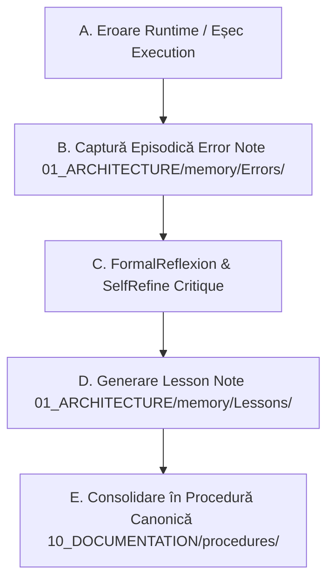

# 🔄 Procedură Canonică: Pipeline de Reflecție Închisă (Closed-Loop Reflexion)

Această procedură definește ciclul automat de reflecție închisă (**Generate → Critique → Revise → Consolidate**) pentru conversia erorilor runtime în lecții și proceduri reutilizabile.

---

## 🔁 1. Ciclul de Reflecție în 4 Etape

### Etapa A: Captura Erorii
- Când un task întâmpină un eșec sau o aserțiune picată, se creează o notă în `01_ARCHITECTURE/memory/Errors/` cu `type: error`, `lifecycle: REVIEW`, log-ul complet nealterat și atribuirea cauzei rădăcină.

### Etapa B: Critica SelfRefine (`cognitive_core/reflection.py`)
- `CriticAgent` și `VerifierAgent` analizează traiectul eșecului prin masca de reguli `SelfRefine`:
  1. Identificarea cauzei rădăcină (*Root Cause Analysis*).
  2. Verificarea dacă problema este specifică proiectului sau o lecție generală reutilizabilă.

### Etapa C: Extragerea Lecției (`01_ARCHITECTURE/memory/Lessons/`)
- Se generează o notă de tip `lesson` care conține:
  - Contextul problemei;
  - Soluția verificată prin test;
  - Regula de prevenție pe viitor.

### Etapa D: Consolidarea în Procedură (`10_DOCUMENTATION/procedures/`)
- Când două sau mai multe lecții descriu un pattern similar, `Consolidator` le sintetizează automat într-o procedură canonică reutilizabilă în `10_DOCUMENTATION/procedures/`.

---

## 🔗 Legături de Memorie & Graf Obsidian
- [[12 Projects and Procedures Map]]
- [[Knowledge Graph Home]]
- [[Knowledge Graph Home]]
