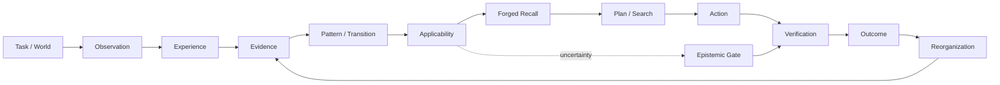
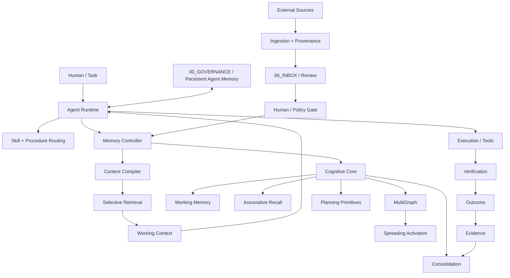

# AI Memory Vault

A persistent external memory substrate for AI agents: provenance-aware memory, skills, procedures, retrieval, cognitive runtime primitives, controlled learning, evidence, and resumable multi-agent execution.

<p align="center">
  <a href="README.md">Română</a> · <strong>English</strong>
</p>

<p align="center">
  <strong>ONE VAULT · ONE CANON · SELECTIVE COGNITION · VERIFIED EVOLUTION</strong>
</p>

<p align="center">
  <a href="https://github.com/userist123/AI_Memory_Vault_CODEX_READY/actions"></a>
  <a href="https://github.com/userist123/AI_Memory_Vault_CODEX_READY/tree/main/.claude-plugin"></a>
  <a href="https://github.com/userist123/AI_Memory_Vault_CODEX_READY/tree/main/07_EVALUATION"></a>
  <a href="https://github.com/userist123/AI_Memory_Vault_CODEX_READY/tree/main/00_GOVERNANCE/coordination"></a>
  <a href="https://obsidian.md/"></a>
</p>

> **The problem:** standard RAG can retrieve text. This project is trying to make external memory *operationally useful* — bounded, attributable, lifecycle-aware, uncertainty-aware, and measurable at the point where an agent reasons, plans, verifies, and acts.

---

## ✦ At a glance

| Layer | What is here | Reality status |
|---|---|---|
| Canonical Vault | Markdown memory, knowledge, skills, agents, procedures, provenance | **IMPLEMENTED** |
| Memory V6 | extraction, proposals, conflict detection, lifecycle, consolidation, retrieval maintenance | **IMPLEMENTED / ACTIVE** |
| Cognitive Core | recall, activation, working memory, global workspace, graphs, spreading activation, planning primitives | **IMPLEMENTED AND TESTED — NOT WIRED INTO PRODUCTION SEARCH** (spreading activation sits behind a flag that is off; `executive` and the global workspace have no production consumer) |
| Memory Controller | storage boundary, read/write policy, context packs, progressive disclosure, lifecycle gating | **IMPLEMENTED** |
| Model execution | fake, local/Ollama, OpenAI provider abstractions, tier routing, usage telemetry | **IMPLEMENTED** |
| External skill ingestion | discovery, provenance, classification, validation, controlled promotion | **IMPLEMENTED** |
| Book → text conversion | PDF outline / typography / page-fallback chunking, OCR detection, per-book metrics | **IMPLEMENTED** |
| Book concept extraction | model-assisted, with grounding, paraphrase, shape and schema gates | **IMPLEMENTED / GATES PROVEN** |
| Book concept *selectivity* | telling a load-bearing concept from experimental furniture | **MEASURED, NOT SOLVED** |
| Book curriculum | ingestion with verified quotes, then a control ↔ treatment benchmark on questions written by the book's authors | **FIRST TRANSFER SHOWN — ONE CHAPTER** |
| Ontology promotion gate | without a verdict manifest, writes into the ontology slots are refused (merge and promotion); unjudged rows are withheld and counted | **IMPLEMENTED / MANDATORY** |
| Row disposition | 213 slot rows, each with a decision and a reason; 93 remain | **EXECUTED — 7 ROWS AWAIT THE OWNER'S DECISION** |
| Graph expansion | 521 synapses, spreading activation, a per-query budget of new nodes | **EFFECTIVELY OFF AT THE DEFAULT BUDGET — DECISION PENDING** |
| Personal-data guard | validated CNP, IBAN and card numbers, personal document names; reports the path, never the value | **IMPLEMENTED / IN CI** |
| Polymarket forecasting | snapshots, council, calibration, edge, abstention, Kelly sizing, backtest, ablation, temporal contract | **IMPLEMENTED / UNVALIDATED ON REAL DATA** |
| Polymarket resolution provenance | the moment an outcome became knowable | **ESTABLISHED UNAVAILABLE** |
| Persistent agent memory | resumable `CURRENT.md` state under `00_GOVERNANCE/coordination/agents/` | **IMPLEMENTED** |
| Planning Influence | V3 simulation without oracle leakage, contradiction veto with absolute priority, baseline benchmark derived by simulation | **VALIDATED AS A SIMULATION — NOT AS A REAL AGENT** |
| Uncertainty policy | applicability + evidence strength + contradiction + verification cost contract | **MEASURED IN THE V3 SIMULATION** |
| Model-backed cognitive influence | paired causal MVE on real model runtime | **NOT YET PROVEN** |
| Fully closed continual learning | outcome → evidence → learning → canonical mutation loop | **PARTIAL / OPEN** |

<details>
<summary><strong>What makes this different from “just RAG”?</strong></summary>

```text
RAG mindset
query → documents → prompt

Vault target
experience → evidence → pattern → applicability → influence → decision → outcome → reorganization
```

The long-term target is **retrieval ≠ influence**. The repository explicitly distinguishes a passive epistemic substrate from active runtime interfaces. The current implementation does not pretend that hidden model state, decoding, planning, or tool execution is magically controlled by a text file.
</details>

---

## 🧠 Cognitive loop



The architecture is intentionally split into five semantic layers:

**Experience** — what happened.  
**Model / Pattern** — what may generalize.  
**Applicability** — where that memory should transfer.  
**Influence** — how it is allowed to affect computation.  
**Reorganization** — how verified outcomes alter future memory.

Evidence, provenance, temporal validity, uncertainty, safety, and token economy cross all five layers.

---

## ⚙️ System architecture



### The core boundary

```text
              PASSIVE EPISTEMIC SUBSTRATE
┌──────────────────────────────────────────────────┐
│ experience • evidence • memory • skills         │
│ provenance • lifecycle • temporal state         │
└────────────────────────┬─────────────────────────┘
                         │
                         ▼
              ACTIVE RUNTIME INTERFACES
┌──────────────────────────────────────────────────┐
│ representation / frame compiler                  │
│ planning / search harness                        │
│ epistemic gate / verification routing            │
│ deterministic execution gateway                  │
└──────────────────────────────────────────────────┘
```

These runtime interfaces are the target architecture. Some are present as isolated primitives or experiments; they are not all fully wired into the production agent path yet.

---

# 🗂️ Repository map

| Path | Role |
|---|---|
| `00_GOVERNANCE/` | rules, protocols, invariants, agent coordination, `VAULT_STATE.md` |
| `01_ARCHITECTURE/` | knowledge notes, registries, skill matrices, the ontology slot files |
| `01_KNOWLEDGE/` | external research and imported knowledge |
| `02_PRODUCT/` | project context and continuity |
| `03_IMPLEMENTATION/` | `03_IMPLEMENTATION/packages/` — cognitive core, memory controller, retrieval, polymarket, providers |
| `04_CONFIG/` · `05_DATA/` | configuration and data artifacts |
| `04_MEMORY/` | canonical memory records |
| `06_INBOX/` | raw and imported material, pre-review |
| `07_EVALUATION/` | audits, experiments, benchmarks, MVE, forensic evidence, captured fixtures |
| `08_OBSERVABILITY/` · `09_SECURITY/` | telemetry and security surfaces |
| `10_DOCUMENTATION/` | procedures, resources, Obsidian projection |
| `20_TESTS/` | the deterministic suite — `pytest -q` runs it from the repository root |
| `30_SCRIPTS/` | ingestion, knowledge, memory, skills and verification tooling |
| `40_EXPERIMENTS/` · `50_ARTIFACTS/` | experimental work and generated artifacts |
| `60_DEPLOYMENT/` · `70_INTEGRATIONS/` | deployment and integration surfaces |
| `80_ARCHIVE/` · `90_RELEASE/` · `99_META/` | history, releases, meta |
| `.agents/` | agent profiles, rules, operational skills |
| `.claude-plugin/` | Claude Code plugin surface |
| `cognitive_core/` | cognitive runtime primitives |
| `staging/` | per-book extraction rows, gitignored — never committed |
| `AI_Memory_Vault_OBSIDIAN/` | the human navigation layer, which still carries the older `00_CORE` / `99_SYSTEM` vault layout |
| `.github/workflows/` | CI, security, ingestion, maintenance, evaluation |

> The numbered directories above are the repository. The vault layout the
> Obsidian projection uses — `00_CORE/`, `09_COORDINATION/`, `99_SYSTEM/` — lives
> under `AI_Memory_Vault_OBSIDIAN/` and is not the repository root. This README
> described the second as if it were the first until 2026-09-14.

---

# 🧩 Cognitive Core

Important runtime modules include:

- `recall.py` — multi-signal recall using semantic, activation, temporal, working-memory, authority and lifecycle signals.
- `ranked_search.py` — graph-aware reranking layer.
- `multi_graph.py` — semantic, temporal, causal and entity-oriented graph views.
- `spreading_activation.py` — associative activation over graph structure.
- `working_memory.py` — active context state.
- `global_workspace.py` — competitive workspace/broadcast primitive.
- `activation.py` — activation/decay behavior.
- `consolidation.py` / `sleep_consolidation.py` — maintenance and reconsolidation.
- `planning.py` / `plan_complexity_analyzer.py` — planning and resource-routing primitives.
- `learning.py`, `reflection.py`, `reasoning.py`, `motivation.py` — higher-level cognitive components.
- `semantic.py` — semantic provider abstraction.

### Reality check

The current default retrieval path is not a fully semantic vector-native system. Deterministic semantic behavior and relevance scoring still contain lexical/token-overlap mechanisms; optional semantic/Qdrant/Ollama paths exist but are not equivalent to a universally wired production semantic index. This distinction is preserved intentionally.

---

# 🗄️ Memory Controller

`03_IMPLEMENTATION/packages/memory_controller/` is the trust and context boundary around canonical memory.

The name is a compatibility shim today: the package holds only an `__init__.py` that redirects the historical import namespace onto responsibility-focused sibling packages. The implementation lives under `retrieval/`, `memory/`, `security/`, `lifecycle/`, `interfaces/` and `observability/`.

It is responsible for things such as:

```text
query sanitation
      ↓
classification
      ↓
lifecycle-aware access
      ↓
candidate retrieval
      ↓
relevance scoring
      ↓
progressive disclosure
      ↓
bounded context pack
      ↓
provenance / audit
```

Key surfaces:

- `memory/controller.py`
- `security/authority.py`
- `retrieval/context/retrieval.py`
- `retrieval/context/relevance_scoring.py`
- `retrieval/context/pack_builder.py`
- `retrieval/context/progressive_disclosure.py`
- SQLite and file-backed storage engines

(paths relative to `03_IMPLEMENTATION/packages/`)

Public reads remain lifecycle controlled. Cognitive inspection can explicitly handle REVIEW material without silently promoting it to canonical truth.

---

# 🧱 Memory V6

Memory V6 adds an operational memory-maintenance layer around the base Vault:

| Capability | Purpose |
|---|---|
| Sensor buffer | transient session/event material |
| Atomic extraction | facts, decisions, procedures, lessons |
| Ollama adapter | optional local-model extraction |
| Proposal queue | review-stage memory candidates |
| Conflict detection | contradictions and competing claims |
| Controlled promotion | human/policy-gated canonicalization |
| MultiGraph | derived relationship views |
| Spreading activation | associative activation / ranking |
| Sleep consolidation | maintenance-oriented processing |
| Retrieval benchmarks | Precision@K / Recall@K / MRR tooling |
| Context budgets | bounded token/byte transport |
| Usage telemetry | estimated vs actual model consumption |
| Efficiency reporting | B4/B5-style execution economics |

The architectural objective is **progressive disclosure**: do not load the whole Vault just because it exists.

```text
metadata
   ↓
relevant rules
   ↓
compact memory
   ↓
detailed evidence only when needed
```

---

# 🧠 Memory Influence — the new research layer

The project is now testing whether external memory can influence computation beyond adding text to a prompt.

### Four intended influence channels

| Channel | Intended effect | Measurement target |
|---|---|---|
| Recall / Representation | change the explicit frame or hypothesis set | memory-off ≠ memory-on representation |
| Planning | change branch/search preference | search trajectory / node allocation changes |
| Uncertainty | change act / verify / explore / abstain behavior | verification routing and abstention |
| Execution | deterministic action constraints at tool boundary | allowed vs rejected actions |

The important safety distinction is:

> **Memory influence must be explicit and observable. Hidden-state influence is not claimed.**

### Evidence-Bound memory model

The target persistent unit is an evidence-linked transfer pattern:

```text
Situation
Goal
Constraints
Action
State transition
Outcome
Evidence
Temporal bounds
Applicability
Counterexamples
```

A compact influence artifact can then be forged on demand instead of repeatedly shipping the entire historical record through the model context.

---

# 🧪 Planning Influence MVE

The isolated MVE lives under:

```text
07_EVALUATION/luna/
├── PLANNING_INFLUENCE_PREREGISTRATION_V2.md
├── PLANNING_INFLUENCE_PREREGISTRATION_V2_1.md
├── PLANNING_INFLUENCE_RESULTS_V3.md
├── PLANNING_INFLUENCE_UNCERTAINTY_POLICY_V1.md
├── planning_influence_mve_v3.py
├── simulate_puct_benchmark.py
├── run_experiments_v3.py
├── generate_planning_influence_report.py
├── run_all_v3.py
├── tables/ (table_luna_1..5.csv)
├── planning_influence_mve.py (retired initial pilot)
└── test_planning_influence_mve.py (retired)
```

### Experimental arms

```text
Arm 1 — baseline / uniform planner (isolated, zero oracle leakage)
Arm 2 — advisory memory / uniform planner
Arm 3 — cognitive treatment / memory-derived planner prior (v1_uncertainty, v2_verification_action)
Arm 4 — stale / contradicted memory control (CONFIRMED_CONTRADICTION)
```

### Validated V3 Results (`PLANNING_INFLUENCE_RESULTS_V3.md`)

The V3 harness fixes the structural leakage of the initial pilot via balanced random branch permutation and orthogonal position-independent SHA-256 tie-breaking (`test_planning_influence_isolation.py` passes 100%, with a strict `xfail` on the retired legacy harness).

Empirical results across the pre-registered experimental grid ($N=200$ independent scenarios per cell, 17,600 total planner evaluations in `run_experiments_v3.py` reproduced byte-for-byte by `run_all_v3.py`):

1. **Baseline isolation and PUCT benchmark:** Uninformed search requires on average $\approx 2.921$ PUCT nodes ($SE = 0.0032$, derived via 200,000-run Monte Carlo simulation in `simulate_puct_benchmark.py`), with zero correlation between optimal branch position and search cost ($r^2 < 0.01$).
2. **Accuracy thresholds ($p^*$):** Memory provides net search cost reduction above $p^* = 0.40$ in calibrated mode ($\Delta_{\text{nodes}} = +0.310$, 95% CI $[0.080, 0.565]$) and $p^* = 0.50$ in uninformative mode ($\Delta_{\text{nodes}} = +0.565$, 95% CI $[0.300, 0.835]$) under the `v1_uncertainty` policy.
3. **Absolute priority of contradiction veto:** Under `CONFIRMED_CONTRADICTION`, priors are strictly forced to uniform ($0.25$) across all policies, guaranteeing $\Delta_{\text{fatals}} = 0.0000$ on the stale arm and completely eliminating decision risk.
4. **Cost-benefit of verification-as-action (`v2_verification_action`):** In small action spaces ($K=4$), paying $1.0$ node per verification yields negative net cost savings ($-0.235$ to $-0.305$ nodes) compared to `v1_uncertainty`; active verification is economically warranted only in larger search spaces ($K \ge 6$) or asymmetric high-stakes failure domains.

> **Methodological limitation:** This is a **deterministic simulation with scenario oracle**. It mathematically validates the mechanics of memory fusion in planning (oracle isolation, Bayesian uncertainty weighting, absolute contradiction veto), but **does not prove that a real LLM-backed agent plans better**.

### Initial deterministic pilot — ⚠️ RETRACTED (invalid measurement via oracle leak, PR #165)

> **The initial pilot is retracted and kept solely for historical traceability.** The baseline ↔ treatment comparison in `planning_influence_mve.py` was compromised by an oracle leak: line 153 placed the optimal branch at index 0 (`optimal=order[0]`), and PUCT selection (line 252) broke ties by branch position (`-branches.index(candidate)`). The baseline thus selected the optimum on step 1 across all 30 scenarios (an artificial 1.0 node/scenario cost). The originally reported figures (baseline 30 nodes / treatment 54 nodes / 12 fatal) are invalid and were formally retracted via PR #165.

### Uncertainty policy

The pre-registered policy separates:

```text
applicability
+ evidence_strength
+ contradiction_state
+ verification_cost
+ planner_influence
+ execution_outcome
```

Fixed applicability strengths for the next isolated run:

```text
APPLICABLE                   = 1.00
APPLICABLE_WITH_VERIFICATION = 0.35
INSUFFICIENTLY_KNOWN         = 0.15
NOT_APPLICABLE               = 0.00
```

The policy is design evidence. Its success has not yet been established.

---

# 🧬 Continual learning direction

The intended learning loop is conservative by design:

```text
REAL EXECUTION
      ↓
OUTCOME
      ↓
EVIDENCE
      ↓
EVALUATION
      ↓
CANDIDATE PATTERN / PROCEDURE / SKILL
      ↓
SANDBOX / REVIEW
      ↓
REGRESSION + HOLDOUT
      ↓
HUMAN / POLICY GATE
      ↓
CANONICAL MEMORY
```

Current outcome tooling and learning components exist, but the repository does **not** currently claim a completely closed autonomous continual-learning loop in which every outcome automatically mutates canonical memory.

That restraint is deliberate: a result that happened once is evidence about an event, not automatically a reusable capability.

---

# 🤖 Multi-agent operating model

Persistent execution state lives under:

```text
00_GOVERNANCE/coordination/
├── README.md
├── UNIVERSAL_AGENT_MEMORY_PROTOCOL_V1.md
├── BOOTSTRAP_ALL_AGENTS_V1.md
├── agents/
│   ├── CODEX/
│   ├── ANTIGRAVITY/
│   ├── PERPLEXITY/
│   └── LUNA/
└── projects/
    └── AI_MEMORY_VAULT/
        └── CURRENT.md
```

Every substantive session is expected to leave:

```text
WHAT I DID
WHERE
EVIDENCE
WHAT FAILED / REMAINS
EXACT NEXT ACTION
```

### Current execution discipline

```text
MAIN_ONLY
SEQUENTIAL_HANDOFF
NO PARALLEL WORK ON SAME TASK
NO FEATURE-BRANCH DEVELOPMENT FOR THIS RESEARCH CHAIN
```

This is the mechanism that makes work resumable across agents, PCs, IDEs and sessions without treating chat history as canonical state.

---

# 📦 Skills & external knowledge

Skills are treated as reusable capabilities, not just prompt snippets.

```text
source
  ↓
discovery
  ↓
provenance
  ↓
classification
  ↓
dedup / validation
  ↓
RAW_EXTERNAL
  ↓
human / policy review
  ↓
operational skill
```

Relevant surfaces:

- `.agents/skills/`
- `.agents/agents/`
- `01_ARCHITECTURE/knowledge/Agents_Skill_Matrix.md`
- `01_ARCHITECTURE/knowledge/Master_Skills_Catalog_251.md`
- `30_SCRIPTS/skills/skill_ingestion.py`
- `06_INBOX/RAW_IMPORTS/`

The repository deliberately preserves source attribution, commit/path metadata, hashing and lifecycle state for imported material.

---

# 🚪 Ontology promotion gate

A merge script wrote **201 concepts** into the sixteen ontology slot files in one
step, every one `proposed`. That is what it was built to do. **160 were still
there five days later, judged by nobody** — and when someone finally read them,
28 were phrases rather than concepts, 8 duplicated concepts already promoted,
1 was two concepts sharing a word, and 6 needed a decision nobody had made.

The slot files were a working area to the merge script and canonical ontology to
everything else. Nobody wrote a gate because nobody thought there was a boundary.

```text
staging rows → verdict manifest → gate → slot files
                     ↑
          a decision, with a reason, per concept
```

`30_SCRIPTS/ingestion/promotion_verdicts.py` is that boundary.

- **`PROMOTE` alone admits.** `UNSURE` deliberately does not: a decision nobody
  could make is not a decision to proceed.
- **A concept absent from the manifest is withheld and counted**, never dropped.
  A run that silently skipped them would look identical to a run where they had
  been decided — which is exactly how the 160 became invisible.
- **A `reason` is required on every entry, including approvals.** A verdict
  without one is a vote.
- **The gate does not judge quality.** A manifest marking a phrase `PROMOTE`
  lets that phrase through and has done its job. What it removes is the
  *unexamined* row.

`30_SCRIPTS/ingestion/slot_rows.py` is the single reader for those files, and it
**raises on a status no tool declares**. Ten rows carrying `unverified_source`
sat unseen for five days because every audit filtered on the two statuses
everyone knew about, and several independent tools agreed on 203 against a real
213 — not from a shared bug, but from a shared assumption.

Disposition for all 213 rows lives in
[`07_EVALUATION/book_corpus_conversion/`](07_EVALUATION/book_corpus_conversion/)
and **has been executed**: 93 rows remain, and the 43 already-promoted concepts were left untouched. Seven rows — six undecided, plus `familiarity`, which hides two concepts behind one word — await a decision by the owner and are touched by no script.

### The gate is now mandatory

The manifest was introduced as opt-in, so existing callers would not break — which meant the gate held only for callers who chose it. For part of a week the parameter did not even exist on `main`: an old branch, merged on top of newer code, had deleted it, and no test failed, because nothing required it.

A write into the canonical slots **without a manifest is now refused** with `UngatedCanonicalWrite`, before the first write, both on merge (`merge_candidate_concepts.py`) and on promotion (`promote_candidate_concept.py`). Any other directory is still allowed: that is how a dry run against a copy of the slots works.

Every write path into the slots, with its gate, is inventoried in
[`07_EVALUATION/ontology_write_paths/WRITE_PATHS.md`](07_EVALUATION/ontology_write_paths/WRITE_PATHS.md),
and a test fails on any new writer that is not on the list. One path is still open and marked as such there: `purge_rejected_rows.py --apply` can delete rows without a manifest.

---

# 📚 Book curriculum

A book does not become knowledge because it was read. It becomes knowledge if, after ingestion, the vault can answer questions it could not answer before — and the questions were not written by whoever extracted the notes.

```text
source with a verifiable licence → text + hash → extraction with verified quotes → REVIEW
        → questions frozen before extraction → control ↔ treatment → result
```

The first chapter through the whole chain: OpenStax *Psychology 2e*, chapter 8 ("Memory"), CC BY 4.0. The questions are the authors' own review questions, with their answer key, frozen in a commit before extraction. The traps have answers absent from the chapter and no option that hints at an exit. A reader model gets only the notes the vault retrieves and must answer with a choice **plus a sentence quoted verbatim from a note**, or `INSUFFICIENT`.

| Arm | Questions supported | Abstentions on traps | Wrong answers |
|---|---|---|---|
| control — without the chapter's notes | 0/12 | 10/10 | 0/12 |
| treatment — with the notes in `REVIEW` | 6/12 | 10/10 | 0/12 |

The full report, with a per-question table, is in
[`07_EVALUATION/neural_plasticity/NEURAL_PLASTICITY_REPORT.md`](07_EVALUATION/neural_plasticity/NEURAL_PLASTICITY_REPORT.md).

The limits are part of the result: one chapter, 12 questions, so a difference of one or two questions would be noise. The notes stay `REVIEW` until the owner attests them. Three figures reported earlier for the same chapter ("7/12", "5/5 abstentions", "50/50 audit") were **withdrawn**, and the report's DEVIATIONS section says why: extraction targeted at the questions, traps judged by a string that could never appear, a self-audit.

---

# 📈 Polymarket forecasting

`03_IMPLEMENTATION/packages/polymarket/` — market snapshots, a prediction
council, calibration, model-vs-market edge, risk abstention, Kelly sizing
clamped last and unconditionally, backtest, benchmark, ablation with
Holm-Bonferroni correction, and a temporal provenance contract.

### What the first real capture established

The package was built through twenty-one phases against two fixtures we wrote
ourselves. The first real data ([`fixtures/real_gamma_markets_*.json`](07_EVALUATION/polymarket/fixtures/))
answered the question the design rested on:

> **No public Polymarket endpoint carries a settlement timestamp.**

Checked across all 143 keys in a 100-market resolved capture. The only
settlement-adjacent fields are `resolvedBy`, an address, and
`automaticallyResolved`, a boolean. `endDate` is the scheduled close,
`closedTime` is when trading stopped and the UMA challenge period began, and
`updatedAt` is when a worker wrote a database row. None is the moment the
outcome became knowable.

So `SOURCE_ONCHAIN_SETTLEMENT` is unreachable without a Polygon RPC node, every
backtest scores on `SOURCE_MANUAL_ATTESTED`, and `ResolutionSet.by_source()`
exists to report exactly that. `resolutions.py` deliberately has **no**
`SOURCE_DERIVED_CLOSE_TIME` constant, and a test asserts the name stays absent:
using a market's close time as its resolution time is the mistake the module
exists to prevent.

**No forecasting result here has been validated against real market outcomes.**
The captures are provenance-stamped with URL, UTC query time, HTTP status,
record count and SHA-256, and nothing is cleaned or reordered.

### How many observations there really are

The extended set has 483 markets but **only 63 independent outcomes**: one American football game yields 56 markets, one Bitcoin day 117, and they all resolve together. A confidence interval computed on 483 would claim almost eight times more information than exists. Once the dependence is corrected, the interval becomes too wide to support an exploitable edge
([`ANTIGRAVITY_RESEARCH_PROGRAM_V1.md`](07_EVALUATION/polymarket/ANTIGRAVITY_RESEARCH_PROGRAM_V1.md)).

In Romania, Polymarket and Kalshi are on the ONJN list of unauthorised operators. The package remains research only: no real-money trading.

---

# 🔐 Security & epistemic safety

The system treats external information as untrusted until it crosses explicit boundaries.

Core principles:

- AI cannot promote its own claim to authoritative verification merely by writing `verified` metadata.
- privileged provenance claims are controlled.
- REVIEW content can be inspected without becoming ACTIVE memory automatically.
- proposal lifecycle transitions are controlled.
- audit trails are preserved.
- provenance survives ingestion.
- contradictory memory must not gain more influence merely because it is contradictory.
- benchmark controls must not silently depend on oracle knowledge.

The repository is public, so personal data has its own gate, separate from secret scanning: `30_SCRIPTS/verification/personal_data_guard.py` refuses documents named for what they are (invoice, account statement, ID card…) and content carrying a **validated** Romanian CNP, Romanian IBAN or card number (check digit, mod-97, Luhn). It reports the path, the rule and a count — never the value — and runs in CI.

The repository also contains security and forensic material covering memory trust boundaries, external corpus hygiene, Defender findings, and repository-level cleanup baselines.

---

# 🛡️ CI / automation

The workflows in [`.github/workflows/`](.github/workflows/), grouped by what they check:

| What it checks | Workflows |
|---|---|
| the full test suite and repository structure | `r001-enforcement.yml`, `memory-v6-tests.yml` |
| repository hygiene: absolute paths, disallowed root files, personal data | `repository-hygiene.yml` |
| retrieval on the held-out benchmark, frozen by SHA-256 | `r009b-heldout-benchmark.yml` |
| imported material, scanned for injected instructions | `untrusted-content-guard.yml` |
| the paths gitleaks skips, scanned for high-confidence secrets | `exempt-area-secret-scan.yml` |
| runtime write paths | `write-path-audit.yml` |
| security: secrets, static analysis | `secret-scan.yml`, `codeql.yml`, `fortify.yml`, `apisec-scan.yml` |
| research: Planning Influence V3 and the Polymarket phases | `planning-influence-mve.yml`, `polymarket-phase*.yml` (one per phase) |
| scheduled runs and ingestion | `memory-consolidation.yml` (the nightly consolidation), `import-external-skills.yml`, `jarvis-command-center.yml` |

A test (`20_TESTS/test_readme_references.py`) fails if the README names a workflow or a path that does not exist — the previous list had fallen 22 files behind and cited two deleted workflows.

The nightly consolidation failed every day after the reorganisation: first it called a module that had moved, then it did not install its dependencies. Nobody noticed, because the tests ran in an environment that had them. A test now checks that every workflow running repository code installs its dependencies first.

The project distinguishes **CI verification** from local execution. A queued workflow is not a pass. A local run is not silently upgraded to CI evidence.

---

# 🧪 Verification model

The repository uses evidence levels to prevent capability inflation:

| Level | Meaning |
|---|---|
| `DOCUMENT_VERIFIED` | supported by canonical documentation |
| `CODE_VERIFIED` | confirmed from repository implementation |
| `TEST_VERIFIED` | observed in actual automated test output |
| `RUNTIME_VERIFIED` | observed in an actual runtime execution |
| `CI_VERIFIED` | observed in GitHub Actions evidence |
| `CLAIMED_ONLY` | stated but not sufficiently evidenced |
| `UNVERIFIED` | design/speculation only |

**Source of truth:** `main` + committed source + real test/runtime output + CI evidence.

Reports, screenshots, README text and agent summaries do not outrank executable repository evidence.

---

# 🚧 Known gaps — intentionally visible

This section is not a weakness of the README. It is part of the project contract.

1. Default retrieval still relies substantially on deterministic lexical/token-overlap behavior; semantic candidate generation is not universally wired into the default `MemoryController.search()` path.
2. **Graph expansion is effectively off in production.** The default budget of new nodes is `min(2·n, 20) − n`, which is zero whenever lexical search finds 20 or more notes — and the lexical limit rose to 200. On the held-out benchmark, expansion is impossible for 25 of 32 queries and the results are identical to the graph switched off; any fixed budget from 5 to 20 adds the same 2 cases, at the edge of noise ([`07_EVALUATION/graph_budget/GRAPH_BUDGET_REPORT.md`](07_EVALUATION/graph_budget/GRAPH_BUDGET_REPORT.md)). Any older conclusion of the form "the graph does not help" was measured with a graph that added nothing. The default value is an owner decision not yet taken.
3. **Most notes have no connection at all.** Of 948 indexed notes, only 157 have an outgoing edge and 145 an incoming one (`00_GOVERNANCE/VAULT_STATE.md`): the rest cannot be reached through the graph, however large the budget.
4. Outcome telemetry does not yet constitute a fully closed autonomous learning loop.
5. Planning Influence V3 is a deterministic simulation with a scenario oracle. It demonstrates the mechanics — isolation, priors, veto — not that a real agent with a real model plans better. The initial pilot is withdrawn.
6. CI execution observed in the current work chain may remain queued; queued means **not verified**.
7. Some research artifacts are design targets rather than implementation guarantees.
8. **Concept selectivity remains unsolved.** The first measurements, on local models, showed constant model confidence (`1.00` even on fabricated evidence) and roughly half the output as experimental furniture — `validation set`, `SGD optimizer`, `Rot-MNIST`. Recurrence across distinct sections (`occurrences ≥ 3`) remained the only signal that works; none of the five new signals tested later beat it, and that measurement used small samples. Measured, not estimated: [`07_EVALUATION/book_corpus_conversion/FINDINGS.md`](07_EVALUATION/book_corpus_conversion/FINDINGS.md).
9. The two scanned books were converted through OCR, but quality is uneven: in Ashby, 13% of pages have their columns in scrambled order.
10. Two paths can still write into the ontology around the verdict manifest: `purge_rejected_rows.py --apply` and the controller's generic write path to the `slot-*` notes. They are documented, not closed.

Showing these gaps is intentional. The project is being hardened by falsification, not by polishing its claims.

One of them was nearly polished away and is worth stating plainly. A prompt change appeared to cut extraction noise by 85%; four of its five surviving concepts were the four the prompt itself listed as good examples, returned regardless of what the passage said. The number looked like a fix and was the model repeating its instructions. The version kept in the repository is the one with the worse number.

---

# 🧭 Roadmap

```text
DONE
 │
 ├─ Planning Influence V3: leak-free simulation, veto fixed, derived baseline
 ├─ first transfer shown from a book (one chapter, 12 questions)
 ├─ verdict gate mandatory on merge and on promotion
 ├─ personal-data guard in CI
 │
 ▼
NOW
 │
 ├─ per-domain curriculum profile, required before ingestion
 ├─ bibliographic provenance, required before promotion
 ├─ general transfer benchmark + a second book, from another domain
 ├─ independent audit of the relations proposed in the graph
 ├─ the graph expansion budget decision
 │
 ▼
THEN
 │
 ├─ connecting isolated notes: most of the memory has no synapse
 ├─ from book to procedure and gate, for method books
 ├─ model-backed pairing: real agent, retrieval, action, verified outcome
 ├─ the cognitive core wired into the real path and measured — or retired if it does not help
 │
 ▼
LATER
 │
 ├─ representation influence measurement
 ├─ epistemic act/verify/abstain gate
 ├─ evidence-bound pattern compilation
 └─ closed, regression-protected learning loop
```

A model-backed MVE is **not authorized merely because deterministic unit tests pass**.

---

# ⚡ Quick start

### Run deterministic tests

```bash
pytest -q
```

### Run isolated Planning Influence V3 tests

```bash
pytest -q 20_TESTS/test_planning_influence_isolation.py
```

### Run complete Planning Influence V3 reproducibility suite

```bash
python 07_EVALUATION/luna/run_all_v3.py
```

### The checks every PR must pass

```bash
python -m pytest 20_TESTS -q
python 30_SCRIPTS/verification/validate_repository_layout.py
python 30_SCRIPTS/verification/repository_hygiene.py
python 30_SCRIPTS/verification/personal_data_guard.py
```

The full suite, not a subset: results reported from subsets have hidden failures that CI found immediately.

### Memory V6 CLI examples

The modules live under `03_IMPLEMENTATION/packages`, so the CLI needs it on `PYTHONPATH`:

```bash
export PYTHONPATH=03_IMPLEMENTATION/packages   # PowerShell: $env:PYTHONPATH = "03_IMPLEMENTATION/packages"
python -m cognitive_core.memory_v6_cli extract --text "We decided: use SQLite WAL." --enqueue
python -m cognitive_core.memory_v6_cli review --show-conflicts
python -m cognitive_core.memory_v6_cli approve <candidate_id> --reviewer human
python -m cognitive_core.memory_v6_cli promote-approved --principal ai_agent
python -m cognitive_core.memory_v6_cli consolidate --render
```

Dependencies: `pip install -e .` and `pip install -r requirements-memory-v6.txt`, as in CI.

---

# 🧭 Canonical navigation

### Architecture & contracts

- [`00_GOVERNANCE/VAULT_STATE.md`](00_GOVERNANCE/VAULT_STATE.md)
- [`07_EVALUATION/luna/COGNITIVE_MEMORY_TARGET_MODEL_V2.md`](07_EVALUATION/luna/COGNITIVE_MEMORY_TARGET_MODEL_V2.md)
- [`07_EVALUATION/luna/COGNITIVE_MEMORY_V2_REPOSITORY_REALITY_MAP_V1.md`](07_EVALUATION/luna/COGNITIVE_MEMORY_V2_REPOSITORY_REALITY_MAP_V1.md)
- [`00_GOVERNANCE/rules/Rules.md`](00_GOVERNANCE/rules/Rules.md)
- [`00_GOVERNANCE/protocols/Memory_Protocol.md`](00_GOVERNANCE/protocols/Memory_Protocol.md)

### MVE / research

- [`07_EVALUATION/luna/PLANNING_INFLUENCE_RESULTS_V3.md`](07_EVALUATION/luna/PLANNING_INFLUENCE_RESULTS_V3.md) — the valid results, generated from the tables
- [`07_EVALUATION/luna/PLANNING_INFLUENCE_UNCERTAINTY_POLICY_V1.md`](07_EVALUATION/luna/PLANNING_INFLUENCE_UNCERTAINTY_POLICY_V1.md)
- [`07_EVALUATION/luna/PLANNING_INFLUENCE_MVE_V2_VALIDATED.md`](07_EVALUATION/luna/PLANNING_INFLUENCE_MVE_V2_VALIDATED.md) — history
- [`07_EVALUATION/luna/PLANNING_INFLUENCE_APPLICABILITY_PILOT_LOCAL_20260904.md`](07_EVALUATION/luna/PLANNING_INFLUENCE_APPLICABILITY_PILOT_LOCAL_20260904.md) — withdrawn
- [`07_EVALUATION/graph_budget/GRAPH_BUDGET_REPORT.md`](07_EVALUATION/graph_budget/GRAPH_BUDGET_REPORT.md) — the graph expansion budget

### Curriculum & ontology

- [`07_EVALUATION/neural_plasticity/NEURAL_PLASTICITY_REPORT.md`](07_EVALUATION/neural_plasticity/NEURAL_PLASTICITY_REPORT.md) — the OpenStax transfer benchmark
- [`07_EVALUATION/curriculum/`](07_EVALUATION/curriculum/) — provenance, attributed source text, the frozen test set
- [`07_EVALUATION/book_corpus_conversion/FINDINGS.md`](07_EVALUATION/book_corpus_conversion/FINDINGS.md) — extraction measurements, with their withdrawals
- [`07_EVALUATION/ontology_write_paths/WRITE_PATHS.md`](07_EVALUATION/ontology_write_paths/WRITE_PATHS.md) — who can write into the ontology
- [`07_EVALUATION/luna/LUNA_INDEPENDENT_MEMORY_ENGINE_AUDIT_V2.md`](07_EVALUATION/luna/LUNA_INDEPENDENT_MEMORY_ENGINE_AUDIT_V2.md)
- [`07_EVALUATION/luna/PERPLEXITY_COGNITIVE_MEMORY_V2_ADVERSARIAL_VALIDATION.md`](07_EVALUATION/luna/PERPLEXITY_COGNITIVE_MEMORY_V2_ADVERSARIAL_VALIDATION.md)

### Agent continuity

- [`00_GOVERNANCE/coordination/UNIVERSAL_AGENT_MEMORY_PROTOCOL_V1.md`](00_GOVERNANCE/coordination/UNIVERSAL_AGENT_MEMORY_PROTOCOL_V1.md)
- [`00_GOVERNANCE/coordination/BOOTSTRAP_ALL_AGENTS_V1.md`](00_GOVERNANCE/coordination/BOOTSTRAP_ALL_AGENTS_V1.md)
- [`00_GOVERNANCE/coordination/projects/AI_MEMORY_VAULT/CURRENT.md`](00_GOVERNANCE/coordination/projects/AI_MEMORY_VAULT/CURRENT.md)

### Skills / ingestion

- [`01_ARCHITECTURE/knowledge/Agents_Skill_Matrix.md`](01_ARCHITECTURE/knowledge/Agents_Skill_Matrix.md)
- [`01_ARCHITECTURE/knowledge/Master_Skills_Catalog_251.md`](01_ARCHITECTURE/knowledge/Master_Skills_Catalog_251.md)
- [`.agents/skills/`](.agents/skills/)
- [`30_SCRIPTS/skills/skill_ingestion.py`](30_SCRIPTS/skills/skill_ingestion.py)

### Runtime

- [`cognitive_core/`](cognitive_core/)
- [`03_IMPLEMENTATION/packages/memory_controller/`](03_IMPLEMENTATION/packages/memory_controller/)
- [`cognitive_core/recall_cli.py`](cognitive_core/recall_cli.py)
- [GitHub Actions](../../actions)

---

## Design principles

```text
ONE CANON
EVIDENCE OVER CONFIDENCE
RETRIEVAL BEFORE CONTEXT INFLATION
EXPLICIT INFLUENCE OVER MAGIC
HUMAN-GATED PROMOTION
PROVENANCE SURVIVES INGESTION
FAILURE IS DATA
MEASURE BEFORE AUTOMATING
HOLD OUT WHAT SHOULD BE HELD OUT
```

> **The ambition is not to build the largest memory store. It is to build a memory system that can remember selectively, expose why a memory should matter, know when it should not matter, influence computation in measurable ways, verify what happened, and reorganize itself only when evidence earns the right to change future behavior.**

<p align="center">
  <sub>AI Memory Vault · CODEX Ready · Cognitive Memory Research & Engineering</sub>
</p>
