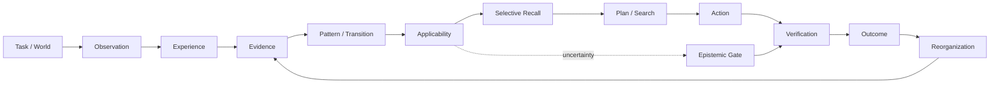
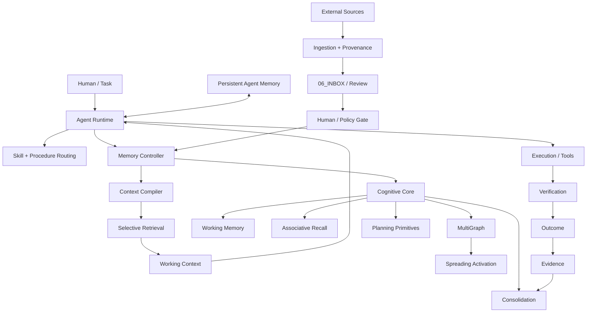
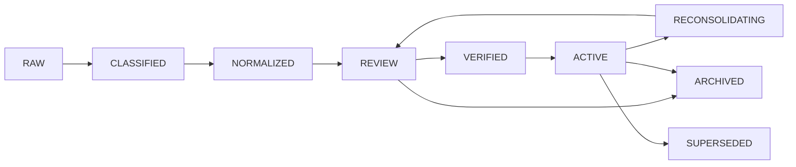

# 🧠 AI Memory Vault

<p align="center">
  <strong>Persistent external memory for intelligent agents</strong>
</p>

<p align="center">
  Provenance-aware · lifecycle-aware · evidence-gated · retrieval-driven · multi-agent · experimentally measurable
</p>

<p align="center">
  <a href="https://github.com/userist123/AI_Memory_Vault_CODEX_READY/actions"></a>
  <a href="https://github.com/userist123/AI_Memory_Vault_CODEX_READY/tree/main/07_EVALUATION"></a>
  <a href="https://github.com/userist123/AI_Memory_Vault_CODEX_READY/tree/main/00_GOVERNANCE/coordination"></a>
  <a href="https://github.com/userist123/AI_Memory_Vault_CODEX_READY/tree/main/.claude-plugin"></a>
  <a href="https://obsidian.md/"></a>
</p>

<p align="center">
  <a href="#-start-here">Start here</a> ·
  <a href="#-architecture">Architecture</a> ·
  <a href="#-memory-v6">Memory V6</a> ·
  <a href="#-cognitive-core">Cognitive Core</a> ·
  <a href="#-security">Security</a> ·
  <a href="#-evaluation">Evaluation</a> ·
  <a href="#-multi-agent-operation">Multi-agent</a> ·
  <a href="#-development-flow">Development</a>
</p>

> **The idea:** standard RAG retrieves text. AI Memory Vault treats memory as an operational subsystem: bounded, attributable, lifecycle-controlled, uncertainty-aware, auditable, and measurable where an agent reasons, plans, verifies, and acts.

---

## ✦ What is this?

AI Memory Vault is a repository-scale memory substrate for AI agents.

```text
experience
    ↓
evidence
    ↓
patterns / knowledge
    ↓
applicability
    ↓
selective retrieval
    ↓
context / planning influence
    ↓
action
    ↓
verification
    ↓
outcome
    ↓
reorganization
```

The project deliberately separates **what exists**, **what has been verified**, and **what is only an experimental or architectural target**.

### The core distinction

```text
retrieval ≠ influence
storage ≠ memory
memory ≠ truth
experience ≠ generalization
confidence ≠ evidence
```

That distinction drives both the architecture and the UX of this repository.

---

## 🚀 Start here

### I want to...

| Goal | Start here |
|---|---|
| Understand the system | [`01_ARCHITECTURE/`](01_ARCHITECTURE/) |
| Understand memory semantics | [`07_EVALUATION/luna/COGNITIVE_MEMORY_TARGET_MODEL_V2.md`](07_EVALUATION/luna/COGNITIVE_MEMORY_TARGET_MODEL_V2.md) |
| Inspect Memory Controller | [`memory_controller/`](memory_controller/) |
| Inspect Cognitive Core | [`cognitive_core/`](cognitive_core/) |
| Inspect security boundaries | [`09_SECURITY/`](09_SECURITY/) |
| Inspect experiments and evidence | [`07_EVALUATION/`](07_EVALUATION/) |
| Continue another agent's work | [`00_GOVERNANCE/coordination/`](00_GOVERNANCE/coordination/) |
| Run tests | [`20_TESTS/`](20_TESTS/) |
| Inspect operational tooling | [`30_SCRIPTS/`](30_SCRIPTS/) |

### The 5-minute path

```text
01  Read architecture
 ↓
02  Read current coordination / project state
 ↓
03  Identify the subsystem you will touch
 ↓
04  Inspect existing evidence + tests
 ↓
05  Change the smallest valid surface
 ↓
06  Test + audit + document the result
```

---

## 📊 System status

| Layer | State | What that means |
|---|---|---|
| Canonical Vault | 🟢 IMPLEMENTED | Markdown memory, knowledge, skills, procedures, provenance |
| Memory V6 | 🟢 IMPLEMENTED / ACTIVE | Extraction, proposals, conflict detection, lifecycle, consolidation, retrieval maintenance |
| Memory Controller | 🟢 IMPLEMENTED | Trust boundary, lifecycle access, context building, persistence contracts |
| Cognitive Core | 🟡 PARTIAL | Recall, activation, graphs, workspace, planning and consolidation primitives |
| Retrieval | 🟡 EVOLVING | Deterministic retrieval + scoring with active graph/semantic work |
| Planning Influence | 🟠 EXPERIMENTAL | Isolated deterministic MVE; not a production planner integration |
| Uncertainty Policy | 🟠 DESIGN / PRE-REGISTERED | Explicit policy for applicability and verification cost |
| Continual Learning | 🟠 PARTIAL / OPEN | Outcome → evidence → learning → canonical mutation is not fully closed |
| Model-backed cognitive influence | 🔴 NOT YET PROVEN | Research target, not a production capability claim |

> **Evidence discipline:** a local result is not automatically CI evidence, and a design artifact is not automatically an implementation guarantee.

---

# 🧭 Architecture

## Cognitive loop



| Layer | Question |
|---|---|
| Experience | What happened? |
| Pattern | What might generalize? |
| Applicability | Where should it transfer? |
| Influence | How is it allowed to affect computation? |
| Reorganization | What changed after verification? |

## System architecture



### Passive substrate → active interfaces

```text
┌──────────────────────────────────────────────────────┐
│ PASSIVE EPISTEMIC SUBSTRATE                         │
│ experience · evidence · memory · skills             │
│ provenance · lifecycle · temporal state             │
└───────────────────────────┬──────────────────────────┘
                            │
                            ▼
┌──────────────────────────────────────────────────────┐
│ ACTIVE RUNTIME INTERFACES                           │
│ representation / context compiler                    │
│ retrieval / ranking                                  │
│ planning / search                                    │
│ epistemic verification routing                       │
│ deterministic execution boundaries                   │
└──────────────────────────────────────────────────────┘
```

The architecture intentionally does **not** claim that a Markdown note can directly manipulate hidden model state.

---

# 🗂️ Repository UX map

```text
00_GOVERNANCE      → rules, coordination, operating contracts
01_ARCHITECTURE    → durable architecture + knowledge model
02_PRODUCT         → product goals + project continuity
03_IMPLEMENTATION  → production implementation
04_CONFIG          → runtime configuration
05_DATA            → persistent/local data boundaries
06_INBOX           → local raw intake / staging
07_EVALUATION      → evidence, benchmarks, experiments
08_OBSERVABILITY   → telemetry, traces, metrics
09_SECURITY        → trust boundaries, audits, invariants
10_DOCUMENTATION   → procedures + resources
20_TESTS           → tests and repository validation
30_SCRIPTS         → operational tooling
40_EXPERIMENTS     → experimental work
50_ARTIFACTS       → generated outputs
80_ARCHIVE         → historical material
99_META            → migration + metadata
```

### Where do I go?

| I need... | Go to... |
|---|---|
| Architecture | `01_ARCHITECTURE/` |
| Product / project continuity | `02_PRODUCT/` |
| Runtime code | `03_IMPLEMENTATION/`, `cognitive_core/`, `memory_controller/` |
| Configuration | `04_CONFIG/` |
| Data boundaries | `05_DATA/` |
| Experiments / evidence | `07_EVALUATION/` |
| Security | `09_SECURITY/` |
| Tests | `20_TESTS/` |
| Tooling | `30_SCRIPTS/` |
| Agent handoff | `00_GOVERNANCE/coordination/` |

---

# 🧱 Memory lifecycle



| State | Meaning |
|---|---|
| `RAW` | newly captured / unprocessed material |
| `CLASSIFIED` | categorized but not normalized |
| `NORMALIZED` | structurally normalized candidate |
| `REVIEW` | candidate awaiting trust / quality decisions |
| `VERIFIED` | explicitly attested |
| `ACTIVE` | canonical operational memory |
| `RECONSOLIDATING` | active memory being challenged / reconciled |
| `ARCHIVED` | retained but no longer active |
| `SUPERSEDED` | replaced by a newer canonical state |

> **A memory candidate does not become canonical truth merely because it exists.**

---

# 🗄️ Memory Controller

`memory_controller/` is the trust, lifecycle, context, and persistence boundary around canonical memory.

```text
INPUT
  ↓
AUTHORIZATION
  ↓
LIFECYCLE POLICY
  ↓
VALIDATION
  ↓
RETRIEVAL / MUTATION
  ↓
AUDIT
  ↓
OUTPUT
```

### Boundary matrix

| Boundary | Core question |
|---|---|
| Authorization | Who may perform this operation? |
| Lifecycle | Is the state transition legal? |
| Provenance | Where did the claim come from? |
| Verification | Has it earned trust? |
| Retrieval | Is it allowed into this context? |
| Persistence | Can the caller bypass the policy? |
| Audit | Can the action be reconstructed? |

### Progressive disclosure

```text
LEVEL 0  metadata
   ↓
LEVEL 1  relevant memory
   ↓
LEVEL 2  supporting evidence
   ↓
LEVEL 3  full source / history
```

The design goal is to avoid loading the whole Vault simply because it exists.

---

# 🧱 Memory V6

Memory V6 adds operational memory maintenance around the Vault.

| Capability | Purpose |
|---|---|
| Sensor buffer | transient session / event material |
| Atomic extraction | facts, decisions, procedures, lessons |
| Ollama adapter | optional local-model extraction |
| Proposal queue | review-stage candidates |
| Conflict detection | contradictions and competing claims |
| Controlled promotion | human/policy-gated canonicalization |
| MultiGraph | derived relationship views |
| Spreading activation | associative ranking / activation |
| Sleep consolidation | maintenance / reconsolidation |
| Retrieval benchmarks | Precision@K / Recall@K / MRR tooling |
| Context budgets | bounded transport |
| Usage telemetry | model consumption accounting |
| Efficiency reporting | execution economics |

### Memory compilation

```text
raw experience
   ↓
canonical facts / patterns
   ↓
applicability + evidence metadata
   ↓
compact memory representation
   ↓
selective context
```

---

# 🧠 Cognitive Core

The Cognitive Core contains runtime primitives for memory access, activation, associative structure, planning, and consolidation.

### Recall & ranking

- `recall.py` — multi-signal recall using semantic, activation, temporal, working-memory, authority, and lifecycle signals.
- `ranked_search.py` — graph-aware reranking.

### Graph cognition

- `multi_graph.py` — semantic, temporal, causal, and entity-oriented views.
- `spreading_activation.py` — associative activation over graph structure.

### Active context

- `working_memory.py`
- `global_workspace.py`
- `activation.py`

### Consolidation

- `consolidation.py`
- `sleep_consolidation.py`

### Planning & higher cognition

- `planning.py`
- `plan_complexity_analyzer.py`
- `learning.py`
- `reflection.py`
- `reasoning.py`
- `motivation.py`
- `semantic.py`

### Reality check

The current default retrieval path is not a universally semantic vector-native system. Deterministic retrieval and relevance scoring still include lexical/token-overlap mechanisms; optional semantic/Qdrant/Ollama paths exist without being equivalent to a fully wired production semantic index.

---

# 🧠 Memory Influence

The research layer asks whether external memory can influence computation beyond merely adding text to a prompt.

| Channel | Intended effect | Measurement |
|---|---|---|
| Recall / Representation | change explicit frame or hypothesis set | representation delta |
| Planning | change branch/search preference | trajectory / node allocation |
| Uncertainty | alter verify / explore / abstain behavior | routing + abstention |
| Execution | constrain deterministic tool behavior | accepted / rejected actions |

> **Memory influence must be explicit and observable. Hidden-state influence is not claimed.**

### Evidence-bound memory pattern

```text
Situation
Goal
Constraints
Action
State transition
Outcome
Evidence
Temporal bounds
Applicability
Counterexamples
```

---

# 🧪 Evaluation

The evaluation philosophy is evidence-first.

## Planning Influence MVE

```text
1. baseline / uniform planner
2. advisory memory / uniform planner
3. cognitive treatment / memory-derived planner prior
4. stale / contradicted / neutral memory control
```

### Current deterministic pilot

```text
baseline:   30/30 success · 30 nodes · 0 fatal
advisory:   30/30 success · 30 nodes · 0 fatal
treatment:  30/30 success · 54 nodes · 12 fatal
stale:      30/30 success · 30 nodes · 0 fatal
```

The treatment arm is **not an efficiency win** in the current pilot. The negative result is retained as falsification evidence rather than tuned away.

The recommendation matched the deterministic optimum in only `7/30` scenarios.

### Uncertainty policy

```text
APPLICABLE                    = 1.00
APPLICABLE_WITH_VERIFICATION  = 0.35
INSUFFICIENTLY_KNOWN          = 0.15
NOT_APPLICABLE                = 0.00
```

The policy is design evidence. Its success has not yet been established.

---

# 🔐 Security

Security is enforced at boundaries, not only in documentation.

```text
┌ Authorization ─────────────────────────────┐
├ Lifecycle policy                            │
├ Provenance validation                       │
├ Verification gate                           │
├ Persistence boundary                        │
├ Retrieval boundary                          │
├ Reconsolidation controls                    │
├ Supersession controls                       │
└ Audit / evidence                            │
```

### Core trust principles

```text
AI can propose.
AI cannot self-verify.
AI cannot silently promote REVIEW to ACTIVE.
Caller input cannot establish privileged lifecycle state.
Provenance survives ingestion.
Reconsolidation uses explicit authorization.
Evidence must remain reconstructible.
```

---

# 🧬 Continual learning direction

```text
REAL EXECUTION
      ↓
OUTCOME
      ↓
EVIDENCE
      ↓
EVALUATION
      ↓
CANDIDATE PATTERN / PROCEDURE / SKILL
      ↓
SANDBOX / REVIEW
      ↓
REGRESSION + HOLDOUT
      ↓
HUMAN / POLICY GATE
      ↓
CANONICAL MEMORY
```

The repository does **not** currently claim a fully autonomous closed-loop learning system.

A result that happened once is evidence about an event, not automatically a reusable capability.

---

# 🤖 Multi-agent operation

Persistent execution state is stored in the repository rather than relying on chat history as canonical state.

```text
00_GOVERNANCE/coordination/
├── UNIVERSAL_AGENT_MEMORY_PROTOCOL_V1.md
├── BOOTSTRAP_ALL_AGENTS_V1.md
├── agents/
│   ├── ANTIGRAVITY/
│   ├── LUNA/
│   ├── PERPLEXITY/
│   └── CODEX/
└── projects/
    └── AI_MEMORY_VAULT/
        └── CURRENT.md
```

### Session handoff contract

```text
WHAT I DID
WHERE
EVIDENCE
WHAT FAILED / REMAINS
EXACT NEXT ACTION
```

### State model

```text
chat history   = transport
project state  = resumable execution state
repository     = canonical system state
```

---

# 🧩 Skills & external knowledge

Skills are reusable capabilities with provenance, not just prompt fragments.

```text
source
  ↓
discovery
  ↓
provenance
  ↓
classification
  ↓
dedup / validation
  ↓
review
  ↓
operational skill
```

Important surfaces:

- `.agents/skills/`
- `.agents/agents/`
- `01_ARCHITECTURE/knowledge/Agents_Skill_Matrix.md`
- `01_ARCHITECTURE/knowledge/Master_Skills_Catalog_251.md`
- `00_GOVERNANCE/skills/ai-memory-vault/SKILL.md`
- `30_SCRIPTS/skills/skill_ingestion.py`

`06_INBOX/RAW_IMPORTS/` is intentionally local-only by contract.

---

# ⚙️ CI & automation

Workflow surfaces include:

```text
memory-v6-tests.yml
planning-influence-mve.yml
memory-consolidation.yml
regenerate-skill-catalog.yml
import-external-skills.yml
process-raw-books.yml
codeql.yml
fortify.yml
apisec-scan.yml
jarvis-command-center.yml
```

The project explicitly distinguishes:

```text
QUEUED  ≠ PASS
LOCAL  ≠ CI
DESIGN ≠ IMPLEMENTATION
CLAIM  ≠ EVIDENCE
```

---

# 🧪 Evidence model

| Evidence level | Meaning |
|---|---|
| `DOCUMENT_VERIFIED` | supported by canonical documentation |
| `CODE_VERIFIED` | confirmed from repository implementation |
| `TEST_VERIFIED` | observed in automated tests |
| `RUNTIME_VERIFIED` | observed in actual runtime execution |
| `CI_VERIFIED` | observed in GitHub Actions evidence |
| `CLAIMED_ONLY` | stated but insufficiently evidenced |
| `UNVERIFIED` | design / speculation |

> **This repository distinguishes implementation from evidence.**

A benchmark report, README statement, screenshot, or agent summary does not outrank executable evidence.

---

# 🛠️ Development flow

```text
READ
 ↓
UNDERSTAND
 ↓
CHANGE
 ↓
TEST
 ↓
AUDIT
 ↓
DOCUMENT
 ↓
HAND OFF
```

### Change checklist

```text
□ Read relevant project / agent state
□ Check architecture boundary
□ Identify the smallest safe change
□ Add regression coverage
□ Preserve provenance + lifecycle semantics
□ Record evidence
□ Hand off exact next action
```

---

# ⚡ Quick start

```bash
pytest -q
```

Planning Influence tests:

```bash
pytest -q 07_EVALUATION/luna/test_planning_influence_mve.py
```

Planning Influence pilot:

```bash
python 07_EVALUATION/luna/planning_influence_mve.py
```

Memory V6 examples:

```bash
python -m cognitive_core.memory_v6_cli extract --text "Am decis: folosim SQLite WAL." --enqueue
python -m cognitive_core.memory_v6_cli review --show-conflicts
python -m cognitive_core.memory_v6_cli approve <candidate_id> --reviewer human
python -m cognitive_core.memory_v6_cli consolidate --render
```

Use the repository environment / dependency files for the exact runtime setup.

---

# 📚 Canonical documentation

### Architecture

- [`01_ARCHITECTURE/System_Architecture.md`](01_ARCHITECTURE/System_Architecture.md)
- [`07_EVALUATION/luna/COGNITIVE_MEMORY_TARGET_MODEL_V2.md`](07_EVALUATION/luna/COGNITIVE_MEMORY_TARGET_MODEL_V2.md)
- [`07_EVALUATION/luna/COGNITIVE_MEMORY_V2_REPOSITORY_REALITY_MAP_V1.md`](07_EVALUATION/luna/COGNITIVE_MEMORY_V2_REPOSITORY_REALITY_MAP_V1.md)

### Governance

- [`00_GOVERNANCE/rules/Rules.md`](00_GOVERNANCE/rules/Rules.md)
- [`00_GOVERNANCE/protocols/Memory_Protocol.md`](00_GOVERNANCE/protocols/Memory_Protocol.md)
- [`00_GOVERNANCE/protocols/AI_Memory_Vault_Multi_Agent_Execution_Protocol_V1.md`](00_GOVERNANCE/protocols/AI_Memory_Vault_Multi_Agent_Execution_Protocol_V1.md)

### Research

- [`07_EVALUATION/luna/PLANNING_INFLUENCE_MVE_V2_VALIDATED.md`](07_EVALUATION/luna/PLANNING_INFLUENCE_MVE_V2_VALIDATED.md)
- [`07_EVALUATION/luna/PLANNING_INFLUENCE_UNCERTAINTY_POLICY_V1.md`](07_EVALUATION/luna/PLANNING_INFLUENCE_UNCERTAINTY_POLICY_V1.md)
- [`07_EVALUATION/luna/PLANNING_INFLUENCE_APPLICABILITY_PILOT_LOCAL_20260904.md`](07_EVALUATION/luna/PLANNING_INFLUENCE_APPLICABILITY_PILOT_LOCAL_20260904.md)

### Agent continuity

- [`00_GOVERNANCE/coordination/UNIVERSAL_AGENT_MEMORY_PROTOCOL_V1.md`](00_GOVERNANCE/coordination/UNIVERSAL_AGENT_MEMORY_PROTOCOL_V1.md)
- [`00_GOVERNANCE/coordination/BOOTSTRAP_ALL_AGENTS_V1.md`](00_GOVERNANCE/coordination/BOOTSTRAP_ALL_AGENTS_V1.md)
- [`00_GOVERNANCE/coordination/projects/AI_MEMORY_VAULT/CURRENT.md`](00_GOVERNANCE/coordination/projects/AI_MEMORY_VAULT/CURRENT.md)

### Skills

- [`01_ARCHITECTURE/knowledge/Agents_Skill_Matrix.md`](01_ARCHITECTURE/knowledge/Agents_Skill_Matrix.md)
- [`01_ARCHITECTURE/knowledge/Master_Skills_Catalog_251.md`](01_ARCHITECTURE/knowledge/Master_Skills_Catalog_251.md)
- [`00_GOVERNANCE/skills/ai-memory-vault/SKILL.md`](00_GOVERNANCE/skills/ai-memory-vault/SKILL.md)

---

# 🚧 Known gaps — intentionally visible

1. Default retrieval still relies substantially on deterministic lexical/token-overlap behavior.
2. Graph / semantic retrieval work is evolving and is not treated as universally authoritative.
3. Outcome telemetry does not yet constitute a fully closed autonomous learning loop.
4. Planning Influence remains an isolated experimental harness.
5. The latest deterministic treatment pilot remains a negative efficiency result.
6. Queued CI is not counted as verification.
7. Some research artifacts are design targets rather than implementation guarantees.

The repository is designed to make these gaps visible rather than hide them behind polished claims.

---

# 🛣️ Roadmap

```text
NOW
 │
 ├─ strengthen lifecycle / trust-boundary closure
 ├─ complete retrieval integration contracts
 ├─ validate corpus quality and deterministic remediation
 └─ produce reproducible CI evidence
 │
 ▼
NEXT
 │
 ├─ frozen uncertainty-policy runs
 ├─ held-out / stale / adversarial model-backed pairing
 ├─ representation influence measurement
 └─ epistemic act / verify / abstain routing
 │
 ▼
LATER
 │
 ├─ deterministic execution gateway
 ├─ evidence-bound pattern compilation
 ├─ closed regression-protected learning loop
 └─ production-grade measurable cognitive influence
```

A passing unit test does not authorize a production cognitive-influence claim.

---

# ✦ Design principles

```text
ONE CANON
EVIDENCE OVER CONFIDENCE
RETRIEVAL BEFORE CONTEXT INFLATION
EXPLICIT INFLUENCE OVER MAGIC
HUMAN-GATED PROMOTION
PROVENANCE SURVIVES INGESTION
FAILURE IS DATA
MEASURE BEFORE AUTOMATING
HOLD OUT WHAT SHOULD BE HELD OUT
```

> **The ambition is not to build the largest memory store. It is to build a memory system that can remember selectively, explain why a memory should matter, recognize when it should not matter, influence computation in measurable ways, verify what happened, and reorganize itself only when evidence earns the right to change future behavior.**

<p align="center">
  <sub>AI Memory Vault · Persistent Cognitive Memory Research & Engineering</sub>
</p>
