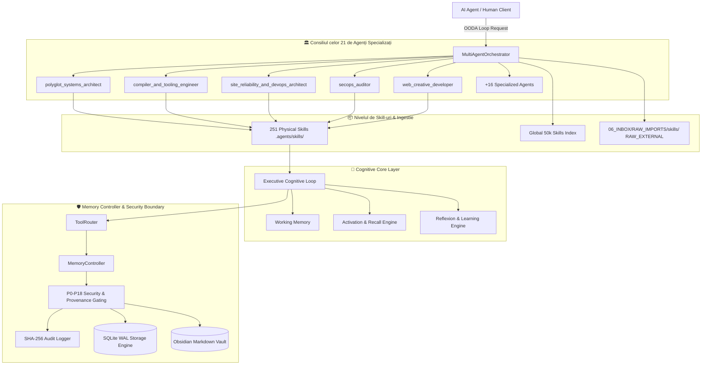

# 🧠 AI Memory Vault (`userist123/AI_Memory_VAULT_CODEX_READY`)

[](https://github.com/userist123/AI_Memory_Vault_CODEX_READY)
[](https://python.org)
[](file:///C:/Users/Marius/Documents/Codex/AI_Memory_Vault_CODEX_READY/memory_controller)
[](file:///C:/Users/Marius/Documents/Codex/AI_Memory_Vault_CODEX_READY/.agents/rules/vault_cognitive_rules.md)
[](file:///C:/Users/Marius/Documents/Codex/AI_Memory_Vault_CODEX_READY/01_KNOWLEDGE/Agents_Skill_Matrix.md)
[](file:///C:/Users/Marius/Documents/Codex/AI_Memory_Vault_CODEX_READY/.agents/skills)
[](file:///C:/Users/Marius/Documents/Codex/AI_Memory_Vault_CODEX_READY/01_KNOWLEDGE/Global_50K_Skill_Registries_Index.md)

> **Codex Operating Contract**: [`AGENTS.md`](file:///C:/Users/Marius/Documents/Codex/AI_Memory_Vault_CODEX_READY/AGENTS.md) | **Invariante de Securitate**: [`vault_cognitive_rules.md`](file:///C:/Users/Marius/Documents/Codex/AI_Memory_Vault_CODEX_READY/.agents/rules/vault_cognitive_rules.md)

**AI Memory Vault v4.0.0** este sistemul cognitiv de memorie persistentă, autorizare pe nivele de securitate și orchestrare multi-agent conceput pentru agenți AI locali și cloud. Proiectul asigură memorie canonică partajată între multiple sesiuni de codare fără re-transmiterea istoricului și fără consum de compute local nedorit pe stația utilizatorului (execuție complet izolată via `127.0.0.1`).

---

## 🏛️ Arhitectura Sistemului pe 5 Niveluri



---

## 1. Controller-ul de Memorie -- `memory_controller/`

`MemoryController` este punctul unic și obligatoriu de intrare pentru orice citire sau scriere în memorie. Acesta impune:

- **Autorizare Scopată**: Politici per operațiune (`propose`, `read`, `search`, `review`, `promote`, `archive`, `update`, `supersede`, `attest`) alocate principalilor `HUMAN`, `AI_AGENT` și `ADMIN`.
- **Gating de Proveniență**: Fiecare notă înregistrează `source_type` (`user`, `official`, `ai`, `inference`, `execution`, `import`). Un agent AI nu poate revendica autonom proveniență umană sau oficială.
- **Ciclu de Viață Controlat**: `RAW -> CLASSIFIED -> NORMALIZED -> REVIEW -> VERIFIED -> ACTIVE -> {SUPERSEDED, ARCHIVED}`. Injectarea de stări privilegiate la creare este blocată.
- **Atestare Umană**: Starea `verification = "verified"` poate fi acordată exclusiv prin metoda `attest()`, rezervată rolurilor `HUMAN`/`ADMIN`.
- **Jurnal de Audit Criptografic SHA-256**: Fiecare acțiune este înregistrată cu actor, țintă, rezultat și amprentă SHA-256 în lanț imutabil.
- **Persistență WAL & Tranzacții Atomice**: Motor de stocare dual: `FileStorageEngine` (Markdown + YAML) și `SQLiteStorageEngine` (WAL mode, `PRAGMA busy_timeout=5000`, `BEGIN IMMEDIATE`).
- **Telemetrie Hardware Imutabilă (P16-P18)**: Identificatorii fizici (VID, PID, Serial Number, Capacitate, Host ID) sunt strict Read-Only; utilizatorul poate modifica exclusiv eticheta logică a volumului.

---

## 2. Motorul Cognitiv -- `cognitive_core/`

`Executive` rulează ciclul cognitiv complet (**Observe -> Retrieve -> Attend -> Reason -> Plan -> Act -> Reflect -> Learn**), coordonând:

- `ActivationEngine` / `RecallEngine`: Retragere cu activare difuză pe bază de scoruri de autoritate, temporalitate și versiuni.
- `WorkingMemory`: Context activ delimitat și ponderat prin atenție.
- `ReasoningEngine` / `Planner`: Planificare multi-etapă și sinteză (*Tree-of-Thought*).
- `ReflectionPipeline` / `LearningEngine`: Captură automată a lecțiilor, promovarea încrederii și consolidare ghidată prin `ToolRouter`.

---

## 🏛️ 3. Consiliul celor 21 de Agenți Specializați (`.agents/agents/`)

`MultiAgentOrchestrator` coordonează o rețea de **21 de Agenți Specializați**, fiecare având permisiuni minime izolate (*Multi-Agent Least Privilege*):

| # | Agent ID | Rol / Specializare | Competențe Cheie & Skill-uri Integrate |
|---|---|---|---|
| 1 | `compiler_and_tooling_engineer` ⚙️ | Compiler & Tooling Engineer | Compilatoare, AST Parsers, TinyCC, CPython, Roslyn, LLVM, JIT Tuning, Refactoring |
| 2 | `site_reliability_and_devops_architect` 🚀 | SRE & Cloud Automation | Kubernetes, Helm, ArgoCD GitOps, Terraform IaC, Ansible, AWS, Azure, GCP, Istio, Prometheus |
| 3 | `polyglot_systems_architect` 🌐 | Polyglot Systems Architect | Architecture Multi-Limbaj (C#, Go, Rust, Python, TypeScript, C++20 Drogon) |
| 4 | `system_architecture_agent` 🏛️ | Enterprise Architecture Agent | Arhitectură Enterprise .NET 10, Isolation Loopback (`127.0.0.1`), Vault Secrets |
| 5 | `backend_systems_engineer` ⚡ | Backend Microservices Engineer | REST, gRPC, GraphQL, Redis Caching, CQRS, Outbox CDC, Saga Pattern, SQLite WAL |
| 6 | `secops_auditor` 🛡️ | SecOps & DevSecOps Auditor | Audit OWASP Top 10, SAST, DAST, Container Scan, Secret Leak, Zero Trust, OPA Rego, HG 585 |
| 7 | `threat_hunting_analyst` 🔍 | Threat Hunting Analyst | DFIR Operations, YARA/Sigma Offline Engine, Forensic Analysis, Containment Runbooks |
| 8 | `wpf_engineer` 🖥️ | WPF .NET 10 Engineer | C# WPF Enterprise, MVVM, Obsidian Tactical UI Tokens, Async Thread Safety |
| 9 | `web_creative_developer` 🌟 | Creative Web & 3D Developer | Three.js, Shaders, GSAP ScrollTrigger, Lenis, CobeJS, VantaJS, MatterJS, Globe GL |
| 10 | `web_design_engineer_agent` 🎨 | Web Design Engineer | Design Systems (Linear, Apple, Stripe, Vercel, Supabase), Agency Grids, Editorial Tech |
| 11 | `web_quality_engineer` ⚡ | Web Quality & Vitals Engineer | Core Web Vitals (LCP/CLS/INP), WCAG 2.2 AAA Accessibility, Web Performance, SEO |
| 12 | `ui_sensei_architect` ⛩️ | UI Sensei Visual Architect | Filosofia UI Sensei, Grid 8px, Micro-Spacing, Dark Glass, Skeuomorphic Clean |
| 13 | `frontend_saas_engineer` 🌐 | Frontend SaaS Engineer | Next.js App Router, Tailwind CSS v4, TanStack Query, Zustand, Storybook, Playwright |
| 14 | `game_engineer` 🎮 | ARPG & Web Game Engineer | Isometric ARPG Engine, Tactical Combat, Enemy AI, VFX Shaders, Audio Feedback |
| 15 | `quant_developer` 📈 | Quant Trading Developer | Python Algorithmic Trading (5 Module: data/strategy/risk/execution/journal) |
| 16 | `local_ai_engineer` 🤖 | Local AI & LLM Engineer | Ollama (`127.0.0.1:11434`), Pydantic JSON Mode, LangChain, LlamaIndex, vLLM, LoRA |
| 17 | `content_strategist` ✍️ | Content & Voice Strategist | Copywriting, Technical Briefings, Presentation Design, Voice Generation |
| 18 | `agentic_workflow_orchestrator` 🔄 | Agentic Workflow Orchestrator | Router Global 50k Skill-uri, Copilot Workflows, MCP Integrations, Ciclul OODA, Reflexion |
| 19 | `ui_ux_designer` 🎨 | UI/UX Designer & Prompting | Dashboard Admin UI, Brand Identity, Data Visualization, Motion Design, UI Prompting |
| 20 | `database_and_persistence_engineer` 💾 | DB & Persistence Engineer | Flyway, Vitess Sharding, DuckDB OLAP, ClickHouse Time-Series, pgvector, Neo4j |
| 21 | `memory_controller_architect` 🧠 | Memory Controller Architect | Arhitectura Memoriei, PRAGMA WAL, SHA-256 Audit, Invariante P0-P18 |

---

## 📦 4. Biblioteca de 251 SKILL-uri Locale & Ingestia Brută pe 12 Faze

### A. Skill-uri Stocate Fizic pe Disc (`.agents/skills/`)
- **251 de SKILL-uri operaționale** stocate direct pe disc în `.agents/skills/<skill_name>/SKILL.md`.
- Catalogul canonic: **[`Master_Skills_Catalog_251.md`](file:///C:/Users/Marius/Documents/Codex/AI_Memory_Vault_CODEX_READY/01_KNOWLEDGE/Master_Skills_Catalog_251.md)**.
- Matricea completă: **[`Agents_Skill_Matrix.md`](file:///C:/Users/Marius/Documents/Codex/AI_Memory_Vault_CODEX_READY/01_KNOWLEDGE/Agents_Skill_Matrix.md)**.

### B. Ingestia Brută nealterată pe 12 Faze (`06_INBOX/RAW_IMPORTS/skills/`)
Toate skill-urile brute externe de pe GitHub intră strict pe granița de securitate **`RAW_EXTERNAL`**:
- **`SOURCE.json`**: Proveniență per pachet (`sha256`, `source_url`, `license`, `discovery_depth`).
- **`_SOURCE_REGISTRY.json`**: Registrul master pentru 141 de surse unice procesate.
- **`_PROGRAMMING_SOURCES.json`**: Referința pentru 70 de limbaje și compilatoare (CPython, Rust, Go, Roslyn, TinyCC, etc.).
- **`_BACKEND_SOURCES.json`**: Referința pentru 51 de arhitecturi backend (Express, .NET, Rails, Spring, Vapor, NestJS).
- **`_VALIDATION_REPORT.md`**: Certificatele de validare a integrității SHA-256 (10/10 checks PASSED).

---

## 📐 5. Structura Directorului Repository-ului

```text
AI_Memory_Vault_CODEX_READY/
├── .agents/
│   ├── agents/               # Profilurile celor 21 de Agenți Specializați
│   ├── rules/                # Regulile cognitive canonice (vault_cognitive_rules.md)
│   └── skills/               # Biblioteca de 251 SKILL-uri stocate fizic pe disc
├── 00_CORE/                  # Identitate, Regulament, Protocol Memorie, Model Încredere
├── 00_CORE/GRAPH/            # Obsidian Maps of Content (MOC navigation layer)
├── 01_KNOWLEDGE/             # Cunoștințe tehnice durabile & Matricea Agenților
├── 02_PROJECTS/              # Starea proiectelor active & fișiere de continuitate
├── 03_PROCEDURES/            # Proceduri repetabile & protocoale de construcție autonomă
├── 04_MEMORY/                # Decizii, Erori, Experiențe, Lecții, Preferințe
├── 05_RESOURCES/             # Materiale de referință
├── 06_INBOX/RAW_IMPORTS/     # Granița de ingestie brută nealterată (RAW_EXTERNAL)
├── 90_TEMPLATES/             # Șabloane canonice de note
├── 99_SYSTEM/                # Scheme, protocoale & rapoarte de securitate
├── cognitive_core/           # Motorul cognitiv Python (Executive, Recall, Planning, Reflexion)
└── memory_controller/        # Controller-ul canonic de memorie & persistență SQLite WAL
```

---

## 🧪 6. Rularea Testelor Automate

Pentru a valida integritatea suitei cognitive și a controller-ului de memorie:

```bash
python -m pytest -q
```

Toate cele 197+ de teste unitare, de integrare și de securitate adversară rulează cu 0 erori.
