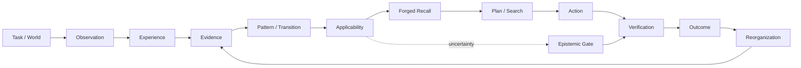
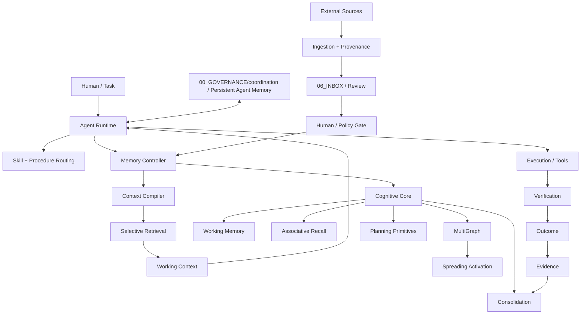

# AI Memory Vault

A persistent external memory substrate for AI agents: provenance-aware memory, skills, procedures, retrieval, cognitive runtime primitives, controlled learning, evidence, and resumable multi-agent execution.

<p align="center">
  <strong>ONE VAULT · ONE CANON · SELECTIVE COGNITION · VERIFIED EVOLUTION</strong>
</p>

<p align="center">
  <a href="https://github.com/userist123/AI_Memory_Vault_CODEX_READY/actions"></a>
  <a href="https://github.com/userist123/AI_Memory_Vault_CODEX_READY/tree/main/.claude-plugin"></a>
  <a href="https://github.com/userist123/AI_Memory_Vault_CODEX_READY/tree/main/07_EVALUATION"></a>
  <a href="https://github.com/userist123/AI_Memory_Vault_CODEX_READY/tree/main/00_GOVERNANCE/coordination"></a>
  <a href="https://obsidian.md/"></a>
</p>

> **The problem:** standard RAG can retrieve text. This project is trying to make external memory *operationally useful* — bounded, attributable, lifecycle-aware, uncertainty-aware, and measurable at the point where an agent reasons, plans, verifies, and acts.

---

## ✦ At a glance

| Layer | What is here | Reality status |
|---|---|---|
| Canonical Vault | Markdown memory, knowledge, skills, agents, procedures, provenance | **IMPLEMENTED** |
| Memory V6 | extraction, proposals, conflict detection, lifecycle, consolidation, retrieval maintenance | **IMPLEMENTED / ACTIVE** |
| Cognitive Core | recall, activation, working memory, global workspace, graphs, spreading activation, planning primitives | **IMPLEMENTED / PARTIAL** |
| Memory Controller | storage boundary, read/write policy, context packs, progressive disclosure, lifecycle gating | **IMPLEMENTED** |
| Model execution | fake, local/Ollama, OpenAI provider abstractions, tier routing, usage telemetry | **IMPLEMENTED** |
| External skill ingestion | discovery, provenance, classification, validation, controlled promotion | **IMPLEMENTED** |
| Persistent agent memory | resumable `CURRENT.md` state under `00_GOVERNANCE/coordination/` | **IMPLEMENTED** |
| Planning Influence | isolated deterministic MVE with four arms and soft priors | **EXPERIMENTAL** |
| Uncertainty policy | applicability + evidence strength + contradiction + verification cost contract | **DESIGN / PRE-REGISTERED** |
| Model-backed cognitive influence | paired causal MVE on real model runtime | **NOT YET PROVEN** |
| Fully closed continual learning | outcome → evidence → learning → canonical mutation loop | **PARTIAL / OPEN** |

<details>
<summary><strong>What makes this different from “just RAG”?</strong></summary>

```text
RAG mindset
query → documents → prompt

Vault target
experience → evidence → pattern → applicability → influence → decision → outcome → reorganization
```

The long-term target is **retrieval ≠ influence**. The repository explicitly distinguishes a passive epistemic substrate from active runtime interfaces. The current implementation does not pretend that hidden model state, decoding, planning, or tool execution is magically controlled by a text file.
</details>

---

## 🧠 Cognitive loop



The architecture is intentionally split into five semantic layers:

**Experience** — what happened.  
**Model / Pattern** — what may generalize.  
**Applicability** — where that memory should transfer.  
**Influence** — how it is allowed to affect computation.  
**Reorganization** — how verified outcomes alter future memory.

Evidence, provenance, temporal validity, uncertainty, safety, and token economy cross all five layers.

---

## ⚙️ System architecture



### The core boundary

```text
              PASSIVE EPISTEMIC SUBSTRATE
┌──────────────────────────────────────────────────┐
│ experience • evidence • memory • skills         │
│ provenance • lifecycle • temporal state         │
└────────────────────────┬─────────────────────────┘
                         │
                         ▼
              ACTIVE RUNTIME INTERFACES
┌──────────────────────────────────────────────────┐
│ representation / frame compiler                  │
│ planning / search harness                        │
│ epistemic gate / verification routing            │
│ deterministic execution gateway                  │
└──────────────────────────────────────────────────┘
```

These runtime interfaces are the target architecture. Some are present as isolated primitives or experiments; they are not all fully wired into the production agent path yet.

---

# 🗂️ Repository map

| Path | Role |
|---|---|
| `00_GOVERNANCE/` | rules, agent coordination, execution protocols, identity, review queue |
| `01_ARCHITECTURE/` | system architecture, durable knowledge (`knowledge/`), graphs (`graphs/`), memory (`memory/`) |
| `02_PRODUCT/` | product goals, specifications, project continuity records (`projects/`), workspaces |
| `03_IMPLEMENTATION/` | production implementation code and application modules |
| `04_CONFIG/` | machine-readable runtime configuration, agent budgets, model tiers |
| `05_DATA/` | local storage, database boundaries and persistent data |
| `06_INBOX/` | raw intake and review staging (local-only by contract) |
| `07_EVALUATION/` | audits, experiments, benchmarks, MVE, forensic evidence |
| `08_OBSERVABILITY/` | telemetry, traces, and metrics |
| `09_SECURITY/` | security audits, trust boundaries, invariants |
| `10_DOCUMENTATION/` | repeatable operational procedures (`procedures/`), resources (`resources/`) |
| `20_TESTS/` | repository-level validation, test suites and test infrastructure |
| `30_SCRIPTS/` | operational tooling, maintenance and ingestion scripts |
| `40_EXPERIMENTS/` | experimental harnesses and research runs |
| `50_ARTIFACTS/` | generated programs, exports and packages |
| `80_ARCHIVE/` | historical material, legacy duplicates and snapshots |
| `99_META/` | migration tracking, metadata inventories and templates |
| `.agents/` | agent profiles, rules, operational skills |
| `.claude-plugin/` | Claude Code plugin surface |
| `cognitive_core/` | cognitive runtime primitives (root pending executable migration) |
| `memory_controller/` | canonical memory boundary and context control (root pending executable migration) |
| `.github/workflows/` | CI, security, ingestion, maintenance, evaluation |

---

# 🧩 Cognitive Core

Important runtime modules include:

- `recall.py` — multi-signal recall using semantic, activation, temporal, working-memory, authority and lifecycle signals.
- `ranked_search.py` — graph-aware reranking layer.
- `multi_graph.py` — semantic, temporal, causal and entity-oriented graph views.
- `spreading_activation.py` — associative activation over graph structure.
- `working_memory.py` — active context state.
- `global_workspace.py` — competitive workspace/broadcast primitive.
- `activation.py` — activation/decay behavior.
- `consolidation.py` / `sleep_consolidation.py` — maintenance and reconsolidation.
- `planning.py` / `plan_complexity_analyzer.py` — planning and resource-routing primitives.
- `learning.py`, `reflection.py`, `reasoning.py`, `motivation.py` — higher-level cognitive components.
- `semantic.py` — semantic provider abstraction.

### Reality check

The current default retrieval path is not a fully semantic vector-native system. Deterministic semantic behavior and relevance scoring still contain lexical/token-overlap mechanisms; optional semantic/Qdrant/Ollama paths exist but are not equivalent to a universally wired production semantic index. This distinction is preserved intentionally.

---

# 🗄️ Memory Controller

`memory_controller/` is the trust and context boundary around canonical memory.

It is responsible for things such as:

```text
query sanitation
      ↓
classification
      ↓
lifecycle-aware access
      ↓
candidate retrieval
      ↓
relevance scoring
      ↓
progressive disclosure
      ↓
bounded context pack
      ↓
provenance / audit
```

Key surfaces:

- `controller.py`
- `authority.py`
- `context/retrieval.py`
- `context/relevance_scoring.py`
- `context/pack_builder.py`
- `context/progressive_disclosure.py`
- SQLite and file-backed storage engines

Public reads remain lifecycle controlled. Cognitive inspection can explicitly handle REVIEW material without silently promoting it to canonical truth.

---

# 🧱 Memory V6

Memory V6 adds an operational memory-maintenance layer around the base Vault:

| Capability | Purpose |
|---|---|
| Sensor buffer | transient session/event material |
| Atomic extraction | facts, decisions, procedures, lessons |
| Ollama adapter | optional local-model extraction |
| Proposal queue | review-stage memory candidates |
| Conflict detection | contradictions and competing claims |
| Controlled promotion | human/policy-gated canonicalization |
| MultiGraph | derived relationship views |
| Spreading activation | associative activation / ranking |
| Sleep consolidation | maintenance-oriented processing |
| Retrieval benchmarks | Precision@K / Recall@K / MRR tooling |
| Context budgets | bounded token/byte transport |
| Usage telemetry | estimated vs actual model consumption |
| Efficiency reporting | B4/B5-style execution economics |

The architectural objective is **progressive disclosure**: do not load the whole Vault just because it exists.

```text
metadata
   ↓
relevant rules
   ↓
compact memory
   ↓
detailed evidence only when needed
```

---

# 🧠 Memory Influence — the new research layer

The project is now testing whether external memory can influence computation beyond adding text to a prompt.

### Four intended influence channels

| Channel | Intended effect | Measurement target |
|---|---|---|
| Recall / Representation | change the explicit frame or hypothesis set | memory-off ≠ memory-on representation |
| Planning | change branch/search preference | search trajectory / node allocation changes |
| Uncertainty | change act / verify / explore / abstain behavior | verification routing and abstention |
| Execution | deterministic action constraints at tool boundary | allowed vs rejected actions |

The important safety distinction is:

> **Memory influence must be explicit and observable. Hidden-state influence is not claimed.**

### Evidence-Bound memory model

The target persistent unit is an evidence-linked transfer pattern:

```text
Situation
Goal
Constraints
Action
State transition
Outcome
Evidence
Temporal bounds
Applicability
Counterexamples
```

A compact influence artifact can then be forged on demand instead of repeatedly shipping the entire historical record through the model context.

---

# 🧪 Planning Influence MVE

The isolated MVE lives under:

```text
07_EVALUATION/luna/
├── COGNITIVE_MEMORY_TARGET_MODEL_V1.md
├── COGNITIVE_MEMORY_TARGET_MODEL_V2.md
├── COGNITIVE_MEMORY_V2_REPOSITORY_REALITY_MAP_V1.md
├── PLANNING_INFLUENCE_EXPERIMENT_V1.md
├── PLANNING_INFLUENCE_MVE_V2_VALIDATED.md
├── PLANNING_INFLUENCE_UNCERTAINTY_POLICY_V1.md
├── planning_influence_mve.py
└── test_planning_influence_mve.py
```

### Experimental arms

```text
Arm 1 — baseline / uniform planner
Arm 2 — advisory memory / uniform planner
Arm 3 — cognitive treatment / memory-derived planner prior
Arm 4 — stale / contradicted / neutral memory control
```

### Current deterministic evidence

The latest local applicability-aware pilot is explicitly **runtime evidence from local reconstructed exact-source execution**, not CI proof:

```text
baseline:   30/30 success · 30 nodes · 0 fatal
advisory:   30/30 success · 30 nodes · 0 fatal
treatment:  30/30 success · 54 nodes · 12 fatal
stale:      30/30 success · 30 nodes · 0 fatal
```

The treatment arm is therefore **not yet an efficiency win**. The prior naive treatment was worse still (125 nodes / 15 fatal). The negative result is intentionally retained as falsification evidence rather than tuned away.

The recommendation matched the deterministic optimum in only `7/30` scenarios in the current pilot. Wrong memory recommendations account for the observed treatment cost.

### Uncertainty policy

The pre-registered policy separates:

```text
applicability
+ evidence_strength
+ contradiction_state
+ verification_cost
+ planner_influence
+ execution_outcome
```

Fixed applicability strengths for the next isolated run:

```text
APPLICABLE                   = 1.00
APPLICABLE_WITH_VERIFICATION = 0.35
INSUFFICIENTLY_KNOWN         = 0.15
NOT_APPLICABLE               = 0.00
```

The policy is design evidence. Its success has not yet been established.

---

# 🧬 Continual learning direction

The intended learning loop is conservative by design:

```text
REAL EXECUTION
      ↓
OUTCOME
      ↓
EVIDENCE
      ↓
EVALUATION
      ↓
CANDIDATE PATTERN / PROCEDURE / SKILL
      ↓
SANDBOX / REVIEW
      ↓
REGRESSION + HOLDOUT
      ↓
HUMAN / POLICY GATE
      ↓
CANONICAL MEMORY
```

Current outcome tooling and learning components exist, but the repository does **not** currently claim a completely closed autonomous continual-learning loop in which every outcome automatically mutates canonical memory.

That restraint is deliberate: a result that happened once is evidence about an event, not automatically a reusable capability.

---

# 🤖 Multi-agent operating model

Persistent execution state lives under:

```text
00_GOVERNANCE/coordination/
├── README.md
├── UNIVERSAL_AGENT_MEMORY_PROTOCOL_V1.md
├── BOOTSTRAP_ALL_AGENTS_V1.md
├── agents/
│   ├── CODEX/
│   ├── ANTIGRAVITY/
│   ├── PERPLEXITY/
│   └── LUNA/
└── projects/
    └── AI_MEMORY_VAULT/
        └── CURRENT.md
```

Every substantive session is expected to leave:

```text
WHAT I DID
WHERE
EVIDENCE
WHAT FAILED / REMAINS
EXACT NEXT ACTION
```

### Current execution discipline

```text
MAIN_ONLY
SEQUENTIAL_HANDOFF
NO PARALLEL WORK ON SAME TASK
NO FEATURE-BRANCH DEVELOPMENT FOR THIS RESEARCH CHAIN
```

This is the mechanism that makes work resumable across agents, PCs, IDEs and sessions without treating chat history as canonical state.

---

# 📦 Skills & external knowledge

Skills are treated as reusable capabilities, not just prompt snippets.

```text
source
  ↓
discovery
  ↓
provenance
  ↓
classification
  ↓
dedup / validation
  ↓
RAW_EXTERNAL
  ↓
human / policy review
  ↓
operational skill
```

Relevant surfaces:

- `.agents/skills/`
- `.agents/agents/`
- `01_ARCHITECTURE/knowledge/Agents_Skill_Matrix.md`
- `01_ARCHITECTURE/knowledge/Master_Skills_Catalog_251.md`
- `00_GOVERNANCE/skills/ai-memory-vault/SKILL.md`
- `30_SCRIPTS/skills/skill_ingestion.py`
- `06_INBOX/RAW_IMPORTS/` (local-only by contract)

The repository deliberately preserves source attribution, commit/path metadata, hashing and lifecycle state for imported material.

---

# 🔐 Security & epistemic safety

The system treats external information as untrusted until it crosses explicit boundaries.

Core principles:

- AI cannot promote its own claim to authoritative verification merely by writing `verified` metadata.
- privileged provenance claims are controlled.
- REVIEW content can be inspected without becoming ACTIVE memory automatically.
- proposal lifecycle transitions are controlled.
- audit trails are preserved.
- provenance survives ingestion.
- contradictory memory must not gain more influence merely because it is contradictory.
- benchmark controls must not silently depend on oracle knowledge.

The repository also contains security and forensic material covering memory trust boundaries, external corpus hygiene, Defender findings, and repository-level cleanup baselines.

---

# 🛡️ CI / automation

Current workflow surfaces include:

```text
.github/workflows/
├── memory-v6-tests.yml
├── planning-influence-mve.yml
├── memory-consolidation.yml
├── regenerate-skill-catalog.yml
├── import-external-skills.yml
├── process-raw-books.yml
├── codeql.yml
├── fortify.yml
├── apisec-scan.yml
└── jarvis-command-center.yml
```

The project distinguishes **CI verification** from local execution. A queued workflow is not a pass. A local run is not silently upgraded to CI evidence.

---

# 🧪 Verification model

The repository uses evidence levels to prevent capability inflation:

| Level | Meaning |
|---|---|
| `DOCUMENT_VERIFIED` | supported by canonical documentation |
| `CODE_VERIFIED` | confirmed from repository implementation |
| `TEST_VERIFIED` | observed in actual automated test output |
| `RUNTIME_VERIFIED` | observed in an actual runtime execution |
| `CI_VERIFIED` | observed in GitHub Actions evidence |
| `CLAIMED_ONLY` | stated but not sufficiently evidenced |
| `UNVERIFIED` | design/speculation only |

**Source of truth:** `main` + committed source + real test/runtime output + CI evidence.

Reports, screenshots, README text and agent summaries do not outrank executable repository evidence.

---

# 🚧 Known gaps — intentionally visible

This section is not a weakness of the README. It is part of the project contract.

1. Default retrieval still relies substantially on deterministic lexical/token-overlap behavior; semantic candidate generation is not universally wired into the default `MemoryController.search()` path.
2. Graph-aware ranking exists, but production integration historically had failure paths that required explicit repair and diagnostics; graph behavior is not treated as automatically authoritative.
3. Outcome telemetry does not yet constitute a fully closed autonomous learning loop.
4. Planning Influence is an isolated experimental harness; it is not yet a production planner integration.
5. The latest treatment pilot still shows negative efficiency against matched advisory control.
6. CI execution observed in the current work chain may remain queued; queued means **not verified**.
7. Some research artifacts are design targets rather than implementation guarantees.

Showing these gaps is intentional. The project is being hardened by falsification, not by polishing its claims.

---

# 🧭 Roadmap

```text
NOW
 │
 ├─ verify latest applicability-aware MVE in CI
 ├─ implement explicit verification route in isolated harness
 ├─ run frozen uncertainty policy without post-hoc tuning
 │
 ▼
THEN
 │
 ├─ accept / falsify / redesign deterministic influence policy
 ├─ add held-out + stale/adversarial model-backed pairing
 │
 ▼
LATER
 │
 ├─ representation influence measurement
 ├─ epistemic act/verify/abstain gate
 ├─ deterministic execution gateway experiments
 ├─ evidence-bound pattern compilation
 └─ closed, regression-protected learning loop
```

A model-backed MVE is **not authorized merely because deterministic unit tests pass**.

---

# ⚡ Quick start

### Run deterministic tests

```bash
pytest -q
```

### Run the isolated Planning Influence MVE tests

```bash
pytest -q 07_EVALUATION/luna/test_planning_influence_mve.py
```

### Run the deterministic MVE pilot

```bash
python 07_EVALUATION/luna/planning_influence_mve.py
```

### Memory V6 CLI examples

```bash
python -m cognitive_core.memory_v6_cli extract --text "Am decis: folosim SQLite WAL." --enqueue
python -m cognitive_core.memory_v6_cli review --show-conflicts
python -m cognitive_core.memory_v6_cli approve <candidate_id> --reviewer human
python -m cognitive_core.memory_v6_cli promote-approved --principal ai_agent
python -m cognitive_core.memory_v6_cli consolidate --render
```

Use the repository's environment files / requirements for the exact runtime dependencies in a local checkout.

---

# 🧭 Canonical navigation

### Architecture & contracts

- [`01_ARCHITECTURE/System_Architecture.md`](01_ARCHITECTURE/System_Architecture.md)
- [`07_EVALUATION/luna/COGNITIVE_MEMORY_TARGET_MODEL_V2.md`](07_EVALUATION/luna/COGNITIVE_MEMORY_TARGET_MODEL_V2.md)
- [`07_EVALUATION/luna/COGNITIVE_MEMORY_V2_REPOSITORY_REALITY_MAP_V1.md`](07_EVALUATION/luna/COGNITIVE_MEMORY_V2_REPOSITORY_REALITY_MAP_V1.md)
- [`00_GOVERNANCE/rules/Rules.md`](00_GOVERNANCE/rules/Rules.md)
- [`00_GOVERNANCE/protocols/Memory_Protocol.md`](00_GOVERNANCE/protocols/Memory_Protocol.md)
- [`00_GOVERNANCE/protocols/AI_Memory_Vault_Multi_Agent_Execution_Protocol_V1.md`](00_GOVERNANCE/protocols/AI_Memory_Vault_Multi_Agent_Execution_Protocol_V1.md)

### MVE / research

- [`07_EVALUATION/luna/PLANNING_INFLUENCE_MVE_V2_VALIDATED.md`](07_EVALUATION/luna/PLANNING_INFLUENCE_MVE_V2_VALIDATED.md)
- [`07_EVALUATION/luna/PLANNING_INFLUENCE_UNCERTAINTY_POLICY_V1.md`](07_EVALUATION/luna/PLANNING_INFLUENCE_UNCERTAINTY_POLICY_V1.md)
- [`07_EVALUATION/luna/PLANNING_INFLUENCE_APPLICABILITY_PILOT_LOCAL_20260904.md`](07_EVALUATION/luna/PLANNING_INFLUENCE_APPLICABILITY_PILOT_LOCAL_20260904.md)
- [`07_EVALUATION/luna/LUNA_INDEPENDENT_MEMORY_ENGINE_AUDIT_V2.md`](07_EVALUATION/luna/LUNA_INDEPENDENT_MEMORY_ENGINE_AUDIT_V2.md)
- [`07_EVALUATION/luna/PERPLEXITY_COGNITIVE_MEMORY_V2_ADVERSARIAL_VALIDATION.md`](07_EVALUATION/luna/PERPLEXITY_COGNITIVE_MEMORY_V2_ADVERSARIAL_VALIDATION.md)

### Agent continuity

- [`00_GOVERNANCE/coordination/UNIVERSAL_AGENT_MEMORY_PROTOCOL_V1.md`](00_GOVERNANCE/coordination/UNIVERSAL_AGENT_MEMORY_PROTOCOL_V1.md)
- [`00_GOVERNANCE/coordination/BOOTSTRAP_ALL_AGENTS_V1.md`](00_GOVERNANCE/coordination/BOOTSTRAP_ALL_AGENTS_V1.md)
- [`00_GOVERNANCE/coordination/projects/AI_MEMORY_VAULT/CURRENT.md`](00_GOVERNANCE/coordination/projects/AI_MEMORY_VAULT/CURRENT.md)

### Skills / ingestion

- [`01_ARCHITECTURE/knowledge/Agents_Skill_Matrix.md`](01_ARCHITECTURE/knowledge/Agents_Skill_Matrix.md)
- [`01_ARCHITECTURE/knowledge/Master_Skills_Catalog_251.md`](01_ARCHITECTURE/knowledge/Master_Skills_Catalog_251.md)
- [`00_GOVERNANCE/skills/ai-memory-vault/SKILL.md`](00_GOVERNANCE/skills/ai-memory-vault/SKILL.md)
- [`30_SCRIPTS/skills/skill_ingestion.py`](30_SCRIPTS/skills/skill_ingestion.py)

### Runtime

- [`cognitive_core/`](cognitive_core/)
- [`memory_controller/`](memory_controller/)
- [`cognitive_core/recall_cli.py`](cognitive_core/recall_cli.py)
- [`GitHub Actions`](.github/workflows)

---

## Design principles

```text
ONE CANON
EVIDENCE OVER CONFIDENCE
RETRIEVAL BEFORE CONTEXT INFLATION
EXPLICIT INFLUENCE OVER MAGIC
HUMAN-GATED PROMOTION
PROVENANCE SURVIVES INGESTION
FAILURE IS DATA
MEASURE BEFORE AUTOMATING
HOLD OUT WHAT SHOULD BE HELD OUT
```

> **The ambition is not to build the largest memory store. It is to build a memory system that can remember selectively, expose why a memory should matter, know when it should not matter, influence computation in measurable ways, verify what happened, and reorganize itself only when evidence earns the right to change future behavior.**

<p align="center">
  <sub>AI Memory Vault · CODEX Ready · Cognitive Memory Research & Engineering</sub>
</p>
