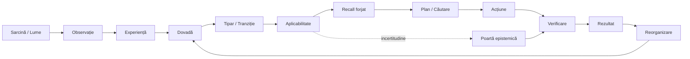
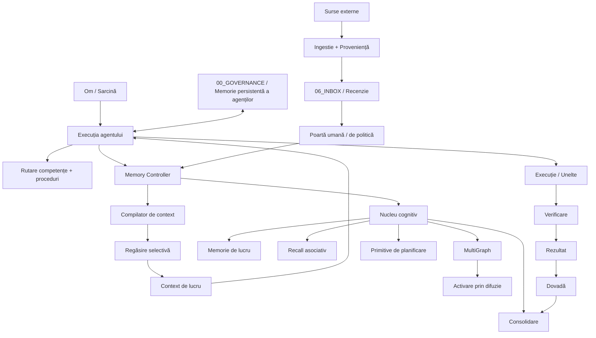

# AI Memory Vault

Un substrat de memorie externă persistentă pentru agenți AI: memorie cu proveniență, competențe, proceduri, regăsire, primitive cognitive de execuție, învățare controlată, dovezi și execuție multi-agent reluabilă.

<p align="center">
  <strong>Română</strong> · <a href="README.en.md">English</a>
</p>

<p align="center">
  <strong>UN SINGUR VAULT · UN SINGUR CANON · COGNIȚIE SELECTIVĂ · EVOLUȚIE VERIFICATĂ</strong>
</p>

<p align="center">
  <a href="https://github.com/userist123/AI_Memory_Vault_CODEX_READY/actions"></a>
  <a href="https://github.com/userist123/AI_Memory_Vault_CODEX_READY/tree/main/.claude-plugin"></a>
  <a href="https://github.com/userist123/AI_Memory_Vault_CODEX_READY/tree/main/07_EVALUATION"></a>
  <a href="https://github.com/userist123/AI_Memory_Vault_CODEX_READY/tree/main/00_GOVERNANCE/coordination"></a>
  <a href="https://obsidian.md/"></a>
</p>

> **Problema:** un sistem RAG standard poate regăsi text. Proiectul acesta încearcă să facă memoria externă *utilă operațional* — delimitată, atribuibilă, conștientă de ciclul de viață, conștientă de incertitudine și măsurabilă exact în punctul în care un agent raționează, planifică, verifică și acționează.

---

## ✦ Pe scurt

| Strat | Ce există aici | Starea reală |
|---|---|---|
| Vault canonic | memorie în Markdown, cunoștințe, competențe, agenți, proceduri, proveniență | **IMPLEMENTAT** |
| Memory V6 | extragere, propuneri, detectare de conflicte, ciclu de viață, consolidare, întreținerea regăsirii | **IMPLEMENTAT / ACTIV** |
| Nucleul cognitiv | recall, activare, memorie de lucru, spațiu global de lucru, grafuri, activare prin difuzie, primitive de planificare | **IMPLEMENTAT ȘI TESTAT — NECONECTAT LA CĂUTAREA DIN PRODUCȚIE** (activarea prin difuzie e în spatele unui flag oprit; `executive` și spațiul global de lucru nu au niciun consumator în producție) |
| Memory Controller | granița de stocare, politica de citire/scriere, pachete de context, dezvăluire progresivă, control pe ciclu de viață | **IMPLEMENTAT** |
| Execuția modelelor | abstracții de furnizor fake, local/Ollama, OpenAI, rutare pe niveluri, telemetrie de consum | **IMPLEMENTAT** |
| Ingestia de competențe externe | descoperire, proveniență, clasificare, validare, promovare controlată | **IMPLEMENTAT** |
| Conversie carte → text | segmentare după cuprins / tipografie / pagini, detectare OCR, metrici per carte | **IMPLEMENTAT** |
| Extragerea conceptelor din cărți | asistată de model, cu porți de ancorare, parafrază, formă și schemă | **IMPLEMENTAT / PORȚI DEMONSTRATE** |
| *Selectivitatea* conceptelor | a distinge un concept portant de mobilierul experimental | **MĂSURAT, NEREZOLVAT** |
| Curriculum din cărți | ingestie cu citate verificate, apoi benchmark control ↔ tratament pe întrebări scrise de autorii cărții | **PRIMUL TRANSFER DEMONSTRAT — UN SINGUR CAPITOL** |
| Poarta de promovare în ontologie | fără manifest de verdicte, scrierea în sloturile ontologiei e refuzată (merge și promovare); rândurile nejudecate sunt reținute și numărate | **IMPLEMENTAT / OBLIGATORIU** |
| Dispoziția rândurilor | 213 rânduri de slot, fiecare cu o decizie și un temei; au rămas 93 | **EXECUTAT — 7 RÂNDURI AȘTEAPTĂ DECIZIA PROPRIETARULUI** |
| Expansiunea prin graf | 521 de sinapse, activare prin difuzie, buget de noduri noi pe interogare | **PRACTIC OPRITĂ LA BUGETUL IMPLICIT — DECIZIE ÎN AȘTEPTARE** |
| Garda de date personale | CNP, IBAN și carduri validate, nume de documente personale; raportează calea, nu valoarea | **IMPLEMENTAT / ÎN CI** |
| Predicție Polymarket | instantanee, consiliu, calibrare, avantaj față de piață, abstenție, dimensionare Kelly, backtest, ablație, contract temporal | **IMPLEMENTAT / NEVALIDAT PE DATE REALE** |
| Proveniența rezoluțiilor Polymarket | momentul în care un rezultat a devenit cognoscibil | **STABILIT CA INDISPONIBIL** |
| Memoria persistentă a agenților | stare reluabilă `CURRENT.md` în `00_GOVERNANCE/coordination/agents/` | **IMPLEMENTAT** |
| Planning Influence | simulare V3 fără scurgere de oracol, veto de contradicție cu prioritate absolută, reper al bazei derivat prin simulare | **VALIDAT CA SIMULARE — NU CA AGENT REAL** |
| Politica de incertitudine | contract de aplicabilitate + forța dovezii + contradicție + cost de verificare | **MĂSURAT ÎN SIMULAREA V3** |
| Influență cognitivă susținută de model | MVE cauzal pereche pe execuție reală de model | **ÎNCĂ NEDEMONSTRAT** |
| Învățare continuă complet închisă | bucla rezultat → dovadă → învățare → mutație canonică | **PARȚIAL / DESCHIS** |

<details>
<summary><strong>Prin ce diferă asta de „pur și simplu RAG"?</strong></summary>

```text
Mentalitatea RAG
interogare → documente → prompt

Ținta Vault
experiență → dovadă → tipar → aplicabilitate → influență → decizie → rezultat → reorganizare
```

Ținta pe termen lung este **regăsire ≠ influență**. Depozitul separă explicit un substrat epistemic pasiv de interfețele active de execuție. Implementarea actuală nu pretinde că starea ascunsă a modelului, decodarea, planificarea sau execuția de unelte ar fi controlate magic de un fișier text.
</details>

---

## 🧠 Bucla cognitivă



Arhitectura este împărțită intenționat în cinci straturi semantice:

**Experiență** — ce s-a întâmplat.  
**Model / Tipar** — ce s-ar putea generaliza.  
**Aplicabilitate** — unde ar trebui să se transfere acea memorie.  
**Influență** — cum îi este permis să afecteze computația.  
**Reorganizare** — cum modifică rezultatele verificate memoria viitoare.

Dovada, proveniența, valabilitatea temporală, incertitudinea, siguranța și economia de tokeni traversează toate cele cinci straturi.

---

## ⚙️ Arhitectura sistemului



### Granița fundamentală

```text
            SUBSTRAT EPISTEMIC PASIV
┌──────────────────────────────────────────────────┐
│ experiență • dovadă • memorie • competențe       │
│ proveniență • ciclu de viață • stare temporală   │
└────────────────────────┬─────────────────────────┘
                         │
                         ▼
          INTERFEȚE ACTIVE DE EXECUȚIE
┌──────────────────────────────────────────────────┐
│ compilator de reprezentare / cadru               │
│ harnașament de planificare / căutare             │
│ poartă epistemică / rutare de verificare         │
│ portal determinist de execuție                   │
└──────────────────────────────────────────────────┘
```

Aceste interfețe de execuție sunt arhitectura-țintă. Unele există ca primitive izolate sau experimente; nu toate sunt încă integrate complet în calea de producție a agentului.

---

# 🗂️ Harta depozitului

| Cale | Rol |
|---|---|
| `00_GOVERNANCE/` | reguli, protocoale, invarianți, coordonarea agenților, `VAULT_STATE.md` |
| `01_ARCHITECTURE/` | note de cunoștințe, registre, matrice de competențe, fișierele de slot ale ontologiei |
| `01_KNOWLEDGE/` | cercetare externă și cunoștințe importate |
| `02_PRODUCT/` | contextul și continuitatea proiectelor |
| `03_IMPLEMENTATION/` | `03_IMPLEMENTATION/packages/` — nucleu cognitiv, memory controller, regăsire, polymarket, furnizori |
| `04_CONFIG/` · `05_DATA/` | configurație și artefacte de date |
| `04_MEMORY/` | înregistrări canonice de memorie |
| `06_INBOX/` | material brut și importat, înainte de recenzie |
| `07_EVALUATION/` | audituri, experimente, benchmark-uri, MVE, dovezi forensice, capturi de date |
| `08_OBSERVABILITY/` · `09_SECURITY/` | telemetrie și suprafețe de securitate |
| `10_DOCUMENTATION/` | proceduri, resurse, proiecția Obsidian |
| `20_TESTS/` | suita deterministă — `pytest -q` o rulează din rădăcina depozitului |
| `30_SCRIPTS/` | unelte de ingestie, cunoștințe, memorie, competențe și verificare |
| `40_EXPERIMENTS/` · `50_ARTIFACTS/` | lucru experimental și artefacte generate |
| `60_DEPLOYMENT/` · `70_INTEGRATIONS/` | suprafețe de implementare și integrare |
| `80_ARCHIVE/` · `90_RELEASE/` · `99_META/` | istoric, versiuni, meta |
| `.agents/` | profiluri de agenți, reguli, competențe operaționale |
| `.claude-plugin/` | suprafața de plugin pentru Claude Code |
| `cognitive_core/` | primitive cognitive de execuție |
| `staging/` | rânduri de extragere per carte, în `.gitignore` — niciodată comise |
| `AI_Memory_Vault_OBSIDIAN/` | stratul de navigare pentru oameni, care păstrează încă vechiul layout `00_CORE` / `99_SYSTEM` |
| `.github/workflows/` | CI, securitate, ingestie, întreținere, evaluare |

> Directoarele numerotate de mai sus sunt depozitul. Layout-ul de vault pe care
> îl folosește proiecția Obsidian — `00_CORE/`, `09_COORDINATION/`, `99_SYSTEM/` —
> se află sub `AI_Memory_Vault_OBSIDIAN/` și nu este rădăcina depozitului. Acest
> README l-a descris pe al doilea ca și cum ar fi fost primul, până la 2026-09-14.

---

# 🧩 Nucleul cognitiv

Module importante de execuție:

- `recall.py` — recall cu semnale multiple: semantic, activare, temporal, memorie de lucru, autoritate și ciclu de viață.
- `ranked_search.py` — strat de reordonare conștient de graf.
- `multi_graph.py` — vederi de graf semantice, temporale, cauzale și orientate pe entități.
- `spreading_activation.py` — activare asociativă peste structura grafului.
- `working_memory.py` — starea contextului activ.
- `global_workspace.py` — primitivă de spațiu global de lucru, competitivă, cu difuzare.
- `activation.py` — comportamentul de activare și decădere.
- `consolidation.py` / `sleep_consolidation.py` — întreținere și reconsolidare.
- `planning.py` / `plan_complexity_analyzer.py` — primitive de planificare și rutare de resurse.
- `learning.py`, `reflection.py`, `reasoning.py`, `motivation.py` — componente cognitive de nivel superior.
- `semantic.py` — abstracție de furnizor semantic.

### Verificarea realității

Calea implicită de regăsire nu este, în acest moment, un sistem complet semantic, nativ vectorial. Comportamentul semantic determinist și scorul de relevanță conțin încă mecanisme lexicale, de suprapunere de tokeni; există căi opționale semantice/Qdrant/Ollama, dar ele nu echivalează cu un index semantic de producție cablat universal. Distincția este păstrată intenționat.

---

# 🗄️ Memory Controller

`03_IMPLEMENTATION/packages/memory_controller/` este granița de încredere și de context din jurul memoriei canonice.

Numele este astăzi un shim de compatibilitate: pachetul conține doar un `__init__.py` care redirecționează vechiul spațiu de import către pachete-frate descompuse pe responsabilități. Implementarea trăiește sub `retrieval/`, `memory/`, `security/`, `lifecycle/`, `interfaces/` și `observability/`.

Răspunde de lucruri precum:

```text
igienizarea interogării
      ↓
clasificare
      ↓
acces conștient de ciclul de viață
      ↓
regăsirea candidaților
      ↓
scorarea relevanței
      ↓
dezvăluire progresivă
      ↓
pachet de context delimitat
      ↓
proveniență / audit
```

Suprafețe principale:

- `memory/controller.py`
- `security/authority.py`
- `retrieval/context/retrieval.py`
- `retrieval/context/relevance_scoring.py`
- `retrieval/context/pack_builder.py`
- `retrieval/context/progressive_disclosure.py`
- motoare de stocare pe SQLite și pe fișiere

(căi relative la `03_IMPLEMENTATION/packages/`)

Citirile publice rămân controlate pe ciclu de viață. Inspecția cognitivă poate trata explicit material aflat în REVIEW fără a-l promova în tăcere la adevăr canonic.

---

# 🧱 Memory V6

Memory V6 adaugă peste Vault-ul de bază un strat operațional de întreținere a memoriei:

| Capacitate | Scop |
|---|---|
| Buffer de senzori | material tranzitoriu de sesiune/eveniment |
| Extragere atomică | fapte, decizii, proceduri, lecții |
| Adaptor Ollama | extragere opțională cu model local |
| Coadă de propuneri | candidați de memorie aflați în recenzie |
| Detectare de conflicte | contradicții și afirmații concurente |
| Promovare controlată | canonicalizare cu poartă umană/de politică |
| MultiGraph | vederi derivate de relații |
| Activare prin difuzie | activare asociativă / clasificare |
| Consolidare în somn | procesare orientată pe întreținere |
| Benchmark-uri de regăsire | unelte Precision@K / Recall@K / MRR |
| Bugete de context | transport delimitat în tokeni/octeți |
| Telemetrie de consum | consum de model estimat față de real |
| Raportare de eficiență | economia execuției, în stil B4/B5 |

Obiectivul arhitectural este **dezvăluirea progresivă**: nu încărca tot Vault-ul doar pentru că există.

```text
metadate
   ↓
reguli relevante
   ↓
memorie compactă
   ↓
dovezi detaliate doar când e nevoie
```

---

# 🧠 Influența memoriei — noul strat de cercetare

Proiectul testează acum dacă memoria externă poate influența computația dincolo de a adăuga text într-un prompt.

### Patru canale de influență vizate

| Canal | Efect urmărit | Ținta măsurării |
|---|---|---|
| Recall / Reprezentare | schimbă cadrul explicit sau setul de ipoteze | reprezentare cu memorie ≠ fără memorie |
| Planificare | schimbă preferința de ramificare/căutare | traiectoria căutării / alocarea de noduri |
| Incertitudine | schimbă comportamentul de a acționa / verifica / explora / se abține | rutarea verificării și abstenția |
| Execuție | constrângeri deterministe de acțiune la granița uneltelor | acțiuni permise față de respinse |

Distincția importantă de siguranță este:

> **Influența memoriei trebuie să fie explicită și observabilă. Influența asupra stării ascunse nu este revendicată.**

### Model de memorie legat de dovezi

Unitatea persistentă vizată este un tipar de transfer legat de dovezi:

```text
Situație
Scop
Constrângeri
Acțiune
Tranziție de stare
Rezultat
Dovadă
Limite temporale
Aplicabilitate
Contraexemple
```

Un artefact compact de influență poate fi apoi forjat la cerere, în loc să fie trimis repetat prin contextul modelului întregul istoric.

---

# 🧪 Planning Influence MVE

MVE-ul izolat se află sub:

```text
07_EVALUATION/luna/
├── PLANNING_INFLUENCE_PREREGISTRATION_V2.md
├── PLANNING_INFLUENCE_PREREGISTRATION_V2_1.md
├── PLANNING_INFLUENCE_RESULTS_V3.md
├── PLANNING_INFLUENCE_UNCERTAINTY_POLICY_V1.md
├── planning_influence_mve_v3.py
├── simulate_puct_benchmark.py
├── run_experiments_v3.py
├── generate_planning_influence_report.py
├── run_all_v3.py
├── tables/ (table_luna_1..5.csv)
├── planning_influence_mve.py (pilot inițial retras)
└── test_planning_influence_mve.py (retras)
```

### Brațele experimentului

```text
Brațul 1 — bază / planificator uniform (izolat, fără scurgere de oracol)
Brațul 2 — memorie consultativă / planificator uniform
Brațul 3 — tratament cognitiv / prior de planificare derivat din memorie (v1_uncertainty, v2_verification_action)
Brațul 4 — control cu memorie învechită / contrazisă (CONFIRMED_CONTRADICTION)
```

### Rezultate V3 validate (`PLANNING_INFLUENCE_RESULTS_V3.md`)

Harnașamentul V3 rezolvă defectul structural de scurgere al pilotului inițial prin ordonare complet aleatoare și departajare PUCT ortogonală prin SHA-256 (`test_planning_influence_isolation.py` trece 100%, cu test strict `xfail` pe pilotul vechi).

Rezultatele experimentale pe grila preînregistrată ($N=200$ scenarii/celulă, 17.600 evaluări totale în `run_experiments_v3.py` reproduse octet cu octet prin `run_all_v3.py`):

1. **Izolarea bazei și reperul PUCT:** Căutarea neghidată consumă în medie $\approx 2.921$ noduri PUCT ($SE = 0.0032$, derivat Monte Carlo pe 200.000 de rulări în `simulate_puct_benchmark.py`), iar poziția ramurii optime are corelație nulă cu costul ($r^2 < 0.01$).
2. **Praguri de rentabilitate ($p^*$):** Memoria devine profitabilă economic la o acuratețe de cel puțin $p^* = 0.40$ în regim calibrat ($\Delta_{\text{nodes}} = +0.310$, 95% CI $[0.080, 0.565]$) și $p^* = 0.50$ în regim neinformativ ($\Delta_{\text{nodes}} = +0.565$, 95% CI $[0.300, 0.835]$) pentru politica `v1_uncertainty`.
3. **Prioritatea absolută a vetoului de contradicție:** Când memoria este marcată `CONFIRMED_CONTRADICTION`, priorii sunt forțați strict uniformi ($0.25$) pentru toate politicile, garantând $\Delta_{\text{fatals}} = 0.0000$ pe brațul stale și neutralizând complet riscul decizional.
4. **Economia verificării ca acțiune (`v2_verification_action`):** În spații restrânse ($K=4$), taxa de $1.0$ nod per verificare produce o economie netă negativă ($-0.235$ până la $-0.305$ noduri) față de `v1_uncertainty`; verificarea activă se justifică exclusiv în spații mari ($K \ge 6$) sau în regimuri de risc critic asimetric.

> **Limitare metodologică:** Aceasta este o **simulare deterministă cu oracol de scenariu**. Ea demonstrează matematic mecanica de fuziune a memoriei în planificare (izolarea oracolului, ponderarea Bayesiană a priorităților, vetoul absolut de contradicție), dar **nu constituie o dovadă că un agent real cu LLM planifică mai bine**.

### Pilotul determinist inițial — ⚠️ RETRAS (măsurătoare invalidă prin scurgere de oracol, PR #165)

> **Pilotul inițial este retras și păstrat exclusiv pentru trasabilitate istorică.** Comparația bază ↔ tratament din `planning_influence_mve.py` a fost viciată de o scurgere de oracol: linia 153 punea ramura optimă pe prima poziție (`optimal=order[0]`), iar selecția PUCT (linia 252) departaja egalitățile după poziția ramurii (`-branches.index(candidate)`). Baza alegea astfel optimul din pasul 1 în toate cele 30 de scenarii (cost artificial de 1.0 nod/scenariu). Cifrele raportate inițial (bază 30 noduri / tratament 54 noduri / 12 fatale) sunt invalide și au fost retrase formal prin PR #165.

### Politica de incertitudine

Politica preînregistrată separă:

```text
aplicabilitate
+ forța dovezii
+ starea de contradicție
+ costul verificării
+ influența asupra planificatorului
+ rezultatul execuției
```

Forțe fixe de aplicabilitate pentru următoarea rulare izolată:

```text
APPLICABLE                   = 1.00
APPLICABLE_WITH_VERIFICATION = 0.35
INSUFFICIENTLY_KNOWN         = 0.15
NOT_APPLICABLE               = 0.00
```

Politica este dovadă de proiectare. Reușita ei nu a fost încă stabilită.

---

# 🧬 Direcția învățării continue

Bucla de învățare vizată este conservatoare prin construcție:

```text
EXECUȚIE REALĂ
      ↓
REZULTAT
      ↓
DOVADĂ
      ↓
EVALUARE
      ↓
TIPAR / PROCEDURĂ / COMPETENȚĂ CANDIDAT
      ↓
SANDBOX / RECENZIE
      ↓
REGRESIE + SET REȚINUT
      ↓
POARTĂ UMANĂ / DE POLITICĂ
      ↓
MEMORIE CANONICĂ
```

Uneltele de rezultat și componentele de învățare există, dar depozitul **nu** revendică în acest moment o buclă de învățare continuă autonomă complet închisă, în care fiecare rezultat mutează automat memoria canonică.

Reținerea aceasta este deliberată: un rezultat care s-a întâmplat o dată este o dovadă despre un eveniment, nu automat o capacitate reutilizabilă.

---

# 🤖 Modelul de operare multi-agent

Starea de execuție persistentă se află sub:

```text
00_GOVERNANCE/coordination/
├── README.md
├── UNIVERSAL_AGENT_MEMORY_PROTOCOL_V1.md
├── BOOTSTRAP_ALL_AGENTS_V1.md
├── agents/
│   ├── CODEX/
│   ├── ANTIGRAVITY/
│   ├── PERPLEXITY/
│   └── LUNA/
└── projects/
    └── AI_MEMORY_VAULT/
        └── CURRENT.md
```

Fiecare sesiune substanțială este așteptată să lase în urmă:

```text
CE AM FĂCUT
UNDE
DOVADA
CE A EȘUAT / CE RĂMÂNE
URMĂTOAREA ACȚIUNE EXACTĂ
```

### Disciplina de execuție actuală

```text
DOAR PE MAIN
PREDARE SECVENȚIALĂ
FĂRĂ LUCRU ÎN PARALEL PE ACEEAȘI SARCINĂ
FĂRĂ DEZVOLTARE PE RAMURI DE FUNCȚIONALITATE PENTRU ACEST LANȚ DE CERCETARE
```

Acesta este mecanismul care face munca reluabilă între agenți, calculatoare, IDE-uri și sesiuni, fără a trata istoricul de conversație drept stare canonică.

---

# 📦 Competențe și cunoștințe externe

Competențele sunt tratate ca aptitudini reutilizabile, nu ca simple fragmente de prompt.

```text
sursă
  ↓
descoperire
  ↓
proveniență
  ↓
clasificare
  ↓
deduplicare / validare
  ↓
RAW_EXTERNAL
  ↓
recenzie umană / de politică
  ↓
competență operațională
```

Suprafețe relevante:

- `.agents/skills/`
- `.agents/agents/`
- `01_ARCHITECTURE/knowledge/Agents_Skill_Matrix.md`
- `01_ARCHITECTURE/knowledge/Master_Skills_Catalog_251.md`
- `30_SCRIPTS/skills/skill_ingestion.py`
- `06_INBOX/RAW_IMPORTS/`

Depozitul păstrează deliberat atribuirea sursei, metadatele de commit/cale, amprentele hash și starea de ciclu de viață pentru materialul importat.

---

# 🚪 Poarta de promovare în ontologie

Un script de merge a scris **201 concepte** în cele șaisprezece fișiere de slot ale ontologiei, într-un singur pas, toate cu statusul `proposed`. Exact asta fusese construit să facă. **160 erau încă acolo cinci zile mai târziu, judecate de nimeni** — iar când cineva le-a citit în sfârșit, 28 erau sintagme, nu concepte, 8 dublau concepte deja promovate, 1 era două concepte diferite sub același cuvânt, iar 6 cereau o decizie pe care n-o luase nimeni.

Fișierele de slot erau zonă de lucru pentru scriptul de merge și ontologie canonică pentru tot restul. Nimeni nu scrisese o poartă pentru că nimeni nu credea că există o graniță.

```text
rânduri din staging → manifest de verdicte → poartă → fișiere de slot
                              ↑
                 o decizie, cu un temei, pentru fiecare concept
```

`30_SCRIPTS/ingestion/promotion_verdicts.py` este acea graniță.

- **Doar `PROMOTE` admite.** `UNSURE` deliberat nu: o decizie pe care nimeni n-a putut s-o ia nu este o decizie de a continua.
- **Un concept absent din manifest este reținut și numărat**, niciodată aruncat în tăcere. O rulare care i-ar fi sărit fără urmă ar arăta identic cu una în care fuseseră judecați — exact mecanismul prin care cele 160 au devenit invizibile.
- **Un `reason` este obligatoriu pe fiecare intrare, inclusiv pe aprobări.** Un verdict fără motiv este un vot.
- **Poarta nu judecă calitatea.** Un manifest care marchează o sintagmă cu `PROMOTE` lasă sintagma să treacă și și-a făcut treaba. Ce elimină ea este rândul *neexaminat*.

`30_SCRIPTS/ingestion/slot_rows.py` este singurul cititor al acelor fișiere și **aruncă o eroare la un status pe care niciun tool nu îl declară**. Zece rânduri cu `unverified_source` au stat nevăzute cinci zile pentru că fiecare audit filtra pe cele două statusuri pe care le știa toată lumea, iar mai multe instrumente independente au dat 203 față de 213 reale — nu dintr-un bug comun, ci dintr-o presupunere comună.

Dispoziția tuturor celor 213 rânduri se află în
[`07_EVALUATION/book_corpus_conversion/`](07_EVALUATION/book_corpus_conversion/)
și **a fost executată**: au rămas 93 de rânduri, iar cele 43 de concepte deja promovate au rămas neatinse. Șapte rânduri — șase nedecise și `familiarity`, care ascunde două concepte sub același cuvânt — așteaptă o decizie a proprietarului și nu sunt atinse de niciun script.

### Poarta a devenit obligatorie

Manifestul a fost introdus opțional, ca apelurile existente să nu se strice — ceea ce însemna că poarta ținea doar pentru cine alegea s-o folosească. O parte din săptămână, parametrul nici nu a existat pe `main`: o ramură veche, merge-uită peste cod mai nou, îl ștersese, iar niciun test nu a picat, pentru că nimic nu îl cerea.

Acum o scriere în sloturile canonice **fără manifest este refuzată** cu `UngatedCanonicalWrite`, înainte de prima scriere, atât la merge (`merge_candidate_concepts.py`), cât și la promovare (`promote_candidate_concept.py`). Orice alt director rămâne permis: așa se face o rulare de probă pe o copie a sloturilor.

Inventarul tuturor căilor de scriere în sloturi, cu poarta fiecăreia, e generat în
[`07_EVALUATION/ontology_write_paths/WRITE_PATHS.md`](07_EVALUATION/ontology_write_paths/WRITE_PATHS.md),
iar un test pică la orice scriitor nou care nu e pe listă. O cale rămâne deschisă și e marcată ca atare acolo: `purge_rejected_rows.py --apply` poate șterge rânduri fără manifest.

---

# 📚 Curriculum din cărți

O carte nu devine cunoaștere pentru că a fost citită. Devine cunoaștere dacă, după ingestie, vault-ul poate răspunde la întrebări la care înainte nu putea — iar întrebările nu le-a scris cine a extras notele.

```text
sursă cu licență verificabilă → text + hash → extragere cu citate verificate → REVIEW
        → întrebări înghețate înainte de extragere → control ↔ tratament → rezultat
```

Primul capitol trecut prin tot lanțul: OpenStax *Psychology 2e*, capitolul 8 („Memory"), licență CC BY 4.0. Întrebările sunt cele de recapitulare ale autorilor cărții, cu cheia lor de răspuns, înghețate într-un commit anterior extragerii. Capcanele au răspunsul absent din capitol și nicio variantă care să indice ieșirea. Un cititor-model primește doar notele recuperate de vault și trebuie să răspundă cu o variantă **plus o propoziție citată textual dintr-o notă**, sau `INSUFFICIENT`.

| Braț | Întrebări susținute | Abțineri la capcane | Răspunsuri greșite |
|---|---|---|---|
| control — fără notele capitolului | 0/12 | 10/10 | 0/12 |
| tratament — cu notele în `REVIEW` | 6/12 | 10/10 | 0/12 |

Raportul complet, cu tabel pe întrebare, se află în
[`07_EVALUATION/neural_plasticity/NEURAL_PLASTICITY_REPORT.md`](07_EVALUATION/neural_plasticity/NEURAL_PLASTICITY_REPORT.md).

Limitele sunt parte din rezultat: un singur capitol, 12 întrebări, deci o diferență de una-două întrebări ar fi zgomot. Notele rămân `REVIEW` până le atestă proprietarul. Trei cifre raportate anterior pentru același capitol („7/12", „5/5 abțineri", „audit 50/50") au fost **retrase**, iar secțiunea DEVIATIONS a raportului spune de ce: extragere țintită pe întrebări, capcane judecate după un șir care nu putea apărea, un auto-audit.

---

# 📈 Predicție Polymarket

`03_IMPLEMENTATION/packages/polymarket/` — instantanee de piață, un consiliu de predicție, calibrare, avantajul modelului față de piață, abstenție de risc, dimensionare Kelly aplicată ultima și necondiționat, backtest, benchmark, ablație cu corecție Holm-Bonferroni și un contract de proveniență temporală.

### Ce a stabilit prima captură reală

Pachetul a fost construit de-a lungul a douăzeci și una de faze, împotriva a două fixture-uri scrise de noi. Primele date reale ([`fixtures/real_gamma_markets_*.json`](07_EVALUATION/polymarket/fixtures/)) au răspuns la întrebarea pe care se sprijinea proiectarea:

> **Niciun endpoint public Polymarket nu poartă o marcă temporală a decontării.**

Verificat pe toate cele 143 de chei dintr-o captură de 100 de piețe rezolvate. Singurele câmpuri apropiate de decontare sunt `resolvedBy`, o adresă, și `automaticallyResolved`, un boolean. `endDate` este momentul programat al închiderii, `closedTime` este momentul în care tranzacționarea s-a oprit și a început perioada de contestație UMA, iar `updatedAt` este momentul în care un worker a scris un rând în baza de date. Niciunul nu este momentul în care rezultatul a devenit cognoscibil.

Prin urmare, `SOURCE_ONCHAIN_SETTLEMENT` este inaccesibil fără un nod Polygon RPC, fiecare backtest scorează pe `SOURCE_MANUAL_ATTESTED`, iar `ResolutionSet.by_source()` există tocmai ca să raporteze asta. `resolutions.py` **nu** are, deliberat, o constantă `SOURCE_DERIVED_CLOSE_TIME`, iar un test cere ca numele să rămână absent: folosirea momentului de închidere a unei piețe drept moment al rezoluției este exact greșeala pe care modulul o previne.

**Niciun rezultat de predicție de aici nu a fost validat împotriva unor rezultate reale de piață.** Capturile sunt ștanțate cu proveniență — URL, marcă temporală UTC, cod HTTP, număr de înregistrări și SHA-256 — și nimic nu este curățat sau reordonat.

### Câte observații sunt de fapt

Setul extins are 483 de piețe, dar **doar 63 de rezultate independente**: un meci de fotbal american dă 56 de piețe, o zi de Bitcoin 117, și toate se rezolvă împreună. Un interval de încredere calculat pe 483 ar pretinde de aproape opt ori mai multă informație decât există. După corectarea dependenței, intervalul devine prea larg ca să susțină un avantaj exploatabil
([`ANTIGRAVITY_RESEARCH_PROGRAM_V1.md`](07_EVALUATION/polymarket/ANTIGRAVITY_RESEARCH_PROGRAM_V1.md)).

În România, Polymarket și Kalshi figurează pe lista ONJN a operatorilor neautorizați. Pachetul rămâne exclusiv cercetare: nicio tranzacție cu bani reali.

---

# 🔐 Securitate și siguranță epistemică

Sistemul tratează informația externă ca neîncrezută până când trece granițe explicite.

Principii fundamentale:

- un AI nu își poate promova propria afirmație la verificare autoritară doar scriind metadata `verified`.
- afirmațiile de proveniență privilegiată sunt controlate.
- conținutul din REVIEW poate fi inspectat fără a deveni automat memorie ACTIVĂ.
- tranzițiile de ciclu de viață ale propunerilor sunt controlate.
- traseele de audit sunt păstrate.
- proveniența supraviețuiește ingestiei.
- memoria contradictorie nu trebuie să câștige mai multă influență doar pentru că este contradictorie.
- controalele de benchmark nu trebuie să depindă în tăcere de cunoașterea oracolului.

Depozitul este public, așa că datele personale au propria poartă, separată de scanarea de secrete: `30_SCRIPTS/verification/personal_data_guard.py` refuză documentele numite după ce sunt (factură, extras de cont, buletin…) și conținutul cu un CNP, un IBAN românesc sau un număr de card **validate** (cifră de control, mod-97, Luhn). Raportează calea, regula și numărul de apariții — niciodată valoarea — și rulează în CI.

Depozitul conține și material de securitate și forensic despre granițele de încredere ale memoriei, igiena corpusurilor externe, constatările Defender și liniile de bază de curățare la nivel de depozit.

---

# 🛡️ CI / automatizare

Workflow-urile din [`.github/workflows/`](.github/workflows/), grupate după ce verifică:

| Ce verifică | Workflow-uri |
|---|---|
| suita completă de teste și structura depozitului | `r001-enforcement.yml`, `memory-v6-tests.yml` |
| igiena depozitului: căi absolute, fișiere nepermise în rădăcină, date personale | `repository-hygiene.yml` |
| regăsirea pe benchmark-ul reținut, înghețat prin SHA-256 | `r009b-heldout-benchmark.yml` |
| materialul importat, scanat pentru instrucțiuni injectate | `untrusted-content-guard.yml` |
| notele ACTIVE, verificate față de amprentele înregistrate | `active-note-integrity.yml` |
| căile de scriere ale runtime-ului | `write-path-audit.yml` |
| securitate: secrete, analiză statică | `secret-scan.yml`, `codeql.yml`, `fortify.yml`, `apisec-scan.yml` |
| cercetare: Planning Influence V3 și fazele Polymarket | `planning-influence-mve.yml`, `polymarket-phase*.yml` (câte unul pe fază) |
| rulări programate și ingestie | `memory-consolidation.yml` (consolidarea de noapte), `import-external-skills.yml`, `jarvis-command-center.yml` |

Un test (`20_TESTS/test_readme_references.py`) pică dacă README-ul numește un workflow sau o cale care nu există — lista de dinainte rămăsese în urmă cu 22 de fișiere și cita două workflow-uri șterse.

Consolidarea de noapte a picat zilnic după reorganizare: întâi apela un modul mutat, apoi nu își instala dependențele. Nimeni nu a observat, pentru că testele rulau într-un mediu care le avea. Acum un test verifică faptul că fiecare workflow care rulează cod din depozit își instalează dependențele înainte.

Proiectul distinge **verificarea în CI** de execuția locală. Un workflow în așteptare nu este o trecere. O rulare locală nu este promovată în tăcere la dovadă din CI.

---

# 🧪 Modelul de verificare

Depozitul folosește niveluri de dovadă pentru a preveni inflația de capacități:

| Nivel | Semnificație |
|---|---|
| `DOCUMENT_VERIFIED` | susținut de documentație canonică |
| `CODE_VERIFIED` | confirmat din implementarea din depozit |
| `TEST_VERIFIED` | observat într-o ieșire reală de test automat |
| `RUNTIME_VERIFIED` | observat într-o execuție reală |
| `CI_VERIFIED` | observat în dovezi din GitHub Actions |
| `CLAIMED_ONLY` | afirmat, dar insuficient susținut cu dovezi |
| `UNVERIFIED` | doar proiectare/speculație |

**Sursa de adevăr:** `main` + sursa comisă + ieșire reală de test/execuție + dovezi din CI.

Rapoartele, capturile de ecran, textul din README și rezumatele agenților nu au întâietate față de dovada executabilă din depozit.

---

# 🚧 Lacune cunoscute — vizibile intenționat

Secțiunea aceasta nu este o slăbiciune a README-ului. Face parte din contractul proiectului.

1. Regăsirea implicită se sprijină încă substanțial pe comportament determinist lexical, de suprapunere de tokeni; generarea semantică de candidați nu este cablată universal în calea implicită `MemoryController.search()`.
2. **Expansiunea prin graf e practic oprită în producție.** Bugetul implicit de noduri noi este `min(2·n, 20) − n`, adică zero ori de câte ori căutarea lexicală găsește cel puțin 20 de note — iar limita lexicală a urcat la 200. Pe benchmark-ul reținut, expansiunea e imposibilă în 25 din 32 de interogări, iar rezultatele sunt identice cu graful oprit; orice buget fix între 5 și 20 aduce aceleași 2 cazuri în plus, la limita zgomotului ([`07_EVALUATION/graph_budget/GRAPH_BUDGET_REPORT.md`](07_EVALUATION/graph_budget/GRAPH_BUDGET_REPORT.md)). Orice concluzie mai veche de tipul „graful nu ajută" a fost măsurată cu un graf care nu adăuga nimic. Valoarea implicită este o decizie a proprietarului, încă neluată.
3. **Majoritatea notelor nu au nicio legătură.** Din 948 de note indexate, doar 157 au o muchie de ieșire și 145 una de intrare (`00_GOVERNANCE/VAULT_STATE.md`): restul nu poate fi atins prin graf, oricât de mare ar fi bugetul.
4. Telemetria de rezultat nu constituie încă o buclă de învățare autonomă complet închisă.
5. Planning Influence V3 este o simulare deterministă cu un oracol de scenariu. Demonstrează mecanica — izolare, priori, veto — nu că un agent real, cu un model real, planifică mai bine. Pilotul inițial e retras.
6. Execuția în CI observată în lanțul curent de lucru poate rămâne în așteptare; în așteptare înseamnă **neverificat**.
7. Unele artefacte de cercetare sunt ținte de proiectare, nu garanții de implementare.
8. **Selectivitatea conceptelor rămâne nerezolvată.** Primele măsurători, pe modele locale, au arătat o încredere a modelului constantă (`1.00` inclusiv pe dovezi fabricate) și cam jumătate din ieșire mobilier experimental — `validation set`, `SGD optimizer`, `Rot-MNIST`. Recurența pe secțiuni distincte (`occurrences ≥ 3`) a rămas singurul semnal care funcționează; niciunul dintre cele cinci semnale noi testate ulterior nu l-a depășit, iar măsurătoarea s-a făcut pe eșantioane mici. Măsurat, nu estimat: [`07_EVALUATION/book_corpus_conversion/FINDINGS.md`](07_EVALUATION/book_corpus_conversion/FINDINGS.md).
9. Cele două cărți scanate au fost convertite prin OCR, dar calitatea nu e uniformă: la Ashby, 13% din pagini au coloanele în ordine amestecată.
10. Două căi pot încă scrie în ontologie pe lângă manifestul de verdicte: `purge_rejected_rows.py --apply` și calea generică de scriere a controlerului către notele `slot-*`. Sunt documentate, nu închise.

Expunerea acestor lacune este intenționată. Proiectul este întărit prin falsificare, nu prin lustruirea afirmațiilor lui.

Una dintre ele a fost cât pe ce să fie lustruită și merită spusă pe șleau. O modificare de prompt a părut să taie zgomotul de extragere cu 85%; patru din cele cinci concepte rămase erau exact cele patru pe care promptul însuși le dădea ca exemple bune, returnate indiferent de ce spunea pasajul. Cifra arăta ca o reparație și era modelul repetându-și instrucțiunile. Versiunea păstrată în depozit este cea cu cifra mai proastă.

---

# 🧭 Foaie de parcurs

```text
FĂCUT
 │
 ├─ Planning Influence V3: simulare fără scurgere, veto reparat, reper derivat
 ├─ primul transfer demonstrat dintr-o carte (un capitol, 12 întrebări)
 ├─ poarta de verdicte obligatorie la merge și la promovare
 ├─ garda de date personale în CI
 │
 ▼
ACUM
 │
 ├─ profil curricular pe domeniu, obligatoriu înainte de ingestie
 ├─ proveniență bibliografică obligatorie înainte de promovare
 ├─ benchmark de transfer general + a doua carte, din alt domeniu
 ├─ auditul independent al relațiilor propuse în graf
 ├─ decizia bugetului de expansiune a grafului
 │
 ▼
APOI
 │
 ├─ legarea notelor izolate: majoritatea memoriei nu are nicio sinapsă
 ├─ de la carte la procedură și poartă, pentru cărțile de metodă
 ├─ pereche susținută de model: agent real, căutare, acțiune, rezultat verificat
 ├─ nucleul cognitiv conectat la calea reală și măsurat — sau retras dacă nu ajută
 │
 ▼
MAI TÂRZIU
 │
 ├─ măsurarea influenței asupra reprezentării
 ├─ poartă epistemică de acțiune/verificare/abstenție
 ├─ compilarea tiparelor legate de dovezi
 └─ buclă de învățare închisă, protejată de regresie
```

Un MVE susținut de model **nu este autorizat doar pentru că trec testele unitare deterministe**.

---

# ⚡ Pornire rapidă

### Rulează testele deterministe

```bash
pytest -q
```

### Rulează testele de izolare ale Planning Influence V3

```bash
pytest -q 20_TESTS/test_planning_influence_isolation.py
```

### Rulează suita completă de reproducere Planning Influence V3

```bash
python 07_EVALUATION/luna/run_all_v3.py
```

### Verificările cerute la fiecare PR

```bash
python -m pytest 20_TESTS -q
python 30_SCRIPTS/verification/validate_repository_layout.py
python 30_SCRIPTS/verification/repository_hygiene.py
python 30_SCRIPTS/verification/personal_data_guard.py
```

Suita completă, nu un subset: rezultatele raportate din subseturi au ascuns în trecut eșecuri pe care CI-ul le-a găsit imediat.

### Exemple de CLI pentru Memory V6

Modulele stau în `03_IMPLEMENTATION/packages`, deci CLI-ul are nevoie de el în `PYTHONPATH`:

```bash
export PYTHONPATH=03_IMPLEMENTATION/packages   # PowerShell: $env:PYTHONPATH = "03_IMPLEMENTATION/packages"
python -m cognitive_core.memory_v6_cli extract --text "Am decis: folosim SQLite WAL." --enqueue
python -m cognitive_core.memory_v6_cli review --show-conflicts
python -m cognitive_core.memory_v6_cli approve <candidate_id> --reviewer human
python -m cognitive_core.memory_v6_cli promote-approved --principal ai_agent
python -m cognitive_core.memory_v6_cli consolidate --render
```

Dependențele: `pip install -e .` și `pip install -r requirements-memory-v6.txt`, la fel ca în CI.

---

# 🧭 Navigare canonică

### Arhitectură și contracte

- [`00_GOVERNANCE/VAULT_STATE.md`](00_GOVERNANCE/VAULT_STATE.md)
- [`07_EVALUATION/luna/COGNITIVE_MEMORY_TARGET_MODEL_V2.md`](07_EVALUATION/luna/COGNITIVE_MEMORY_TARGET_MODEL_V2.md)
- [`07_EVALUATION/luna/COGNITIVE_MEMORY_V2_REPOSITORY_REALITY_MAP_V1.md`](07_EVALUATION/luna/COGNITIVE_MEMORY_V2_REPOSITORY_REALITY_MAP_V1.md)
- [`00_GOVERNANCE/rules/Rules.md`](00_GOVERNANCE/rules/Rules.md)
- [`00_GOVERNANCE/protocols/Memory_Protocol.md`](00_GOVERNANCE/protocols/Memory_Protocol.md)

### MVE / cercetare

- [`07_EVALUATION/luna/PLANNING_INFLUENCE_RESULTS_V3.md`](07_EVALUATION/luna/PLANNING_INFLUENCE_RESULTS_V3.md) — rezultatele valide, generate din tabele
- [`07_EVALUATION/luna/PLANNING_INFLUENCE_UNCERTAINTY_POLICY_V1.md`](07_EVALUATION/luna/PLANNING_INFLUENCE_UNCERTAINTY_POLICY_V1.md)
- [`07_EVALUATION/luna/PLANNING_INFLUENCE_MVE_V2_VALIDATED.md`](07_EVALUATION/luna/PLANNING_INFLUENCE_MVE_V2_VALIDATED.md) — istoric
- [`07_EVALUATION/luna/PLANNING_INFLUENCE_APPLICABILITY_PILOT_LOCAL_20260904.md`](07_EVALUATION/luna/PLANNING_INFLUENCE_APPLICABILITY_PILOT_LOCAL_20260904.md) — retras
- [`07_EVALUATION/graph_budget/GRAPH_BUDGET_REPORT.md`](07_EVALUATION/graph_budget/GRAPH_BUDGET_REPORT.md) — bugetul de expansiune a grafului

### Curriculum și ontologie

- [`07_EVALUATION/neural_plasticity/NEURAL_PLASTICITY_REPORT.md`](07_EVALUATION/neural_plasticity/NEURAL_PLASTICITY_REPORT.md) — benchmark-ul de transfer OpenStax
- [`07_EVALUATION/curriculum/`](07_EVALUATION/curriculum/) — proveniență, text-sursă cu atribuire, setul de test înghețat
- [`07_EVALUATION/book_corpus_conversion/FINDINGS.md`](07_EVALUATION/book_corpus_conversion/FINDINGS.md) — măsurătorile de extragere, cu retractările lor
- [`07_EVALUATION/ontology_write_paths/WRITE_PATHS.md`](07_EVALUATION/ontology_write_paths/WRITE_PATHS.md) — cine poate scrie în ontologie
- [`07_EVALUATION/luna/LUNA_INDEPENDENT_MEMORY_ENGINE_AUDIT_V2.md`](07_EVALUATION/luna/LUNA_INDEPENDENT_MEMORY_ENGINE_AUDIT_V2.md)
- [`07_EVALUATION/luna/PERPLEXITY_COGNITIVE_MEMORY_V2_ADVERSARIAL_VALIDATION.md`](07_EVALUATION/luna/PERPLEXITY_COGNITIVE_MEMORY_V2_ADVERSARIAL_VALIDATION.md)

### Continuitatea agenților

- [`00_GOVERNANCE/coordination/UNIVERSAL_AGENT_MEMORY_PROTOCOL_V1.md`](00_GOVERNANCE/coordination/UNIVERSAL_AGENT_MEMORY_PROTOCOL_V1.md)
- [`00_GOVERNANCE/coordination/BOOTSTRAP_ALL_AGENTS_V1.md`](00_GOVERNANCE/coordination/BOOTSTRAP_ALL_AGENTS_V1.md)
- [`00_GOVERNANCE/coordination/projects/AI_MEMORY_VAULT/CURRENT.md`](00_GOVERNANCE/coordination/projects/AI_MEMORY_VAULT/CURRENT.md)

### Competențe / ingestie

- [`01_ARCHITECTURE/knowledge/Agents_Skill_Matrix.md`](01_ARCHITECTURE/knowledge/Agents_Skill_Matrix.md)
- [`01_ARCHITECTURE/knowledge/Master_Skills_Catalog_251.md`](01_ARCHITECTURE/knowledge/Master_Skills_Catalog_251.md)
- [`.agents/skills/`](.agents/skills/)
- [`30_SCRIPTS/skills/skill_ingestion.py`](30_SCRIPTS/skills/skill_ingestion.py)

### Execuție

- [`cognitive_core/`](cognitive_core/)
- [`03_IMPLEMENTATION/packages/memory_controller/`](03_IMPLEMENTATION/packages/memory_controller/)
- [`cognitive_core/recall_cli.py`](cognitive_core/recall_cli.py)
- [GitHub Actions](../../actions)

---

## Principii de proiectare

```text
UN SINGUR CANON
DOVADA ÎNAINTEA ÎNCREDERII
REGĂSIRE ÎNAINTEA INFLAȚIEI DE CONTEXT
INFLUENȚĂ EXPLICITĂ ÎN LOC DE MAGIE
PROMOVARE CU POARTĂ UMANĂ
PROVENIENȚA SUPRAVIEȚUIEȘTE INGESTIEI
EȘECUL ESTE DATĂ
MĂSOARĂ ÎNAINTE SĂ AUTOMATIZEZI
REȚINE CE TREBUIE REȚINUT
```

> **Ambiția nu este de a construi cel mai mare depozit de memorie. Este de a construi un sistem de memorie care poate să își amintească selectiv, să expună de ce ar trebui să conteze o amintire, să știe când nu ar trebui să conteze, să influențeze computația în moduri măsurabile, să verifice ce s-a întâmplat și să se reorganizeze doar atunci când dovada câștigă dreptul de a schimba comportamentul viitor.**

<p align="center">
  <sub>AI Memory Vault · CODEX Ready · Cercetare și inginerie de memorie cognitivă</sub>
</p>
